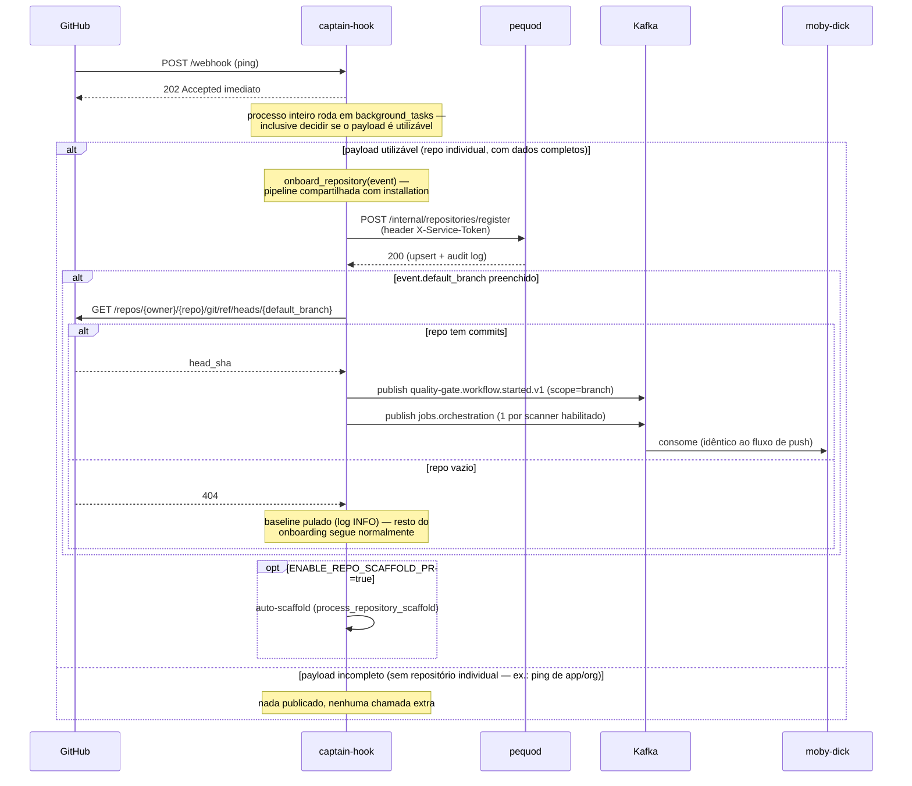
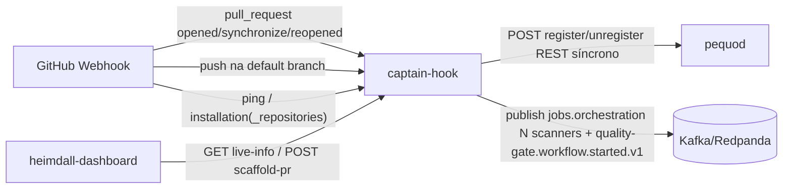

# Captain-hook

Ponto de entrada do GitHub: recebe webhooks, valida HMAC e publica `JobDescriptor v1` no Kafka (`jobs.orchestration`). Também expõe endpoints HTTP síncronos consumidos diretamente pelo `heimdall-dashboard` e para disparo manual do auto-scaffold.

Desde a migração REST de ping/install (PR #44, mergeado 15/set/2026 — ver [proposta de implementação](design/ping-install-rest-migration.md), agora implementada), o captain-hook também é **cliente HTTP síncrono do pequod**: `ping` e `installation`/`installation_repositories` não publicam mais em Kafka pra registrar repositório — chamam `POST /internal/repositories/register`/`/unregister` diretamente (`diplomat/http_out/pequod_client.py`), com retry embutido. Os tópicos `repository.registered.v1`/`repository.unregistered.v1` deixaram de existir.

## Quick start

```bash
docker compose up -d            # redpanda + sonarqube + sonar-db
cp .env.example .env
pip install -r requirements.txt
uvicorn main:app --host 0.0.0.0 --port 8080
```

## Endpoints

| Método | Path | Descrição |
|---|---|---|
| `POST` | `/webhook` | recebe webhooks do GitHub (`ping`, `pull_request`, `push`, `installation`, `installation_repositories`) |
| `GET` | `/health` | liveness |
| `GET` | `/repos/{owner}/{repo}/live-info` | issues abertas + dependências (Dependency Graph/SBOM) do repositório, buscadas ao vivo no GitHub — sem persistência, sem publicar evento; consumido diretamente pelo `heimdall-dashboard` |
| `POST` | `/repos/{owner}/{repo}/scaffold-pr` | dispara manualmente o auto-scaffold (PR sugerindo `docker-compose.aspm.yml` + lint config + workflow) para um repositório específico — necessário para repositórios registrados em massa via `installation`, que nunca recebem `ping` individual |
| `GET` | `/docs` | Swagger |

!!! note "CORS e live-info"
    `/repos/{owner}/{repo}/live-info` é chamado diretamente do navegador pelo `heimdall-dashboard` na tela de Governança. As duas buscas (issues + dependências) rodam em paralelo e falham de forma independente. Origens permitidas via `CORS_ALLOWED_ORIGINS`.

## Eventos do GitHub processados

| Evento | Action(s) monitoradas | O que dispara |
|---|---|---|
| `ping` | — | registra o repositório no pequod via REST (`POST /internal/repositories/register`), dispara **Security Baseline** (scope=`branch`) imediato e, se `ENABLE_REPO_SCAFFOLD_PR`, o auto-scaffold — tudo dentro de `background_tasks`, respondendo `202` antes de processar (mesmo status de todo `/webhook`) |
| `pull_request` | `opened`, `synchronize`, `reopened` | inicia o **Quality Gate** (scope=`pr`): publica `quality-gate.workflow.started.v1` + 1 `JobDescriptor` por scanner habilitado em `jobs.orchestration` |
| `push` | push na **default branch** do repositório | inicia o **Security Baseline** (scope=`branch`): mesma máquina do Quality Gate (`workflow.started` + `jobs.orchestration`), sem `SONAR_PULLREQUEST_*`/`base_ref` (full-branch scan) — ver `controller/push_controller.py` |
| `installation` | `created`, `deleted` | registra/desregistra em massa (REST) todos os repositórios cobertos pela instalação da App, em **paralelo** (`installation_max_concurrency`); `created` também dispara Security Baseline + auto-scaffold por repositório (mesma pipeline do `ping`) |
| `installation_repositories` | `added`, `removed` | idem, para mudança de escopo de repositórios de uma instalação já existente |

Eventos sem processamento dedicado são logados e descartados — não fazem o webhook retornar erro.

!!! note "Push só dispara Security Baseline na default branch"
    `adapter/wire_in/push_adapter.py::to_baseline_context` filtra estritamente `refs/heads/{repository.default_branch}`, ignora `deleted=true` e commits vazios (`after` zerado). Push em feature branch, tag ou delete de branch não gera nenhum job — o webhook é recebido, mas `to_baseline_context` retorna `None` e `process_push_event` só loga "push ignorado". Confirmado em `main` desde 31/ago/2026 (PR #38) — ver [Decisão §15](overview/decisions.md#15-quality-gate-com-scopepr-e-scopebranch-security-baseline--ponta-a-ponta-em-main-reconfirmado-2026-09-10). Ver também [onboarding de repositório](integration/onboarding-repo.md).

## Como `ping` e `installation(_repositories)` são processados (sequência)

Desde o PR #44 (15/set/2026), esses eventos fazem bem mais que registrar o repositório: registro **REST** síncrono no pequod, **Security Baseline** (scope=`branch`) imediato e **auto-scaffold**, tudo pela mesma pipeline compartilhada (`controller/repository_onboarding.py::onboard_repository`) — `ping` a chama 1x por webhook, `installation`/`installation_repositories` a chama Nx em paralelo, uma por repositório. Os diagramas abaixo substituem a versão anterior (só publish Kafka de registro).

### `ping`



### `installation` / `installation_repositories`

```mermaid
sequenceDiagram
    participant GH as GitHub
    participant CH as captain-hook
    participant PQ as pequod
    participant K as Kafka
    participant MD as moby-dick

    GH->>CH: POST /webhook (installation | installation_repositories)
    CH-->>GH: 202 Accepted imediato
    Note over CH: processamento em background_tasks

    par por repositório (até installation_max_concurrency simultâneos)
        alt action = created | added
            Note over CH: onboard_repository(event) — mesma função do ping
            CH->>PQ: POST /internal/repositories/register
            PQ-->>CH: 200 (upsert + audit log)
            CH->>GH: GET /repos/{owner}/{repo}/git/ref/heads/{default_branch}
            GH-->>CH: head_sha (ou 404 — baseline pulado, resto segue)
            CH->>K: publish workflow.started + jobs.orchestration (scope=branch)
            K->>MD: consome
            opt ENABLE_REPO_SCAFFOLD_PR=true
                CH->>CH: auto-scaffold
            end
        else action = deleted | removed
            CH->>PQ: POST /internal/repositories/unregister
        end
    end
    end
    Note over CH: asyncio.gather — 1 falha isolada (registro,<br/>baseline ou scaffold de UM repo) não aborta as demais
```

!!! note "Fonte"
    `controller/webhook_controller.py` (roteamento), `controller/ping_controller.py`, `controller/installation_controller.py` (`_process_repositories_concurrently`), `controller/repository_onboarding.py` (`onboard_repository`, núcleo compartilhado), `adapter/wire_in/install_baseline_adapter.py`, `controller/baseline_jobs.py`, `diplomat/http_out/pequod_client.py`, `diplomat/http_out/github_write_client.py` (`get_ref_sha`, trata `404` como repo vazio). Confirmado em `main` em 2026-09-16 (PR #44, mergeado 2026-09-15).

## Scanners disparados

Cada evento relevante (`pull_request` relevante ou `push` na default branch) monta uma lista de `JobDescriptor`, um por scanner habilitado, publicada em `jobs.orchestration`:

| Scanner | Sempre ativo? | Feature flag (captain-hook) | `kind` |
|---|---|---|---|
| SonarQube | ✅ sempre | — | `sonar_scan` |
| Semgrep SAST | opcional | `ENABLE_SEMGREP_SCAN` | `semgrep_scan` |
| Trivy SCA | opcional | `ENABLE_TRIVY_SCAN` | `trivy_scan` |
| OWASP ZAP DAST | opcional | `ENABLE_ZAP_SCAN` (+ `ZAP_TARGET_URL` obrigatório se `DAST_MODE=fixed_url`) | `zap_scan` |

Cada scanner tem seu builder próprio em `adapter/wire_out/scanners/{sonar,semgrep,trivy,zap}_scanner.py`, com duas funções: `build_job` (scope=`pr`, chamado por `pull_request_controller`) e `build_baseline_job` (scope=`branch`, chamado por `push_controller`) — mesma matriz de feature flags nos dois casos, só muda o contexto (sem `SONAR_PULLREQUEST_*`/`base_ref` no baseline). Ver [Adicionar novo scanner](developer/adding-a-scanner.md) para o padrão completo.

!!! tip "SONAR_PROJECT_KEY"
    `SONAR_PROJECT_KEY` é sempre `f"gh_{repository.id}"`, montado em `adapter/wire_out/scanners/sonar_scanner.py` (`build_job`/`build_baseline_job`). `repository.id` é imutável no GitHub — sobrevive a rename/transfer. Ver [Decisão §13](overview/decisions.md#13-sonar_project_key-derivado-de-githubrepositoryid) e [JobDescriptor](reference/job-descriptor.md#convenção-sonar_project_key).

## Links

- README completo: ../captain-hook/README.md
- JobDescriptor: ../reference/job-descriptor.md
- Onboarding de repositório: ../integration/onboarding-repo.md
- Adicionar novo scanner: ../developer/adding-a-scanner.md

## Fluxo de dados




