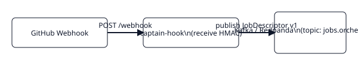

# Captain-hook

Ponto de entrada do GitHub: recebe webhooks, valida HMAC e publica `JobDescriptor v1` no Kafka (`jobs.orchestration`).

## Quick start

```bash
docker compose up -d            # redpanda + sonarqube + sonar-db
cp .env.example .env
pip install -r requirements.txt
uvicorn main:app --host 0.0.0.0 --port 8080
```

## Endpoints

- `POST /webhook` — recebe webhooks do GitHub (PR opened/synchronize/reopened)
- `GET /health` — liveness
- `GET /docs` — Swagger

## Links

- README completo: ../captain-hook/README.md
- JobDescriptor: ../reference/job-descriptor.md

## Fluxo de dados

```mermaid
flowchart LR
  GH[GitHub Webhook]
  CH[captain-hook]
  K[(Kafka/Redpanda)]

  GH -->|webhook (PR opened/synchronize)| CH
  CH -->|publish jobs.orchestration| K
```


