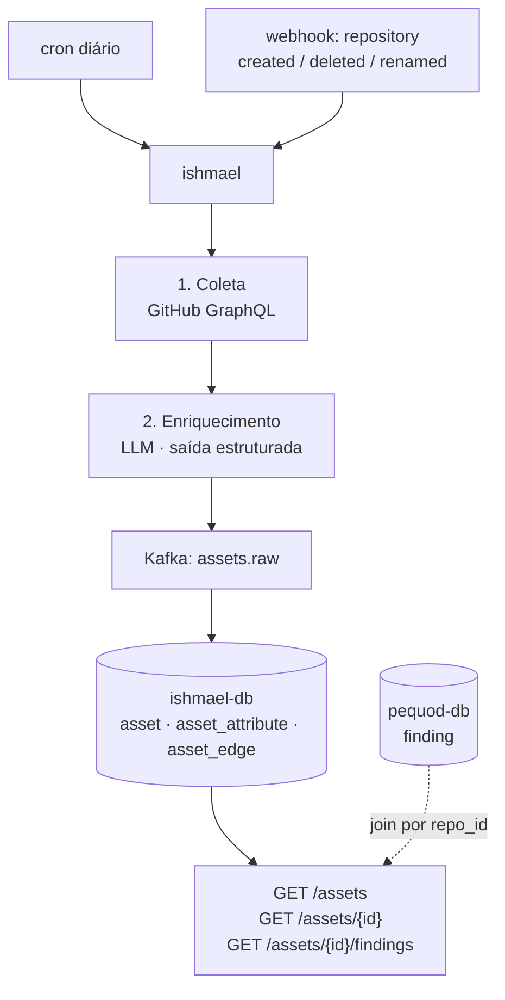

# ishmael — Asset Inventory com IA

!!! warning "Documento de design — não implementado"
    O `ishmael` ainda não existe como repositório. Esta página descreve o desenho proposto,
    para revisão antes de qualquer código. Nada aqui é estado atual da plataforma.

> *"Call me Ishmael."* — o narrador de Moby Dick é quem observa e cataloga.

## Por que existe

A plataforma hoje responde **"o que há de errado?"** (findings). Não responde **"errado onde, e o quanto isso importa?"**.

Sem inventário de ativos:

- não existe priorização real — um SQL injection num script interno pesa igual a um numa API de pagamento
- não existe blast radius — "esse CVE afeta quais sistemas?" não tem resposta
- não existe unidade de cobrança — a proposta comercial é SaaS **por ativo**, e `asset` não é entidade em lugar nenhum

## O problema de chamar isso de "IA"

Enumerar repositórios de uma organização é uma chamada de API. Não tem IA nenhuma.

A IA precisa responder o que a API **não** responde:

| Pergunta | API do GitHub responde? | Como resolver |
|---|---|---|
| Que repositórios existem? | sim | coleta determinística |
| Que linguagem usa? | sim | coleta determinística |
| Isso é frontend, API, lib ou infra? | não | LLM sobre README + estrutura |
| Quão crítico é para o negócio? | não | LLM + sinais de exposição e dependência reversa |
| Toca dado sensível (PII/PCI)? | não | NLP sobre schema, env vars, nomes de campo |
| Quem é o dono de verdade? | às vezes (CODEOWNERS) | histórico de commits + CODEOWNERS |
| Está órfão / é shadow IT? | não | detecção de anomalia |
| Esses N repos são a mesma aplicação? | não | embeddings + clustering |

As quatro últimas linhas são inferência genuína. É onde a IA se justifica.

## Papel

**Descobrir, classificar e relacionar os ativos da organização.**

**Responsabilidades:**

- Varrer a organização no GitHub (agendado + reativo a webhooks)
- Coletar fatos determinísticos sobre cada ativo
- Inferir atributos não observáveis via LLM, com proveniência
- Manter o grafo de relações entre ativos
- Publicar mudanças em `assets.raw`
- Servir `GET /assets` e derivados

**O que NÃO faz:**

- Não executa scanner
- Não persiste finding (isso é do `pequod`)
- Não decide severidade de vulnerabilidade
- Não escreve no GitHub — é read-only sobre a org

## Fluxo



## Modelo de ativo

Três níveis. O recorte inicial cobre L1 e parte do L2.

| Nível | Tipo | Origem | Escopo inicial |
|---|---|---|---|
| L1 | `repository` | GitHub API | ✅ sim |
| L2 | `package`, `image` | manifestos, Dockerfile, SARIF do Trivy | 🟡 parcial |
| L3 | `endpoint`, recurso cloud | ZAP target, rotas do framework, IaC | 🔴 depois |

### Identidade

`asset.id` para repositório é **`gh_<github.repository.id>`** — a mesma chave que o `pequod` já usa em `finding.repo_id`.

Identificador imutável: sobrevive a rename e transfer do repositório. O join entre ativo e finding sai de graça, sem migração.

## Schema

A decisão de design central: **fato coletado e atributo inferido nunca moram na mesma coluna.**

```sql
CREATE TABLE asset (
  id             TEXT PRIMARY KEY,          -- gh_123456
  tenant_id      TEXT,                      -- nullable hoje; unidade de cobrança amanhã
  kind           TEXT NOT NULL,             -- repository | package | image | endpoint
  name           TEXT NOT NULL,
  url            TEXT,
  visibility     TEXT,                      -- public | private | internal
  archived       BOOLEAN DEFAULT false,
  default_branch TEXT,
  last_push_at   TIMESTAMPTZ,
  languages      JSONB,                     -- {"Python": 84210, "Shell": 1200}
  topics         TEXT[],
  first_seen_at  TIMESTAMPTZ DEFAULT now(),
  last_seen_at   TIMESTAMPTZ DEFAULT now(),
  status         TEXT DEFAULT 'active'      -- active | archived | gone
);

CREATE TABLE asset_attribute (
  asset_id      TEXT NOT NULL REFERENCES asset(id) ON DELETE CASCADE,
  key           TEXT NOT NULL,   -- category | criticality | data_sensitivity | owner | internet_facing
  value         TEXT NOT NULL,
  source        TEXT NOT NULL,   -- collected | inferred | manual
  confidence    NUMERIC,         -- só para source = inferred
  model_version TEXT,            -- ex: claude-sonnet-5, heuristic-v1
  rationale     TEXT,            -- por que o modelo decidiu isso
  inferred_at   TIMESTAMPTZ,
  PRIMARY KEY (asset_id, key, source)
);

CREATE TABLE asset_edge (
  src_id   TEXT NOT NULL,
  dst_id   TEXT NOT NULL,
  relation TEXT NOT NULL,        -- depends_on | deploys | exposes | owns | same_app
  source   TEXT NOT NULL,        -- collected | inferred
  PRIMARY KEY (src_id, dst_id, relation)
);
```

### Por que separar `source`

- **Re-inferir sem recoletar.** Trocou de modelo? Apaga `source = 'inferred'` e roda de novo. Fato coletado intacto.
- **Precedência humana.** `manual` sobrescreve `inferred` na leitura — mesmo padrão do `status` no `pequod`, que já preserva triagem manual entre rescans.
- **Auditabilidade.** `rationale` + `confidence` + `model_version` respondem "como a IA decidiu isso?". Sem isso, a inferência é caixa-preta e ninguém confia.
- **Inferência errada não corrompe fato.**

Leitura com precedência:

```sql
SELECT DISTINCT ON (asset_id, key) asset_id, key, value, source, confidence
FROM asset_attribute
WHERE asset_id = $1
ORDER BY asset_id, key,
         CASE source WHEN 'manual' THEN 0 WHEN 'collected' THEN 1 ELSE 2 END;
```

## Estágio 1 — coleta

GraphQL, não REST. O rate limit é de 5000 pontos/hora por installation; REST gastaria uma chamada por repositório.

```graphql
query($org: String!, $cursor: String) {
  organization(login: $org) {
    repositories(first: 100, after: $cursor) {
      pageInfo { hasNextPage endCursor }
      nodes {
        databaseId
        name
        url
        isPrivate
        isArchived
        pushedAt
        primaryLanguage { name }
        languages(first: 10) { edges { size node { name } } }
        repositoryTopics(first: 20) { nodes { topic { name } } }
        defaultBranchRef { name }
        readme:     object(expression: "HEAD:README.md")          { ... on Blob { text } }
        codeowners: object(expression: "HEAD:.github/CODEOWNERS") { ... on Blob { text } }
      }
    }
  }
}
```

Complementar com busca de manifestos — sinal forte de stack e de superfície de deploy:

| Arquivo | Sinal |
|---|---|
| `package.json`, `pom.xml`, `requirements.txt`, `go.mod` | stack + dependências (arestas `depends_on`) |
| `Dockerfile` | aresta `deploys` para imagem |
| `*.tf`, `*.yaml` (k8s) | recurso de infra, exposição |
| `.github/workflows/*` | tem CI, faz deploy, para onde |

### Autenticação

O `moby-dick` já implementa JWT (RS256) → installation access token em `diplomat/http_out/`.

!!! note "Extrair, não copiar"
    Esta seria a **terceira** cópia do cliente da GitHub App. A decisão §9 aceita duplicação
    deliberada de **modelo de domínio** entre consumers — não de cliente de infraestrutura.
    Recomendação: extrair para lib compartilhada antes de escrever o `ishmael`.

## Estágio 2 — enriquecimento

Monta um **repo card** compacto e submete ao LLM com saída estruturada obrigatória.

**Entrada (repo card):**

- README truncado
- árvore de diretórios em 2 níveis
- dependências principais
- linguagens e proporção
- presença de workflows, Dockerfile, IaC
- contagem de dependências reversas (de outros ativos já conhecidos)

**Saída (schema fechado):**

```json
{
  "category": "backend-api",
  "criticality": "high",
  "criticality_rationale": "expõe endpoint público de pagamento; 3 repositórios dependem dele",
  "data_sensitivity": ["pii", "financial"],
  "tech_stack": ["python", "fastapi", "postgres"],
  "internet_facing": true,
  "confidence": 0.82
}
```

Cada campo vira uma linha em `asset_attribute` com `source = 'inferred'`.

### Segurança da inferência

O LLM lê README e código de terceiros. Esse conteúdo é **entrada não confiável**.

Um README pode conter texto instruindo o modelo a classificar o repositório como `criticality: none`, ou a emitir dados de outros ativos. O vetor é real e está no OWASP LLM Top 10 (LLM01 — Prompt Injection).

Controles obrigatórios desde o primeiro commit:

- **Conteúdo do repositório entra sempre delimitado e rotulado como dado**, nunca como instrução
- **Saída exclusivamente por schema estruturado**, validada antes de persistir — nada de texto livre virando campo
- **O agente de inferência não tem ferramentas.** Sem acesso a rede, disco ou banco. Texto entra, JSON sai
- **Valores fora do enum são descartados** e o ativo é marcado `needs_review`
- **Conteúdo suspeito vira finding próprio** — tentativa de injeção é sinal de segurança, não ruído

!!! tip "Dois requisitos por um"
    Isso entrega o requisito de **detecção de prompt injection** da proposta comercial com um
    caso de uso genuíno, em vez de uma demo artificial. O sistema defende o próprio pipeline.

## O grafo

Arestas extraíveis com custo baixo:

| Relação | Origem | Custo |
|---|---|---|
| `repo --depends_on--> package@version` | manifestos, ou SARIF do Trivy (já traz SCA) | baixo |
| `repo --deploys--> image` | Dockerfile, workflow | baixo |
| `repo --exposes--> endpoint` | `ZAP_TARGET_URL`, rotas do framework | médio |
| `repo --same_app--> repo` | embeddings + clustering | alto |

Isso destrava a pergunta que define ASPM:

> "CVE-2026-XXXX em `lodash@4.17.20` — quais ativos são afetados, e quais deles são críticos e expostos?"

Recursive CTE no Postgres resolve nessa escala. **Não é necessário banco de grafo.**

## Integração com o pequod

`finding.repo_id` e `asset.id` são a mesma chave. Join direto, zero migração:

```sql
SELECT a.name,
       a.kind,
       crit.value AS criticality,
       count(f.id) FILTER (WHERE f.status = 'open') AS open_findings
FROM asset a
LEFT JOIN asset_attribute crit
       ON crit.asset_id = a.id
      AND crit.key = 'criticality'
LEFT JOIN finding f
       ON f.repo_id = a.id
GROUP BY a.name, a.kind, crit.value
ORDER BY open_findings DESC;
```

!!! success "A migration 002 do pequod paga aqui"
    A troca da chave de dedup de `(fingerprint, repo)` para `(fingerprint, repo_id)` foi o que
    torna esse join possível sem retrabalho.

Como os bancos são separados, o join acontece na camada de aplicação ou via view materializada — não há FK entre bancos.

## Contratos

### Kafka

| Tópico | Produtor | Consumidor | Key |
|---|---|---|---|
| `assets.raw` | ishmael (coleta) | ishmael (persistência) | `asset_id` |

Mesmo padrão dos demais: produtor e consumidor no mesmo serviço mantém o ponto de extensão aberto para quem quiser reagir a mudança de inventário.

### HTTP

| Método | Rota | Descrição |
|---|---|---|
| `GET` | `/assets` | lista com filtro por `kind`, `criticality`, `category`, `tenant_id` |
| `GET` | `/assets/{id}` | ativo com atributos e proveniência |
| `GET` | `/assets/{id}/edges` | relações de entrada e saída |
| `GET` | `/assets/{id}/findings` | findings do ativo (proxy para o pequod) |
| `PATCH` | `/assets/{id}/attributes` | sobrescrita manual (`source = manual`) |
| `POST` | `/assets/sync` | dispara varredura sob demanda |
| `GET` | `/health` | liveness |

## Entrega faseada

| Fase | Entrega | Resultado |
|---|---|---|
| 1 | Coleta GraphQL + tabela `asset` + `GET /assets` | Inventário automatizado existe. Sem IA ainda. |
| 2 | Inferência de `category` e `criticality` com proveniência | O "AI-driven" da proposta passa a ser verdade. |
| 3 | Join ativo ↔ findings + risco por ativo | Painel único. É a tela de demonstração. |
| 4 | `asset_edge` com `depends_on` a partir do SARIF do Trivy | Blast radius. É o que diferencia. |
| 5 | Clustering `same_app` por embedding | Última milha. Cortável sob prazo. |

Fases 1 a 3 fazem o inventário existir e ser demonstrável. A fase 4 é o diferencial técnico.

## Decisões em aberto

| # | Questão | Impacto |
|---|---|---|
| 1 | Diplomat ou ports/adapters? | Depende de [moby-dick#20](https://github.com/OdinEye-FIAP/moby-dick/issues/20). O `ishmael` deve nascer no padrão vencedor, não criar um terceiro. |
| 2 | Banco próprio ou tabela no `pequod-db`? | Banco próprio isola ciclos de vida; mesmo banco simplifica o join. Recomendação: próprio. |
| 3 | Qual modelo para inferência, e custo por varredura? | Uma org de 200 repositórios × 1 chamada por repo por dia tem custo real. Considerar inferir só quando o repo card mudar. |
| 4 | `tenant_id` entra agora? | Coluna nullable hoje custa zero. Multi-tenancy retroativo é migração dolorosa. Recomendação: entra agora. |
| 5 | Frequência da varredura | Diária + reativa a webhook cobre a maioria dos casos sem estourar rate limit. |

## Riscos

**Escala de demonstração.** A organização tem 5 repositórios, um dos quais contém apenas um README. Inventário de 5 itens não demonstra a tese. Considerar apontar a varredura para uma organização pública grande em modo leitura, deixando explícito que é demonstração.

**Custo de inferência.** Inferir todo repositório em toda varredura é desperdício. Guardar hash do repo card e só re-inferir quando mudar.

**Deriva do inventário.** Repositório deletado no GitHub não some sozinho do banco. Marcar `status = 'gone'` quando desaparecer da varredura, em vez de deletar — histórico de ativo importa para auditoria.

**Confiança na inferência.** `criticality` inferida errada distorce toda a priorização a jusante. Por isso `confidence` e `manual` existem: abaixo de um limiar, o valor deve aparecer na interface como sugestão, não como fato.

## Relação com a proposta comercial

| Requisito da proposta | Coberto por |
|---|---|
| Inventário de ativos automatizado com IA | este serviço, fases 1–2 |
| Priorização com IA | `criticality` + `data_sensitivity` alimentam o score |
| Visibilidade unificada | `GET /assets` + join com findings, fase 3 |
| Detecção de prompt injection | controles do estágio 2 |
| SaaS precificado por ativo | `asset` como entidade + `tenant_id` |
| ML | `criticality` inferida vira feature; `finding.status` da triagem manual vira rótulo de treino |
