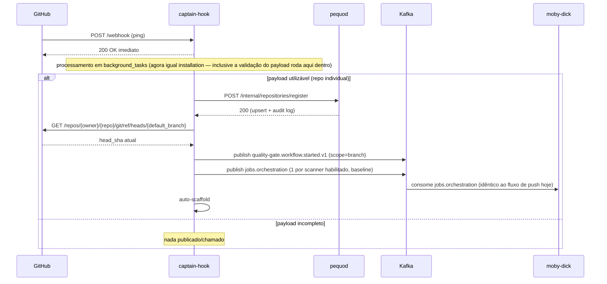
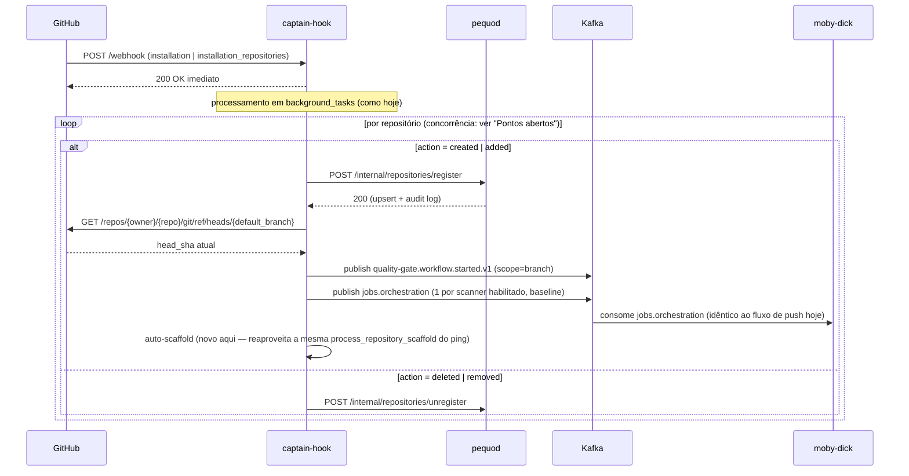

# Proposta: registro de repositório via REST + Security Baseline em `ping`/`installation`

> **Status:** proposta, não implementada. Este documento é a especificação
> de implementação — foi escrito para que uma sessão/chat diferente do que
> o discutiu possa implementar sem precisar do histórico da discussão.
> Discussão original: `decisions.md` → seção "Open questions", item
> "Confiabilidade do producer em `installation`/`installation_repositories`"
> (levantado 2026-09-10/11).

## Contexto (estado atual, confirmado no código em 2026-09-11)

Hoje `ping` e `installation`/`installation_repositories` (captain-hook)
fazem **só uma coisa**: registrar/desregistrar o repositório no inventário
do pequod, via Kafka (`repository.registered.v1`/`repository.unregistered.v1`,
produtor captain-hook, consumidor pequod — confirmado como único par
producer/consumer desses tópicos, sem terceiros dependendo deles).

Isso tem três lacunas: confiabilidade, escopo e consistência do padrão de
resposta ao GitHub.

1. **Confiabilidade:** `ping` propaga falha de publish Kafka pra resposta
   HTTP do webhook (GitHub reentrega). Mas `installation`/`installation_repositories`
   roda em `background_tasks` — depois do `200 OK` já devolvido ao GitHub —
   e `_publish_registrations_sequentially`/`_publish_unregistrations_sequentially`
   (`captain-hook/controller/installation_controller.py`) capturam a exceção
   por repositório, logam e seguem. Se o Kafka cair nesse momento, o lote
   inteiro nunca é publicado: sem DLQ possível (mensagem nunca saiu do
   captain-hook), sem retry, e o GitHub não reentrega (do lado dele, o
   webhook já teve sucesso).
2. **Escopo:** quando a App é instalada num repo/org, ou quando `ping`
   dispara, hoje **nada roda scanner nenhum** no `main` do repositório —
   só o registro no inventário. O primeiro Security Baseline (scope=`branch`)
   só acontece no próximo `push` na default branch, o que pode nunca
   acontecer logo após o onboarding. Além disso, o auto-scaffold (PR
   sugerindo lint/CI de baseline) hoje só dispara pelo `ping` individual
   (`ping_controller.py:52-58`) — repositórios registrados em massa via
   `installation`/`installation_repositories` nunca recebem esse PR
   automaticamente, só via endpoint manual (`repository_scaffold_handler.py`).
3. **Consistência de resposta ao GitHub (levantado 2026-09-11):**
   `installation`/`installation_repositories` já respondem `200 OK`
   **antes** de processar — `webhook_controller.py` agenda a função
   inteira (`process_installation_event`/`process_installation_repositories_event`)
   como `background_tasks.add_task(...)`, sem nenhuma lógica síncrona no
   meio; toda decisão (action, lista de repos) roda dentro do próprio
   background task. Já `ping` hoje é diferente: `webhook_controller.py`
   dá `await process_ping_event(...)` **síncrono**, e essa função não é só
   parsing — ela já inclui um `await publisher.publish(...)` real (Kafka,
   I/O de rede) **aguardado antes do `200`** (`ping_controller.py:35-39`).
   Só o auto-scaffold roda em `background_tasks` hoje. Isso já era uma
   assimetria real (não só de forma) entre os dois fluxos, e com a Fase
   A/B abaixo o caminho síncrono do `ping` cresceria ainda mais (REST pro
   pequod + `GET` no GitHub pro HEAD sha + 2 publishes Kafka antes do
   `200`) — risco real de aproximar do timeout de webhook do GitHub
   (~10s) num pequod ou GitHub API mais lentos.

## Objetivo desta mudança

- **Fase A:** eliminar a Kafka do caminho captain-hook→pequod pra
  registro/desregistro de repositório, substituindo por REST síncrono
  (mesmo padrão do Quality Gate — ver `decisions.md` §16). Resolve a
  lacuna de confiabilidade (1).
- **Fase B:** captain-hook passa a disparar um Security Baseline
  (scope=`branch`) imediatamente no `ping` e no `installation`/
  `installation_repositories` (ações de registro), reaproveitando 100% da
  máquina que já existe pro `push` (`quality-gate.workflow.started.v1` +
  `jobs.orchestration`, consumida pelo moby-dick exatamente como hoje).
  **Também** passa a disparar o auto-scaffold (mesma função já usada pelo
  `ping`) dentro do loop de `installation`/`installation_repositories`,
  fechando a lacuna descrita no item (2) do Contexto — levantado e
  confirmado em 2026-09-11.
- **Fase A/B, ajuste de consistência:** `ping` passa a responder `200 OK`
  **antes** de processar, igual `installation` — `webhook_controller.py`
  passa a agendar a função inteira do `ping` (parsing + registro +
  baseline + scaffold) como `background_tasks.add_task(...)`, sem
  nenhuma lógica síncrona no meio, exatamente como `installation` já faz
  hoje. Resolve a lacuna (3).

## Não-objetivo

- Não muda nada em `pull_request`/`push` (scope=`pr` continua igual).
- Não muda o moby-dick. Ele continua scanner-agnóstico e não sabe (nem
  precisa saber) se um `jobs.orchestration` veio de um `push` real ou de
  um `ping`/`installation` — pra ele é o mesmo `JobDescriptor` com
  `scope=branch`.
- Não muda a lógica interna de `process_repository_scaffold`
  (`repo_scaffold_controller.py`) — a função já é agnóstica à origem do
  trigger (só recebe owner/repo), só passa a ser chamada de um lugar novo.
- Não muda o comportamento de upsert + audit log do pequod no registro
  (ver "Pontos abertos", item 5 — questionado se é necessário, mas não
  decidido/removido nesta proposta).
- Não implementa "listar PRs" nem o redesenho do `/live-info` — são ideias
  registradas separadamente em `decisions.md` (Open questions).
- Não implementa tópicos Kafka por scanner — ideia registrada
  separadamente em `decisions.md` (Open questions), sem decisão tomada.

## Decisões já fechadas (não reabrir sem motivo novo)

| Decisão | Escolha | Por quê |
|---|---|---|
| Estratégia de corte | **Cutover direto** | Volume baixo, sem terceiros consumindo os tópicos hoje. Sem dual-write/feature-flag temporário. |
| Auth do novo endpoint no pequod | **Dependency genérica de service token** | Substitui o padrão duplicado (`require_moby_dick_service_token`, e equivalente do tars-ai) por uma única `require_service_token(*allowed)` reutilizável — inclusive pro futuro BFF (ver `decisions.md`, item "BFF"). |
| `ping`/`installation` ainda precisam de Kafka? | **Sim, pra moby-dick** (Fase B) | Só a comunicação captain-hook↔pequod perde Kafka. Captain-hook↔moby-dick continua Kafka — moby-dick nunca consumiu os tópicos de registro, então não há nada a preservar aí; o que muda é que captain-hook passa a *também* publicar `jobs.orchestration`/`workflow.started` a partir desses dois eventos, não só do `push`. |
| Registro deveria passar por um tópico Kafka consumido pelo moby-dick, em vez de REST direto ao pequod? | **Não** | Discutido explicitamente (2026-09-11). Trocar o destino do publish de "pequod" pra "moby-dick" **não resolve** a lacuna de confiabilidade (1) — o produtor (`captain-hook`) continua sendo o mesmo `publisher.publish()` dentro do mesmo loop de `background_tasks` que hoje engole falha silenciosamente; o problema nunca foi o consumidor. REST com retry embutido no `PequodClient` resolve porque tenta de novo *antes* de desistir, sem depender do broker estar de pé. Além disso, pequod já é chamado diretamente por 3 serviços hoje (moby-dick `/evaluate`, tars-ai `/integrations/tars/*`, heimdall-dashboard `/api/v1/*`), captain-hook virar o 4º não quebra padrão nenhum, é exatamente o cenário que motivou a auth genérica (linha acima). O que o rascunho de "tópico + moby-dick consome N repos" descreve **já existe** para o disparo de scan: é o `jobs.orchestration` da Fase B, que já é consumido por um único `JobConsumer` no moby-dick, unificado entre push/PR/ping/install, sem necessidade de tópico novo. |
| Sonar (e demais scanners) reutilizável entre push/PR/ping/install | **Já é hoje** | `build_job`/`build_baseline_job` de cada scanner (`adapter/wire_out/scanners/*.py`) já são agnósticos à origem do trigger — não precisam mudar. |
| `ping` deve responder o GitHub antes ou depois de processar (registro + baseline)? | **Antes — `background_tasks`, igual `installation`** (levantado 2026-09-11) | Fase A/B tornam o caminho síncrono do `ping` mais pesado (1 REST pro pequod + 1 GET no GitHub + 2 publishes Kafka antes do `200`), o que aproxima do timeout de webhook do GitHub. `installation` já usa esse padrão hoje. Trade-off aceito: falha deixa de propagar pro GitHub (sem reentrega automática) — mitigado pelo retry já embutido no `PequodClient` (Fase A) e pelo log de erro; é o mesmo trade-off que `installation` já opera com hoje, só que agora com retry, que não existia antes. |
| A validação do payload do `ping` (decidir se é "payload utilizável") deve rodar antes do `200` (síncrona) ou dentro do `background_tasks`, igual `installation`? | **Dentro do `background_tasks`, sem etapa síncrona nenhuma** (levantado 2026-09-11) | `installation`/`installation_repositories` nunca tiveram etapa síncrona de validação — `webhook_controller.py` sempre agendou a função inteira como background task, e a decisão de `action`/lista de repos roda lá dentro (`installation_controller.py:40`). Parsing de payload é barato e sem I/O, então não há razão funcional pra fazer isso antes do `200` — fazer `ping` decidir "payload utilizável" dentro do próprio background task, exatamente como `installation` decide `action`, deixa os dois fluxos estruturalmente idênticos: recebe webhook → agenda função inteira como background → responde `200` — zero lógica no meio, em ambos. |
| Auto-scaffold deve rodar também em `installation`/`installation_repositories`, não só em `ping`? | **Sim** (levantado 2026-09-11) | Hoje o scaffold só dispara pelo `ping` porque foi implementado assim desde o início, sem relacao com REST/Kafka — repositórios que entram em massa via `installation`/`installation_repositories` nunca recebem esse PR automaticamente (só endpoint manual). Como `process_repository_scaffold` já é agnóstica à origem (só recebe owner/repo), a extensão é chamar a mesma função dentro do loop de `installation_controller.py`, sob a mesma flag `ENABLE_REPO_SCAFFOLD_PR` (default `False`) que já protege o `ping` hoje. |

## Fluxo proposto

Em ambos os diagramas abaixo, toda chamada captain-hook→pequod
(`POST /internal/repositories/register`/`/unregister`) é **REST
síncrono, autenticado via header `X-Service-Token`** — mecanismo único,
não repetido seta a seta. Os dois fluxos (`ping` e `installation`) publicam
exatamente os **mesmos dois tópicos Kafka** pro Security Baseline, na
mesma ordem — `quality-gate.workflow.started.v1` e `jobs.orchestration`
(nomes confirmados em `captain-hook/config/settings.py` e idênticos aos
já documentados em `kafka-topics.md`) — e, a partir desta proposta, os
dois também disparam o mesmo auto-scaffold ao final. Os dois diagramas
são agora **estruturalmente idênticos**: recebe webhook → responde `200`
imediato — zero lógica síncrona no meio — → tudo (validação de payload
incluída) roda dentro de `background_tasks`. O consumo do `jobs.orchestration`
pelo moby-dick só acontece no branch de registro (`ping` com payload
utilizável / `installation` com `action=created|added`) — nunca no
branch de desregistro, que não publica esse tópico.

> **Atenção — não confundir nome do tópico com `event_type` do payload:**
> `quality-gate.workflow.started.v1` (com hífen e sufixo `.v1`) é o nome
> do **tópico Kafka** — é o que se usa pra assinar/configurar o consumer.
> Dentro do **payload** dessa mensagem, o campo `event_type` carrega uma
> string ligeiramente diferente: `quality_gate.workflow.started`
> (underscore, sem `.v1`) — ver `wire/schemas/quality_gate_v1.py`. São
> dois identificadores distintos que coincidem parcialmente; quem for
> implementar não deve copiar um no lugar do outro.

> **Por que existe o `GET /repos/{owner}/{repo}/git/ref/heads/{default_branch}`:**
> `push_controller.py` monta o `BaselineContext` direto do payload do
> webhook, porque `push` traz o `head_sha` pronto no campo `after`.
> `ping`/`installation`/`installation_repositories` **não** têm esse
> campo — não houve push nenhum, só registro/instalação. O nome da
> default branch **já vem no payload** desses webhooks também
> (`repository.default_branch`), sem precisar de API. O que falta é só o
> `head_sha` — o commit que está na ponta dessa branch agora — e isso só
> a API do GitHub dá: `GET /repos/{owner}/{repo}/git/ref/heads/{default_branch}`
> devolve o ref atual, de onde se extrai o sha. Sem esse `head_sha` não
> dá pra montar o `BaselineContext`/`JobDescriptor` que o moby-dick espera.

> **O que significa `PQ-->>CH: 200 (upsert + audit log)`:**
> É a resposta do novo endpoint `/internal/repositories/register` no
> pequod. Internamente (`process_repository_registered`, lógica
> **inalterada** por esta proposta — só muda quem a invoca) ele faz duas
> coisas na **mesma transação** de banco: (1) `upsert` na tabela
> `applications`, com `ON CONFLICT (repository_provider, repository_external_id)
> DO UPDATE` — chamar duas vezes pro mesmo repo não duplica linha, só
> atualiza os campos; (2) `INSERT` imutável numa tabela de audit log,
> registrando o evento de registro/atualização. Se o insert do audit log
> falhar, o upsert também é revertido (mesma transação) — os dois ficam
> sempre em sincronia. É exatamente o mesmo comportamento de hoje (quando
> isso ainda é disparado por consumer Kafka); a Fase A só troca o
> mecanismo de invocação (Kafka consumer → handler REST), não a lógica.
> Se o audit log for considerado desnecessário no futuro (ver "Pontos
> abertos", item 5), essa resposta mudaria pra só `200 (upsert)`.
>
> **Achado à parte, fora do escopo desta proposta:** o texto do audit log
> gravado hoje usa literalmente as strings `"application.registered_via_ping"`/
> `"application.updated_via_ping"`, mesmo quando o registro originou de um
> `installation`/`installation_repositories` (já hoje, antes desta
> proposta — o consumer é o mesmo pra ambos os triggers). Ou seja, o
> histórico de auditoria já está impreciso pra repositórios registrados em
> massa. Não corrigido aqui porque foge do escopo (REST + baseline); vale
> um radar/fix separado em `decisions.md`.

### `ping`

### `installation` / `installation_repositories`

Note que a chamada REST (registro) e a publicação Kafka (baseline) são
**independentes** — não há ordem obrigatória entre elas, podem correr em
paralelo. A única dependência real de ordem é a de sempre: publicar
`quality-gate.workflow.started.v1` antes (ou junto) dos `jobs.orchestration`
do mesmo `workflow_id`, exatamente como `push_controller.py` já faz hoje —
e mesmo essa não é rígida, porque `pequod/controller/quality_gate_controller.py::process_quality_gate_scanner_completed`
já tolera um `scanner.completed` chegando antes do `workflow.started`
(cria um run "provisório"). O auto-scaffold não tem dependência de ordem
com o registro/baseline — só precisa do owner/repo, poderia até rodar em
paralelo, mas fica após por simplicidade (mesma ordem do `ping`). O
`K->>MD` fica dentro do branch de registro nos dois diagramas (não depois
do `loop`/`alt` inteiro) porque é exatamente aonde a publicação acontece
— o branch de desregistro nunca publica `jobs.orchestration`, e o
consumo pelo moby-dick é contínuo/por mensagem, não um evento agregado
que acontece uma vez depois do loop terminar.

Com o ajuste de consistência, `ping` e `installation` agora seguem o
**mesmo padrão de resposta, sem nenhuma diferença estrutural**: receber
webhook → `200 OK` imediato (zero lógica síncrona no meio, nem parsing)
→ tudo — validação de payload, REST pequod, GET GitHub, publish Kafka,
scaffold — dentro de `background_tasks`.

## Changeset — Fase A (registro via REST)

### pequod

| Arquivo | Mudança |
|---|---|
| `diplomat/http_in/service_auth.py` (novo) | `require_service_token(*allowed: str)` — dependency factory genérica. Lê os tokens conhecidos (`moby_dick_service_token`, `tars_service_token`, `captain_hook_service_token`) das settings, valida `X-Service-Token` contra os serviços listados em `allowed` com `hmac.compare_digest`. Se nenhum token esperado estiver configurado (dev local), não exige auth — mesmo comportamento do `require_moby_dick_service_token` atual. |
| `diplomat/http_in/moby_dick_auth.py` | Removido — callers passam a usar `require_service_token("moby-dick")`. |
| (arquivo equivalente do tars-ai, se existir um dedicado) | Idem — migra pra `require_service_token("tars-ai")`. |
| `diplomat/http_in/repository_registration_sync_handler.py` (novo) | Dois handlers finos: `handle_register_repository(payload: dict) -> dict` e `handle_unregister_repository(payload: dict) -> dict`. Fazem `RepositoryRegisteredEvent.model_validate(payload)` / `RepositoryUnregisteredEvent.model_validate(payload)` e chamam direto `process_repository_registered`/`process_repository_unregistered` (`controller/repository_registration_controller.py` e `repository_unregistration_controller.py` — **zero mudança** nesses dois controllers, upsert idempotente + audit log na mesma transação continuam iguais — ver "Pontos abertos", item 5, pra revisão futura do audit log). Retornam `{"status": "ok", "application_id": ...}`. |
| `diplomat/http_in/captain_hook_integration_router.py` (novo) | `APIRouter(prefix="/internal/repositories", dependencies=[Depends(require_service_token("captain-hook"))])`; rotas `POST /register` → `handle_register_repository`, `POST /unregister` → `handle_unregister_repository`. |
| `config/settings.py` | + `captain_hook_service_token: str = ""`. Remove `topic_repository_registered`, `topic_repository_unregistered`, `topic_repository_registration_dlq`, `topic_repository_unregistration_dlq`, `kafka_repository_registration_consumer_group`, `kafka_repository_unregistration_consumer_group`. |
| `diplomat/http_server.py` | Registra `captain_hook_integration_router`. Remove `RepositoryRegistrationConsumer`/`RepositoryUnregistrationConsumer` do `lifespan` (imports, criação, `start()`/`stop()`, `app.state.*`). |
| `diplomat/messaging/repository_registration_consumer.py` | Apagar. |
| `diplomat/messaging/repository_unregistration_consumer.py` | Apagar. |
| `controller/repository_registration_controller.py` | Sem mudança de lógica — só muda quem chama (`process_repository_registered` passa a ser invocado pelo handler HTTP, não pelo consumer). |
| `controller/repository_unregistration_controller.py` | Idem. |
| `diplomat/http_in/quality_gates_router.py` / `tars_integration_router.py` | Trocar `Depends(require_moby_dick_service_token)`/equivalente por `Depends(require_service_token("moby-dick"))` / `Depends(require_service_token("tars-ai"))`. |

### captain-hook

| Arquivo | Mudança |
|---|---|
| `diplomat/http_out/pequod_client.py` (novo) | Espelha `moby-dick/diplomat/http_out/pequod_client.py`: classe `PequodClient` com `register_repository(event: RepositoryRegisteredEvent) -> None` e `unregister_repository(event: RepositoryUnregisteredEvent) -> None`. `POST {pequod_base_url}/internal/repositories/register`/`/unregister`, header `X-Service-Token: {pequod_service_token}`, retry exponencial em 429/5xx/erro de conexão (`pequod_api_max_attempts`/`pequod_api_retry_base_seconds`), timeout `pequod_api_timeout_seconds`. Levanta erro (não engole) em falha definitiva — quem chama decide o que fazer. |
| `config/settings.py` | + `pequod_base_url`, `pequod_service_token`, `pequod_api_timeout_seconds: float = 10.0`, `pequod_api_max_attempts: int = 4`, `pequod_api_retry_base_seconds: float = 0.5`. Remove `topic_repository_registered`, `topic_repository_unregistered`. |
| `controller/webhook_controller.py` | O branch de `ping` deixa de fazer `await process_ping_event(...)` síncrono e passa a fazer `background_tasks.add_task(process_ping_event, webhook, settings=settings, pequod_client=...)`, retornando `200` na sequência — dispatch fica idêntico ao de `installation`/`installation_repositories` (linhas 51-68, já usam `background_tasks.add_task`). |
| `controller/ping_controller.py` | `process_ping_event` passa a rodar **inteira** dentro do background task (não só o scaffold): parsing do payload (`to_repository_registered_event`, lógica pura, inalterada), decisão "payload utilizável", `await get_pequod_client().register_repository(registration_event)` (troca do antigo `publisher.publish(topic=settings.topic_repository_registered, ...)`, que hoje bloqueia o `200` — deixa de bloquear), seguido do fluxo de Fase B. Falha agora **não propaga mais pra resposta HTTP** — só loga (`logger.exception`), mesma filosofia que `installation` já usa. Mitigado pelo retry do `PequodClient`. |
| `controller/installation_controller.py` | `_publish_registrations_sequentially`/`_publish_unregistrations_sequentially` trocam o `publisher.publish(...)` por `get_pequod_client().register_repository(event)`/`.unregister_repository(event)`. Mantém o try/except por repositório (mesma filosofia: 1 falha não aborta o lote) — só que agora a falha só ocorre depois de esgotado o retry do `PequodClient`, não na primeira tentativa. |
| `diplomat/messaging/kafka_producer.py` | Sem mudança — continua em uso por `jobs.orchestration`/`quality-gate.workflow.started.v1`. |

## Changeset — Fase B (Security Baseline + auto-scaffold em ping/installation)

### captain-hook

| Arquivo | Mudança |
|---|---|
| `diplomat/http_out/github_read_client.py` (novo, ou método novo em `github_write_client.py` se fizer mais sentido reaproveitar o cliente existente) | Método pra buscar o HEAD sha atual de uma branch: `GET /repos/{owner}/{repo}/git/ref/heads/{branch}` (usa o mesmo installation token que `GitHubWriteClient` já minta pra `enrich_registrations_with_repository_details`/scaffold). |
| `adapter/wire_in/install_baseline_adapter.py` (novo) | `to_baseline_context_from_registration(event: RepositoryRegisteredEvent, head_sha: str) -> BaselineContext` — monta o mesmo `BaselineContext` que `push_adapter.to_baseline_context` produz a partir de um push, só que a partir dos dados já disponíveis no evento de registro (que já inclui `default_branch`, vindo do payload original do webhook) + do `head_sha` buscado via API. |
| `controller/ping_controller.py` | Dentro do mesmo background task do registro (ver Fase A acima): depois do `register_repository`, se `registration_event.default_branch` estiver preenchido, busca o HEAD sha, monta `BaselineContext`, chama a mesma `_build_baseline_jobs`/`to_baseline_workflow_started_event` que `push_controller.py` usa (extrair essas duas funções pra um módulo compartilhado, ex. `controller/baseline_jobs.py`, pra não duplicar código entre `push_controller` e `ping_controller`/`installation_controller`), publica `workflow.started` + `jobs.orchestration`, depois chama `process_repository_scaffold` (agora também dentro do mesmo background task, já que a função toda foi movida pra lá — ver linha de `webhook_controller.py`/`ping_controller.py` na tabela da Fase A). |
| `controller/installation_controller.py` | Idem, dentro do loop por repositório, só pra `action=created`/`added` (não pra `deleted`/`removed`, óbvio): (a) dispara Security Baseline igual ao `ping` (mesmo módulo compartilhado `baseline_jobs.py`); (b) **novo** — chama `process_repository_scaffold(owner, repo, ...)` (a mesma função já usada por `ping_controller.py`, sem nenhuma mudança nela), sob a mesma flag `ENABLE_REPO_SCAFFOLD_PR`. Isso fecha a lacuna do item (2) do Contexto: repositórios registrados em massa passam a receber o mesmo PR de scaffold que hoje só `ping` dispara. |
| `controller/push_controller.py` | Refatorado só pra importar `_build_baseline_jobs` do módulo compartilhado em vez de definir localmente — comportamento idêntico. |

**Reaproveitamento confirmado:** nenhuma mudança em `adapter/wire_out/scanners/*.py` (cada builder já tem `build_baseline_job` agnóstico à origem), nenhuma mudança em `repo_scaffold_controller.py` (`process_repository_scaffold` já é agnóstica à origem do trigger, só recebe owner/repo), nenhuma mudança em moby-dick, nenhuma mudança em pequod além da Fase A.

## Testes

- pequod: unit test de `require_service_token` (aceita serviço certo, rejeita token errado, rejeita serviço não-listado em `allowed`, modo dev sem token configurado). Integration test do router novo: registro cria `application`; registro duplicado (mesmo `repository_id`) faz upsert, não duplica; unregister faz soft delete; 401 sem token.
- captain-hook: unit test de `PequodClient` (retry em 5xx, propaga em 404, propaga depois de esgotar tentativas). Unit test de `ping_controller`/`installation_controller` com `PequodClient` mockado — cobre o caso de falha isolada não abortar o lote em `installation`, **e** o caso de `ping` responder `200` mesmo quando o background task falha (comportamento novo, precisa de teste dedicado). Fase B: teste de que `BaselineContext` sintético (via ping/install) gera o mesmo formato de `JobDescriptor` que o caminho de `push` gera pro mesmo repo/branch (só o `trigger`/`delivery_id` diferem). **Novo:** teste de que `installation_controller.py` chama `process_repository_scaffold` por repositório no loop de `created`/`added`, respeitando `ENABLE_REPO_SCAFFOLD_PR` e não duplicando PR se a branch de scaffold já existir (mesma checagem que `ping` já tem). **Novo:** teste de que `webhook_controller.py` agenda `process_ping_event` via `background_tasks.add_task` (não mais `await` direto) e responde `200` mesmo com payload de ping incompleto/inválido.
- Manual/staging: instalar a App num repo de teste (`aspm-vuln-lab` ou `clint-eastwood`) e confirmar: aplicação aparece no pequod imediatamente (sem esperar push), Security Baseline dispara e aparece Issue agregada no repo, `ping` de reconfiguração de webhook não duplica nada, `ping` responde `200` rapidamente mesmo com pequod/GitHub API lentos (validar com um delay artificial em staging). **Novo:** instalar a App numa org com vários repos de uma vez (`installation` created com `repositories` com N > 1) e confirmar que cada repo recebe PR de scaffold (com `ENABLE_REPO_SCAFFOLD_PR=true`), sem duplicar se rodar de novo.

## Ordem de deploy (dentro do cutover direto)

Mesmo sem dual-write, a ordem de deploy entre os dois serviços importa:

1. **pequod** primeiro: adiciona o endpoint novo, mas **mantém** os consumers Kafka de registro rodando nesse deploy (aditivo, não quebra nada ainda).
2. **captain-hook**: troca publish por REST **e** move `ping` pra `background_tasks` (dispatch inteiro, não só o scaffold) **e** adiciona a chamada de scaffold no loop de `installation`. A partir daqui, os tópicos `repository.registered.v1`/`.unregistered.v1` deixam de receber mensagens.
3. **pequod**, follow-up: remove os consumers Kafka + tópicos/DLQs das settings (agora sim, seguro — confirmado que não há mais producer).

Fase B pode ir no mesmo deploy do captain-hook do passo 2, ou em um deploy seguinte — não tem dependência com a Fase A além de reaproveitar o `PequodClient`/registro já migrado. O ajuste de `ping` pra `background_tasks` deve ir junto do passo 2 (é mudança no mesmo arquivo/handler).

## Pontos abertos (decidir antes ou durante a implementação)

1. **Concorrência do loop de `installation`:** hoje é sequencial (repo por repo). Trocar por HTTP síncrono deixa isso mais lento pra orgs com muitos repositórios — principalmente com a Fase B somada (cada repo agora também dispara N jobs de scanner **e**, a partir desta revisão, até 3 chamadas extra de API do GitHub pro scaffold — checar arquivos, criar branch, commitar, abrir PR). Manter sequencial (simples) ou paralelizar com limite de concorrência (ex. `INSTALLATION_MAX_CONCURRENCY`, no espírito do `SCANNER_MAX_CONCURRENCY` do moby-dick)? **Ainda sem decisão.**
2. **Escopo da Fase B:** todo repositório instalado recebe Security Baseline imediato e PR de scaffold, sem exceção? Numa instalação em massa numa org grande, isso pode disparar dezenas/centenas de workflows de scan **e** dezenas/centenas de PRs de scaffold de uma vez (o scaffold já é protegido pela flag `ENABLE_REPO_SCAFFOLD_PR`, default `False` — baixo risco enquanto desligada; o Kafka + `SCANNER_MAX_CONCURRENCY` do moby-dick absorve o lado do baseline com backpressure natural). Vale confirmar se é o comportamento desejado ou se deveria ter algum controle adicional — ex. feature flag dedicada `ENABLE_BASELINE_ON_INSTALL` pro baseline, no estilo do `ENABLE_REPO_SCAFFOLD_PR` que o scaffold já tem. **Ainda sem decisão — recomendo um kill switch dedicado pro baseline, dado o precedente do próprio `ENABLE_REPO_SCAFFOLD_PR`.**
3. **Nomes finais de settings/endpoints** listados acima são propostos, não fechados — ajustar durante a implementação se algo já existir com nome diferente.
4. **Achado à parte, fora do escopo:** audit log de registro grava sempre `"application.registered_via_ping"`/`"application.updated_via_ping"` (`repository_registration_controller.py`), mesmo quando o trigger real foi `installation`/`installation_repositories` — já é assim hoje, antes desta proposta. Não corrigido aqui; vale registrar em `decisions.md` como fix separado.
5. **Audit log de registro/desregistro pode ser desnecessário** (levantado 2026-09-11): questionado se vale a pena manter o `INSERT` na tabela de audit log dentro de `process_repository_registered`/`process_repository_unregistered`, já que é mais uma escrita síncrona na mesma transação do upsert (acopla disponibilidade do endpoint à disponibilidade da tabela de audit). **Sem decisão agora** — anotado pra reavaliar depois; se for removido, simplifica a Fase A (menos coisa pra `zero mudança` preservar) e o achado do item 4 acima deixa de fazer sentido (não haveria mais audit log pra ficar impreciso).

## Documentação a atualizar depois da implementação

- `docs/captain-hook.md`: os dois diagramas sequenciais de `ping`/`installation` (adicionados no PR #19) passam a refletir REST + baseline + auto-scaffold + resposta imediata via `background_tasks`, não mais só Kafka de registro.
- `docs/reference/kafka-topics.md`: remove `repository.registered.v1`/`.unregistered.v1` e as DLQs correspondentes.
- `docs/reference/http-endpoints.md`: adiciona `/internal/repositories/register`/`unregister` no pequod; atualiza a lista de "Side effects" do `POST /webhook` do captain-hook; documenta que `ping` agora também responde antes de processar (como `installation`); documenta que `installation`/`installation_repositories` agora também pode abrir PR de scaffold.
    - **Achado à parte, não relacionado a esta proposta:** esse mesmo arquivo hoje lista `github.events.raw` como side-effect "sempre" publicado pelo `/webhook` — esse tópico não existe no código (já corrigido em `architecture.md`/`kafka-topics.md`/`decisions.md`, mas este arquivo específico ficou de fora daquela correção). Vale um fix separado, pequeno, independente desta proposta.
- `docs/overview/decisions.md`: nova decisão numerada (ex. §19) documentando a mudança feita; mover o item de "Open questions" pra "Resolvido"; adicionar radar novo pro achado do audit log `_via_ping` (item 4) e pra revisão da necessidade do audit log em si (item 5) de "Pontos abertos" acima.
- `docs/overview/repos.md`: responsabilidades do captain-hook mencionam "publicar registro/baixa via Kafka" — atualizar pra REST.
