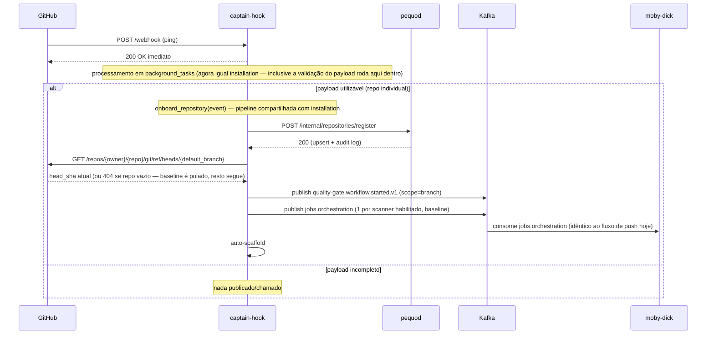
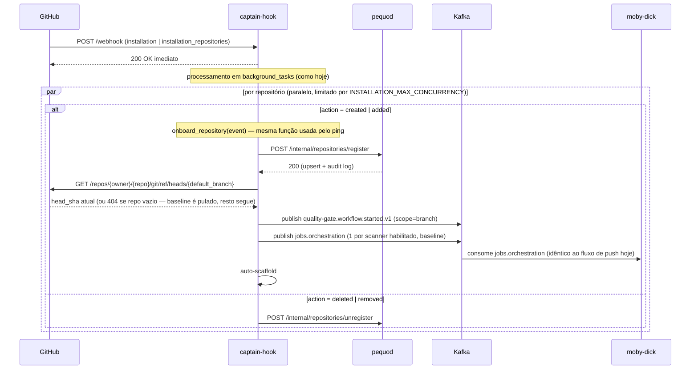

# Proposta: registro de repositório via REST + Security Baseline em `ping`/`installation`

> **Status: implementada.** Fase A+B mergeadas no captain-hook em
> 2026-09-15 (PR #44) — o endpoint REST correspondente no pequod já
> estava no ar (PR #55, mencionado no changeset abaixo). Este documento
> permanece como registro histórico da especificação e das decisões
> tomadas durante o design; o comportamento atual está descrito em
> [captain-hook.md](../captain-hook.md#como-ping-e-installation_repositories-são-processados-sequência).
> Discussão original: `decisions.md` → seção "Open questions", item
> "Confiabilidade do producer em `installation`/`installation_repositories`"
> (levantado 2026-09-10/11).

## Contexto (estado atual, confirmado no código em 2026-09-11)

Hoje `ping` e `installation`/`installation_repositories` (captain-hook)
fazem **só uma coisa**: registrar/desregistrar o repositório no inventário
do pequod, via Kafka (`repository.registered.v1`/`repository.unregistered.v1`,
produtor captain-hook, consumidor pequod — confirmado como único par
producer/consumer desses tópicos, sem terceiros dependendo deles).

Isso tem três lacunas: confiabilidade, escopo e consistência do padrão de
resposta ao GitHub.

1. **Confiabilidade:** `ping` propaga falha de publish Kafka pra resposta
   HTTP do webhook (GitHub reentrega). Mas `installation`/`installation_repositories`
   roda em `background_tasks` — depois do `200 OK` já devolvido ao GitHub —
   e `_publish_registrations_sequentially`/`_publish_unregistrations_sequentially`
   (`captain-hook/controller/installation_controller.py`) capturam a exceção
   por repositório, logam e seguem. Se o Kafka cair nesse momento, o lote
   inteiro nunca é publicado: sem DLQ possível (mensagem nunca saiu do
   captain-hook), sem retry, e o GitHub não reentrega (do lado dele, o
   webhook já teve sucesso).
2. **Escopo:** quando a App é instalada num repo/org, ou quando `ping`
   dispara, hoje **nada roda scanner nenhum** no `main` do repositório —
   só o registro no inventário. O primeiro Security Baseline (scope=`branch`)
   só acontece no próximo `push` na default branch, o que pode nunca
   acontecer logo após o onboarding. Além disso, o auto-scaffold (PR
   sugerindo lint/CI de baseline) hoje só dispara pelo `ping` individual
   (`ping_controller.py:52-58`) — repositórios registrados em massa via
   `installation`/`installation_repositories` nunca recebem esse PR
   automaticamente, só via endpoint manual (`repository_scaffold_handler.py`).
3. **Consistência de resposta ao GitHub (levantado 2026-09-11):**
   `installation`/`installation_repositories` já respondem `200 OK`
   **antes** de processar — `webhook_controller.py` agenda a função
   inteira (`process_installation_event`/`process_installation_repositories_event`)
   como `background_tasks.add_task(...)`, sem nenhuma lógica síncrona no
   meio; toda decisão (action, lista de repos) roda dentro do próprio
   background task. Já `ping` hoje é diferente: `webhook_controller.py`
   dá `await process_ping_event(...)` **síncrono**, e essa função não é só
   parsing — ela já inclui um `await publisher.publish(...)` real (Kafka,
   I/O de rede) **aguardado antes do `200`** (`ping_controller.py:35-39`).
   Só o auto-scaffold roda em `background_tasks` hoje. Isso já era uma
   assimetria real (não só de forma) entre os dois fluxos, e com a Fase
   A/B abaixo o caminho síncrono do `ping` cresceria ainda mais (REST pro
   pequod + `GET` no GitHub pro HEAD sha + 2 publishes Kafka antes do
   `200`) — risco real de aproximar do timeout de webhook do GitHub
   (~10s) num pequod ou GitHub API mais lentos.

## Objetivo desta mudança

- **Fase A:** eliminar a Kafka do caminho captain-hook→pequod pra
  registro/desregistro de repositório, substituindo por REST síncrono
  (mesmo padrão do Quality Gate — ver `decisions.md` §16). Resolve a
  lacuna de confiabilidade (1).
- **Fase B:** captain-hook passa a disparar um Security Baseline
  (scope=`branch`) imediatamente no `ping` e no `installation`/
  `installation_repositories` (ações de registro), reaproveitando 100% da
  máquina que já existe pro `push` (`quality-gate.workflow.started.v1` +
  `jobs.orchestration`, consumida pelo moby-dick exatamente como hoje).
  **Também** passa a disparar o auto-scaffold (mesma função já usada pelo
  `ping`) dentro do loop de `installation`/`installation_repositories`,
  fechando a lacuna descrita no item (2) do Contexto — levantado e
  confirmado em 2026-09-11.
- **Fase A/B, ajuste de consistência:** `ping` passa a responder `200 OK`
  **antes** de processar, igual `installation` — `webhook_controller.py`
  passa a agendar a função inteira do `ping` (parsing + registro +
  baseline + scaffold) como `background_tasks.add_task(...)`, sem
  nenhuma lógica síncrona no meio, exatamente como `installation` já faz
  hoje. Resolve a lacuna (3).
- **Fase A/B, concorrência do loop de `installation`:** o loop por
  repositório deixa de ser sequencial e passa a rodar em paralelo, com um
  limite (`INSTALLATION_MAX_CONCURRENCY`) — decidido em 2026-09-11, ver
  "Decisões já fechadas".
- **Fase B, tratamento de repo vazio:** `get_ref_sha` (reaproveitado pra
  buscar o HEAD sha) passa a tratar `404` como "repo sem commits ainda",
  em vez de propagar erro — achado confirmado em 2026-09-14.
- **Fase B, pipeline compartilhada:** com as mudanças acima, `ping` e
  `installation` passam a executar **exatamente a mesma sequência**
  (registro → HEAD sha → baseline → scaffold) pra cada repositório —
  diferindo só em quantidade (1 vs. N) e no branch de desregistro (só
  `installation` tem). Confirmado em 2026-09-15: extrair essa sequência
  pra uma única função compartilhada (`onboard_repository`), eliminando a
  duplicação entre `ping_controller.py` e `installation_controller.py`.
  Ver "Decisões já fechadas" e Changeset da Fase B.

## Não-objetivo

- Não muda nada em `pull_request`/`push` (scope=`pr` continua igual).
  `push_controller.py` continua sem tocar em registro/inventário (confirmado
  em 2026-09-14 — nunca chamou `repository.registered.v1` nem qualquer
  upsert; só monta `BaselineContext` e publica `workflow.started`/
  `jobs.orchestration`, assumindo que o repo já está registrado, ou
  contando com o self-heal do pequod — ver "Pontos abertos", item 6).
- Não muda o moby-dick. Ele continua scanner-agnóstico e não sabe (nem
  precisa saber) se um `jobs.orchestration` veio de um `push` real ou de
  um `ping`/`installation` — pra ele é o mesmo `JobDescriptor` com
  `scope=branch`.
- Não muda a lógica interna de `process_repository_scaffold`
  (`repo_scaffold_controller.py`) — a função já é agnóstica à origem do
  trigger (só recebe owner/repo), só passa a ser chamada de um lugar novo
  (`onboard_repository`, em vez de diretamente por `ping_controller.py`/
  `installation_controller.py`). Continua sujeita ao mesmo bug de repo
  vazio no scaffold manual (fora do escopo corrigir o scaffold em si aqui
  — só o `get_ref_sha` usado pelo fluxo novo de baseline).
- Não muda o comportamento de upsert + audit log do pequod no registro
  (ver "Pontos abertos", item 4 — questionado se é necessário, mas não
  decidido/removido nesta proposta).
- Não muda o self-heal mínimo de `applications` feito por
  `finding_repo.py::_resolve_application_id` durante ingestão de
  `findings.raw` (ver "Pontos abertos", item 6).
- Não trata `installation` com `action=suspend`/`unsuspend` (ver "Pontos
  abertos", item 7 — lacuna pré-existente, não introduzida por esta
  proposta).
- Não implementa controle proativo de rate limit da API do GitHub (ver
  "Pontos abertos", item 8).
- Não implementa "listar PRs" nem o redesenho do `/live-info` — são ideias
  registradas separadamente em `decisions.md` (Open questions).
- Não implementa tópicos Kafka por scanner — ideia registrada
  separadamente em `decisions.md` (Open questions), sem decisão tomada.

## Decisões já fechadas (não reabrir sem motivo novo)

| Decisão | Escolha | Por quê |
|---|---|---|
| Estratégia de corte | **Cutover direto** | Volume baixo, sem terceiros consumindo os tópicos hoje. Sem dual-write/feature-flag temporário. |
| Auth do novo endpoint no pequod | **Dependency genérica de service token** | Substitui o padrão duplicado (`require_moby_dick_service_token`, e equivalente do tars-ai) por uma única `require_service_token(*allowed)` reutilizável — inclusive pro futuro BFF (ver `decisions.md`, item "BFF"). |
| `ping`/`installation` ainda precisam de Kafka? | **Sim, pra moby-dick** (Fase B) | Só a comunicação captain-hook↔pequod perde Kafka. Captain-hook↔moby-dick continua Kafka — moby-dick nunca consumiu os tópicos de registro, então não há nada a preservar aí; o que muda é que captain-hook passa a *também* publicar `jobs.orchestration`/`workflow.started` a partir desses dois eventos, não só do `push`. |
| Registro deveria passar por um tópico Kafka consumido pelo moby-dick, em vez de REST direto ao pequod? | **Não** | Discutido explicitamente (2026-09-11). Trocar o destino do publish de "pequod" pra "moby-dick" **não resolve** a lacuna de confiabilidade (1) — o produtor (`captain-hook`) continua sendo o mesmo `publisher.publish()` dentro do mesmo loop de `background_tasks` que hoje engole falha silenciosamente; o problema nunca foi o consumidor. REST com retry embutido no `PequodClient` resolve porque tenta de novo *antes* de desistir, sem depender do broker estar de pé. Além disso, pequod já é chamado diretamente por 3 serviços hoje (moby-dick `/evaluate`, tars-ai `/integrations/tars/*`, heimdall-dashboard `/api/v1/*`), captain-hook virar o 4º não quebra padrão nenhum, é exatamente o cenário que motivou a auth genérica (linha acima). O que o rascunho de "tópico + moby-dick consome N repos" descreve **já existe** para o disparo de scan: é o `jobs.orchestration` da Fase B, que já é consumido por um único `JobConsumer` no moby-dick, unificado entre push/PR/ping/install, sem necessidade de tópico novo. |
| Sonar (e demais scanners) reutilizável entre push/PR/ping/install | **Já é hoje** | `build_job`/`build_baseline_job` de cada scanner (`adapter/wire_out/scanners/*.py`) já são agnósticos à origem do trigger — não precisam mudar. |
| `ping` deve responder o GitHub antes ou depois de processar (registro + baseline)? | **Antes — `background_tasks`, igual `installation`** (levantado 2026-09-11) | Fase A/B tornam o caminho síncrono do `ping` mais pesado (1 REST pro pequod + 1 GET no GitHub + 2 publishes Kafka antes do `200`), o que aproxima do timeout de webhook do GitHub. `installation` já usa esse padrão hoje. Trade-off aceito: falha deixa de propagar pro GitHub (sem reentrega automática) — mitigado pelo retry já embutido no `PequodClient` (Fase A) e pelo log de erro; é o mesmo trade-off que `installation` já opera com hoje, só que agora com retry, que não existia antes. |
| A validação do payload do `ping` (decidir se é "payload utilizável") deve rodar antes do `200` (síncrona) ou dentro do `background_tasks`, igual `installation`? | **Dentro do `background_tasks`, sem etapa síncrona nenhuma** (levantado 2026-09-11) | `installation`/`installation_repositories` nunca tiveram etapa síncrona de validação — `webhook_controller.py` sempre agendou a função inteira como background task, e a decisão de `action`/lista de repos roda lá dentro (`installation_controller.py:40`). Parsing de payload é barato e sem I/O, então não há razão funcional pra fazer isso antes do `200` — fazer `ping` decidir "payload utilizável" dentro do próprio background task, exatamente como `installation` decide `action`, deixa os dois fluxos estruturalmente idênticos: recebe webhook → agenda função inteira como background → responde `200` — zero lógica no meio, em ambos. |
| Auto-scaffold deve rodar também em `installation`/`installation_repositories`, não só em `ping`? | **Sim** (levantado 2026-09-11) | Hoje o scaffold só dispara pelo `ping` porque foi implementado assim desde o início, sem relacao com REST/Kafka — repositórios que entram em massa via `installation`/`installation_repositories` nunca recebem esse PR automaticamente (só endpoint manual). Como `process_repository_scaffold` já é agnóstica à origem (só recebe owner/repo), a extensão é chamar a mesma função dentro do loop de `installation_controller.py`, sob a mesma flag `ENABLE_REPO_SCAFFOLD_PR` (default `False`) que já protege o `ping` hoje. |
| O loop por repositório de `installation`/`installation_repositories` deve ser sequencial ou paralelo? | **Paralelo, com limite de concorrência** (`INSTALLATION_MAX_CONCURRENCY`, decidido em 2026-09-11) | Sequencial (o comportamento de hoje) fica cada vez mais lento com a Fase B somada — cada repo agora também dispara N jobs de scanner e até 3 chamadas de API do GitHub pro scaffold, tudo isso multiplicado pelo número de repositórios da instalação. Rodar em paralelo com um `asyncio.Semaphore(settings.installation_max_concurrency)` (mesmo espírito do `SCANNER_MAX_CONCURRENCY` do moby-dick) reduz o tempo total sem sobrecarregar pequod/GitHub API/Kafka de uma vez só. Cada tarefa por repositório mantém seu próprio try/except (1 falha não aborta as outras, mesma filosofia de hoje), só que agora rodando concorrentemente em vez de uma atrás da outra. |
| `get_ref_sha` deve tratar `404` (repo vazio) como erro ou como "sem baseline ainda"? | **Como "sem baseline ainda" — retorna `None`, não propaga exceção** (confirmado 2026-09-14) | Hoje `get_ref_sha` (`github_write_client.py:229-232`) só espera `200` e deixa `404` virar `HTTPError`. Isso já existia (usado pelo scaffold manual), mas a proposta faz essa chamada rodar **automaticamente** em todo `ping`/`install`, tornando muito mais provável bater nisso (repo criado sem commit ainda, App instalada logo em seguida). O padrão certo já existe em outras chamadas do mesmo client (`get_file_contents`, `branch_exists`: `expected_status={200, 404}`, retornam `None` no 404) — só não estava aplicado aqui. Corrigir isso como parte do Changeset da Fase B (não é mudança de escopo, só fecha um buraco que a própria proposta expõe). |
| `ping` e `installation` devem manter cada um sua própria implementação de registro+baseline+scaffold, ou compartilhar uma única pipeline? | **Compartilhar — novo módulo `controller/repository_onboarding.py::onboard_repository`** (confirmado 2026-09-15) | Depois de todas as decisões acima, `ping` e `installation` executam a mesma sequência pra cada repositório (registro REST → HEAD sha → baseline → scaffold), diferindo só em cardinalidade (1 vs. N) e no branch de desregistro. Manter duas implementações dessa sequência (uma em cada controller) arriscaria divergência futura (ex. corrigir um bug só num dos dois lugares) e já seria duplicação desnecessária no dia 1. `ping_controller.py` chama `onboard_repository` **uma vez**; `installation_controller.py` chama a mesma função **N vezes em paralelo** (dentro do `asyncio.Semaphore`). O branch de desregistro (`unregister_repository`) continua simples e não entra nessa função — desregistro nunca dispara baseline/scaffold, não há lógica pra compartilhar aí. |

## Fluxo proposto

Em ambos os diagramas abaixo, toda chamada captain-hook→pequod
(`POST /internal/repositories/register`/`/unregister`) é **REST
síncrono, autenticado via header `X-Service-Token`** — mecanismo único,
não repetido seta a seta. Os dois fluxos (`ping` e `installation`) publicam
exatamente os **mesmos dois tópicos Kafka** pro Security Baseline, na
mesma ordem — `quality-gate.workflow.started.v1` e `jobs.orchestration`
(nomes confirmados em `captain-hook/config/settings.py` e idênticos aos
já documentados em `kafka-topics.md`) — e, a partir desta proposta, os
dois também disparam o mesmo auto-scaffold ao final. Os dois diagramas
são agora **estruturalmente idênticos**: recebe webhook → responde `200`
imediato — zero lógica síncrona no meio — → tudo (validação de payload
incluída) roda dentro de `background_tasks`. O consumo do `jobs.orchestration`
pelo moby-dick só acontece no branch de registro (`ping` com payload
utilizável / `installation` com `action=created|added`) — nunca no
branch de desregistro, que não publica esse tópico.

> **Toda a sequência dentro dos dois blocos `alt ... = created | added`
> abaixo (registro → HEAD sha → publish Kafka → scaffold) é, no
> código, a mesma função:** `controller/repository_onboarding.py::onboard_repository`
> (novo módulo, decidido em 2026-09-15 — ver "Decisões já fechadas" e o
> Changeset da Fase B). `ping_controller.py` chama essa função uma vez
> por webhook; `installation_controller.py` chama a mesma função uma vez
> por repositório, em paralelo (`INSTALLATION_MAX_CONCURRENCY`). Os dois
> diagramas abaixo desenham a mesma caixa preta duas vezes porque é
> literalmente o mesmo código rodando 1x ou Nx.

> **Atenção — não confundir nome do tópico com `event_type` do payload:**
> `quality-gate.workflow.started.v1` (com hífen e sufixo `.v1`) é o nome
> do **tópico Kafka** — é o que se usa pra assinar/configurar o consumer.
> Dentro do **payload** dessa mensagem, o campo `event_type` carrega uma
> string ligeiramente diferente: `quality_gate.workflow.started`
> (underscore, sem `.v1`) — ver `wire/schemas/quality_gate_v1.py`. São
> dois identificadores distintos que coincidem parcialmente; quem for
> implementar não deve copiar um no lugar do outro.

> **Por que existe o `GET /repos/{owner}/{repo}/git/ref/heads/{default_branch}`:**
> `push_controller.py` monta o `BaselineContext` direto do payload do
> webhook, porque `push` traz o `head_sha` pronto no campo `after`.
> `ping`/`installation`/`installation_repositories` **não** têm esse
> campo — não houve push nenhum, só registro/instalação. O nome da
> default branch **já vem no payload** desses webhooks também
> (`repository.default_branch`), sem precisar de API. O que falta é só o
> `head_sha` — o commit que está na ponta dessa branch agora — e isso só
> a API do GitHub dá: `GET /repos/{owner}/{repo}/git/ref/heads/{default_branch}`
> devolve o ref atual, de onde se extrai o sha. Sem esse `head_sha` não
> dá pra montar o `BaselineContext`/`JobDescriptor` que o moby-dick espera.
>
> **Achado à parte, confirmado em 2026-09-14 — repo vazio quebra essa
> chamada:** `get_ref_sha` hoje só espera `200`; um repositório sem
> nenhum commit ainda não tem ref de branch, e a API devolve `404`, que
> vira `HTTPError` não tratado. Como esta proposta faz essa chamada rodar
> automaticamente em todo `ping`/`install` (não só no scaffold manual,
> onde já existia o mesmo problema), corrigir isso entrou no Changeset
> da Fase B: `get_ref_sha` passa a aceitar `404` e retornar `None`
> (mesmo padrão já usado por `get_file_contents`/`branch_exists` no
> mesmo client), e o `onboard_repository` pula o baseline com log claro
> ("repo sem commits ainda") em vez de quebrar o resto do processamento
> desse repositório.

> **O que significa `PQ-->>CH: 200 (upsert + audit log)`:**
> É a resposta do novo endpoint `/internal/repositories/register` no
> pequod. Internamente (`process_repository_registered`, lógica
> **inalterada** por esta proposta — só muda quem a invoca) ele faz duas
> coisas na **mesma transação** de banco: (1) `upsert` na tabela
> `applications`, com `ON CONFLICT (repository_provider, repository_external_id)
> DO UPDATE` — chamar duas vezes pro mesmo repo não duplica linha, só
> atualiza os campos; (2) `INSERT` imutável numa tabela de audit log,
> registrando o evento de registro/atualização. Se o insert do audit log
> falhar, o upsert também é revertido (mesma transação) — os dois ficam
> sempre em sincronia. É exatamente o mesmo comportamento de hoje (quando
> isso ainda é disparado por consumer Kafka); a Fase A só troca o
> mecanismo de invocação (Kafka consumer → handler REST), não a lógica.
> Se o audit log for considerado desnecessário no futuro (ver "Pontos
> abertos", item 4), essa resposta mudaria pra só `200 (upsert)`.
>
> **Achado à parte, fora do escopo desta proposta:** o texto do audit log
> gravado hoje usa literalmente as strings `"application.registered_via_ping"`/
> `"application.updated_via_ping"`, mesmo quando o registro originou de um
> `installation`/`installation_repositories` (já hoje, antes desta
> proposta — o consumer é o mesmo pra ambos os triggers). Ou seja, o
> histórico de auditoria já está impreciso pra repositórios registrados em
> massa. Não corrigido aqui porque foge do escopo (REST + baseline); vale
> um radar/fix separado em `decisions.md`.
>
> **Achado à parte, confirmado em 2026-09-14 — registro "capenga" via
> self-heal do finding:** o pequod tem uma rede de segurança pra não
> travar a ingestão de `findings.raw` quando o repo nunca foi registrado:
> `finding_repo.py::_resolve_application_id` faz um upsert mínimo em
> `applications` (só `repository_provider`, `repository_external_id`,
> `repository_full_name`, `name`, `repository_url` — marcado no metadata
> como `"updated_from": "pequod_finding_dual_write"`), já que
> `scans.application_id` é `NOT NULL` com FK. Isso significa que **um
> `push` pode criar sozinho uma `application` capenga**, sem `owner_name`,
> `default_branch`, `language`, `description`, `is_active` — campos que
> só vêm do registro oficial (`process_repository_registered`, via
> `ping`/`installation`). `push_controller.py` **nunca** chama registro
> (confirmado — nenhuma referência a `register`/`registered`/`upsert` no
> arquivo); ele só monta `BaselineContext` e publica pro Quality Gate,
> assumindo (ou não se importando) que o registro já aconteceu antes. Se
> um `push` chegar antes de qualquer `ping`/`installation` pro mesmo repo
> (ex. app instalada mas evento de registro ainda não processado, ou
> configuração manual de webhook sem instalar a App), o repo fica
> "capenga" até um registro oficial chegar depois e sobrescrever. Ver
> "Pontos abertos", item 6.

### `ping`

### `installation` / `installation_repositories`

Note que a chamada REST (registro) e a publicação Kafka (baseline) são
**independentes** — não há ordem obrigatória entre elas, podem correr em
paralelo. A única dependência real de ordem é a de sempre: publicar
`quality-gate.workflow.started.v1` antes (ou junto) dos `jobs.orchestration`
do mesmo `workflow_id`, exatamente como `push_controller.py` já faz hoje —
e mesmo essa não é rígida, porque `pequod/controller/quality_gate_controller.py::process_quality_gate_scanner_completed`
já tolera um `scanner.completed` chegando antes do `workflow.started`
(cria um run "provisório"). O auto-scaffold não tem dependência de ordem
com o registro/baseline — só precisa do owner/repo, poderia até rodar em
paralelo, mas fica após por simplicidade (mesma ordem do `ping`). O
`K->>MD` fica dentro do branch de registro nos dois diagramas (não depois
do bloco inteiro) porque é exatamente aonde a publicação acontece — o
branch de desregistro nunca publica `jobs.orchestration`, e o consumo
pelo moby-dick é contínuo/por mensagem, não um evento agregado que
acontece uma vez depois de tudo terminar.

O `loop` do `installation` virou `par` (bloco Mermaid pra fluxos
concorrentes) pra refletir a mudança: cada repositório processa em
paralelo, até o limite de `INSTALLATION_MAX_CONCURRENCY` tarefas ao mesmo
tempo (implementado com `asyncio.Semaphore` — ver Changeset). Nãoé mais
sequencial repo-por-repo como no diagrama antigo.

Com o ajuste de consistência, `ping` e `installation` agora seguem o
**mesmo padrão de resposta, sem nenhuma diferença estrutural**: receber
webhook → `200 OK` imediato (zero lógica síncrona no meio, nem parsing)
→ tudo — validação de payload, `onboard_repository` (REST pequod, GET
GitHub, publish Kafka, scaffold) — dentro de `background_tasks`.

## Changeset — Fase A (registro via REST)

### pequod

| Arquivo | Mudança |
|---|---|
| `diplomat/http_in/service_auth.py` (novo) | `require_service_token(*allowed: str)` — dependency factory genérica. Lê os tokens conhecidos (`moby_dick_service_token`, `tars_service_token`, `captain_hook_service_token`) das settings, valida `X-Service-Token` contra os serviços listados em `allowed` com `hmac.compare_digest`. Se nenhum token esperado estiver configurado (dev local), não exige auth — mesmo comportamento do `require_moby_dick_service_token` atual. |
| `diplomat/http_in/moby_dick_auth.py` | Removido — callers passam a usar `require_service_token("moby-dick")`. |
| (arquivo equivalente do tars-ai, se existir um dedicado) | Idem — migra pra `require_service_token("tars-ai")`. |
| `diplomat/http_in/repository_registration_sync_handler.py` (novo) | Dois handlers finos: `handle_register_repository(payload: dict) -> dict` e `handle_unregister_repository(payload: dict) -> dict`. Fazem `RepositoryRegisteredEvent.model_validate(payload)` / `RepositoryUnregisteredEvent.model_validate(payload)` e chamam direto `process_repository_registered`/`process_repository_unregistered` (`controller/repository_registration_controller.py` e `repository_unregistration_controller.py` — **zero mudança** nesses dois controllers, upsert idempotente + audit log na mesma transação continuam iguais — ver "Pontos abertos", item 4, pra revisão futura do audit log). Retornam `{"status": "ok", "application_id": ...}`. |
| `diplomat/http_in/captain_hook_integration_router.py` (novo) | `APIRouter(prefix="/internal/repositories", dependencies=[Depends(require_service_token("captain-hook"))])`; rotas `POST /register` → `handle_register_repository`, `POST /unregister` → `handle_unregister_repository`. |
| `config/settings.py` | + `captain_hook_service_token: str = ""`. Remove `topic_repository_registered`, `topic_repository_unregistered`, `topic_repository_registration_dlq`, `topic_repository_unregistration_dlq`, `kafka_repository_registration_consumer_group`, `kafka_repository_unregistration_consumer_group`. |
| `diplomat/http_server.py` | Registra `captain_hook_integration_router`. Remove `RepositoryRegistrationConsumer`/`RepositoryUnregistrationConsumer` do `lifespan` (imports, criação, `start()`/`stop()`, `app.state.*`). |
| `diplomat/messaging/repository_registration_consumer.py` | Apagar. |
| `diplomat/messaging/repository_unregistration_consumer.py` | Apagar. |
| `controller/repository_registration_controller.py` | Sem mudança de lógica — só muda quem chama (`process_repository_registered` passa a ser invocado pelo handler HTTP, não pelo consumer). |
| `controller/repository_unregistration_controller.py` | Idem. |
| `diplomat/http_in/quality_gates_router.py` / `tars_integration_router.py` | Trocar `Depends(require_moby_dick_service_token)`/equivalente por `Depends(require_service_token("moby-dick"))` / `Depends(require_service_token("tars-ai"))`. |

### captain-hook

| Arquivo | Mudança |
|---|---|
| `diplomat/http_out/pequod_client.py` (novo) | Espelha `moby-dick/diplomat/http_out/pequod_client.py`: classe `PequodClient` com `register_repository(event: RepositoryRegisteredEvent) -> None` e `unregister_repository(event: RepositoryUnregisteredEvent) -> None`. `POST {pequod_base_url}/internal/repositories/register`/`/unregister`, header `X-Service-Token: {pequod_service_token}`, retry exponencial em 429/5xx/erro de conexão (`pequod_api_max_attempts`/`pequod_api_retry_base_seconds`), timeout `pequod_api_timeout_seconds`. Levanta erro (não engole) em falha definitiva — quem chama decide o que fazer. |
| `config/settings.py` | + `pequod_base_url`, `pequod_service_token`, `pequod_api_timeout_seconds: float = 10.0`, `pequod_api_max_attempts: int = 4`, `pequod_api_retry_base_seconds: float = 0.5`, **+ `installation_max_concurrency: int = 5`** (novo, controla o paralelismo do loop de `installation`). |
| `controller/webhook_controller.py` | O branch de `ping` deixa de fazer `await process_ping_event(...)` síncrono e passa a fazer `background_tasks.add_task(process_ping_event, webhook, settings=settings, ...)`, retornando `200` na sequência — dispatch fica idêntico ao de `installation`/`installation_repositories` (linhas 51-68, já usam `background_tasks.add_task`). |
| `controller/ping_controller.py` | Fica bem mais fino. `process_ping_event` roda **inteira** dentro do background task: só faz o parsing puro (`to_repository_registered_event`, inalterado) pra decidir "payload utilizável"; se sim, chama `await onboard_repository(event, ...)` (novo módulo compartilhado, ver Fase B) dentro de um try/except — falha loga (`logger.exception`), não propaga pro HTTP. Não faz mais `publisher.publish` direto nem orquestra registro/baseline/scaffold ela mesma — isso tudo virou responsabilidade do `onboard_repository`. |
| `controller/installation_controller.py` | Monta a lista de eventos de registro/desregistro exatamente como hoje (`repositories_to_register_from_installation`/`repositories_to_unregister_from_installation`/`enrich_registrations_with_repository_details` — inalterados). Pra cada evento de **registro**, cria uma coroutine que chama `await onboard_repository(event, ...)` (mesmo módulo novo, ver Fase B); pra cada evento de **desregistro**, cria uma coroutine que só chama `get_pequod_client().unregister_repository(event)` (sem baseline/scaffold — não faz sentido escanear um repo que acabou de ser desregistrado). Todas as coroutines (registro + desregistro juntas) rodam via `asyncio.gather(*tasks)`, cada uma adquirindo um `asyncio.Semaphore(settings.installation_max_concurrency)` antes de rodar, cada uma com seu próprio try/except (1 falha não aborta as outras). As antigas `_publish_registrations_sequentially`/`_publish_unregistrations_sequentially` deixam de existir como funções separadas — viram um único orquestrador concorrente por repositório (ex. `_process_repositories_concurrently`). |
| `diplomat/messaging/kafka_producer.py` | Sem mudança — continua em uso por `jobs.orchestration`/`quality-gate.workflow.started.v1`, agora chamado de dentro de `onboard_repository` em vez de diretamente pelos controllers. |

## Changeset — Fase B (Security Baseline + auto-scaffold + pipeline compartilhada)

### captain-hook

| Arquivo | Mudança |
|---|---|
| `diplomat/http_out/github_write_client.py` | **Fix** — `get_ref_sha()` (linhas 229-232) passa a aceitar `expected_status={200, 404}` e retornar `None` no `404`, seguindo o mesmo padrão já usado por `get_file_contents()`/`branch_exists()` no mesmo arquivo. Corrige o achado de repo vazio confirmado em 2026-09-14. |
| `adapter/wire_in/install_baseline_adapter.py` (novo) | `to_baseline_context_from_registration(event: RepositoryRegisteredEvent, head_sha: str) -> BaselineContext` — monta o mesmo `BaselineContext` que `push_adapter.to_baseline_context` produz a partir de um push, só que a partir dos dados já disponíveis no evento de registro (que já inclui `default_branch`) + do `head_sha` buscado via API. |
| `controller/baseline_jobs.py` (novo) | Extrai `_build_baseline_jobs`/`to_baseline_workflow_started_event` de `push_controller.py` pra um módulo compartilhado — usado por `push_controller.py` (refatorado, comportamento idêntico) e por `onboard_repository` (novo, abaixo). |
| `controller/repository_onboarding.py` (novo) — **núcleo compartilhado entre `ping` e `installation`** | `async def onboard_repository(event: RepositoryRegisteredEvent, *, pequod_client: PequodClient, github_client: GitHubWriteClient, publisher: EventPublisher, settings: Settings) -> None`. Passos, nessa ordem: **(1)** `await pequod_client.register_repository(event)` — REST síncrono da Fase A, retry já embutido no client; erro definitivo propaga pro caller decidir (mesma filosofia de isolamento por repositório que `ping_controller.py`/`installation_controller.py` já aplicam no try/except deles). **(2)** se `event.default_branch` estiver preenchido: busca `head_sha = await github_client.get_ref_sha(owner, repo, event.default_branch)` (com o fix do 404 acima); se `None` (repo vazio), loga INFO ("repo sem commits ainda, baseline pulado") e pula direto pro passo 3, sem publicar nada no Kafka; se preenchido, monta `BaselineContext` (`to_baseline_context_from_registration`) e publica `workflow.started` + `jobs.orchestration` via `baseline_jobs.py`. **(3)** se `settings.enable_repo_scaffold_pr`, chama `process_repository_scaffold(owner, repo, ...)` (função existente, **zero mudança** nela). É a mesma pipeline que `ping` (1x) e `installation` (Nx, em paralelo) passam a compartilhar — corrigir um bug aqui corrige nos dois fluxos de uma vez, sem risco de divergência. |

**Reaproveitamento confirmado:** nenhuma mudança em `adapter/wire_out/scanners/*.py` (cada builder já tem `build_baseline_job` agnóstico à origem), nenhuma mudança em `repo_scaffold_controller.py` (`process_repository_scaffold` já é agnóstica à origem do trigger, só recebe owner/repo — só muda quem a chama, agora `onboard_repository` em vez de `ping_controller.py`/`installation_controller.py` direto), nenhuma mudança em moby-dick, nenhuma mudança em pequod além da Fase A.

## Testes

- pequod: unit test de `require_service_token` (aceita serviço certo, rejeita token errado, rejeita serviço não-listado em `allowed`, modo dev sem token configurado). Integration test do router novo: registro cria `application`; registro duplicado (mesmo `repository_id`) faz upsert, não duplica; unregister faz soft delete; 401 sem token.
- captain-hook: unit test de `PequodClient` (retry em 5xx, propaga em 404, propaga depois de esgotar tentativas). **Novo, foco principal:** unit test de `onboard_repository` isolado (mockando `pequod_client`/`github_client`/`publisher`) cobrindo: registro ok + head_sha ok publica os dois tópicos e chama scaffold; registro ok + head_sha `None` (404) pula publish e vai direto pro scaffold; `register_repository` levanta erro e propaga (isolamento fica a cargo do caller). Unit test de `ping_controller`/`installation_controller` verificando que **ambos delegam pra `onboard_repository`** (mock da função, confirma chamada com o evento certo) em vez de reimplementar a sequência — evita regressão de divergência entre os dois fluxos. Cobre também: falha isolada não abortar o lote em `installation`; `ping` responder `200` mesmo quando o background task falha. Fase B: teste de que `BaselineContext` sintético (via `onboard_repository`) gera o mesmo formato de `JobDescriptor` que o caminho de `push` gera pro mesmo repo/branch (só o `trigger`/`delivery_id` diferem). **Novo:** teste de que `installation_controller.py` também dispara `unregister_repository` (sem passar por `onboard_repository`) pro branch de `deleted`/`removed`, respeitando `ENABLE_REPO_SCAFFOLD_PR` no scaffold que roda dentro de `onboard_repository`. **Novo:** teste de que `webhook_controller.py` agenda `process_ping_event` via `background_tasks.add_task` (não mais `await` direto) e responde `200` mesmo com payload de ping incompleto/inválido. **Novo:** teste de concorrência — com `INSTALLATION_MAX_CONCURRENCY=2` e um `installation` com 5 repositórios, confirmar que nunca mais que 2 coroutines (`onboard_repository`/`unregister_repository`) rodam ao mesmo tempo, e que uma falha isolada num repositório não impede os outros 4 de completar.
- pequod: teste de regressão pro self-heal — confirmar que um `push` (via `findings.raw`) pra um repo nunca registrado ainda cria a `application` capenga (comportamento preservado, não quebrado por esta proposta) e que um registro oficial subsequente sobrescreve os campos corretamente.
- Manual/staging: instalar a App num repo de teste (`aspm-vuln-lab` ou `clint-eastwood`) e confirmar: aplicação aparece no pequod imediatamente (sem esperar push), Security Baseline dispara e aparece Issue agregada no repo, `ping` de reconfiguração de webhook não duplica nada, `ping` responde `200` rapidamente mesmo com pequod/GitHub API lentos (validar com um delay artificial em staging). **Novo:** instalar a App num repo vazio (criado na hora, sem commit) e confirmar que não quebra nada — só pula o baseline. **Novo:** instalar a App numa org com vários repos de uma vez (`installation` created com `repositories` com N > 1) e confirmar que cada repo recebe PR de scaffold (com `ENABLE_REPO_SCAFFOLD_PR=true`), sem duplicar se rodar de novo, e que o tempo total cai em relação ao processamento sequencial.

## Ordem de deploy (dentro do cutover direto)

Mesmo sem dual-write, a ordem de deploy entre os dois serviços importa:

1. **pequod** primeiro: adiciona o endpoint novo, mas **mantém** os consumers Kafka de registro rodando nesse deploy (aditivo, não quebra nada ainda).
2. **captain-hook**: introduz `onboard_repository` (Fase B), troca publish por REST **e** move `ping` pra `background_tasks` (dispatch inteiro) **e** faz `installation` chamar `onboard_repository` no loop **e** paraleliza esse loop (`INSTALLATION_MAX_CONCURRENCY`) **e** corrige `get_ref_sha` pro caso de repo vazio — tudo no mesmo deploy, já que `ping_controller.py`/`installation_controller.py` mudam juntos pra apontar pro novo módulo. A partir daqui, os tópicos `repository.registered.v1`/`.unregistered.v1` deixam de receber mensagens.
3. **pequod**, follow-up: remove os consumers Kafka + tópicos/DLQs das settings (agora sim, seguro — confirmado que não há mais producer).

Dado que `onboard_repository` já nasce fazendo Fase A (registro) + Fase B (baseline/scaffold) juntas, não faz mais sentido separar os deploys de Fase A/Fase B do lado do captain-hook — vão no mesmo deploy do passo 2.

## Pontos abertos (decidir antes ou durante a implementação)

1. **Escopo da Fase B:** todo repositório instalado recebe Security Baseline imediato e PR de scaffold, sem exceção? Numa instalação em massa numa org grande, isso pode disparar dezenas/centenas de workflows de scan **e** dezenas/centenas de PRs de scaffold de uma vez — agora ainda mais rápido, já que o loop passa a ser paralelo (o scaffold já é protegido pela flag `ENABLE_REPO_SCAFFOLD_PR`, default `False` — baixo risco enquanto desligada; o Kafka + `SCANNER_MAX_CONCURRENCY` do moby-dick absorve o lado do baseline com backpressure natural). Vale confirmar se é o comportamento desejado ou se deveria ter algum controle adicional — ex. feature flag dedicada `ENABLE_BASELINE_ON_INSTALL` pro baseline, no estilo do `ENABLE_REPO_SCAFFOLD_PR` que o scaffold já tem. **Ainda sem decisão — recomendo um kill switch dedicado pro baseline, dado o precedente do próprio `ENABLE_REPO_SCAFFOLD_PR`.**
2. **Nomes finais de settings/endpoints/módulos** listados acima são propostos, não fechados — ajustar durante a implementação se algo já existir com nome diferente. Isso inclui o valor default de `installation_max_concurrency` (proposto `5`, sem benchmark real ainda) e o nome `repository_onboarding.py`/`onboard_repository`.
3. **Achado à parte, fora do escopo:** audit log de registro grava sempre `"application.registered_via_ping"`/`"application.updated_via_ping"` (`repository_registration_controller.py`), mesmo quando o trigger real foi `installation`/`installation_repositories` — já é assim hoje, antes desta proposta. Não corrigido aqui; vale registrar em `decisions.md` como fix separado.
4. **Audit log de registro/desregistro pode ser desnecessário** (levantado 2026-09-11): questionado se vale a pena manter o `INSERT` na tabela de audit log dentro de `process_repository_registered`/`process_repository_unregistered`, já que é mais uma escrita síncrona na mesma transação do upsert (acopla disponibilidade do endpoint à disponibilidade da tabela de audit). **Sem decisão agora** — anotado pra reavaliar depois; se for removido, simplifica a Fase A (menos coisa pra `zero mudança` preservar) e o achado do item 3 acima deixa de fazer sentido (não haveria mais audit log pra ficar impreciso).
5. **Paralelização e falhas concorrentes:** com N repositórios processando ao mesmo tempo (até `INSTALLATION_MAX_CONCURRENCY`), se vários falharem simultaneamente (ex. pequod fora do ar), os logs de erro também saem concorrentes — vale confirmar que o logging estruturado consegue distinguir qual repositório falhou em qual etapa sem se confundir (correlation id por repositório/coroutine, idealmente incluindo se veio de `ping` ou `installation`). Não deveria exigir mudança de design, só checar na implementação.
6. **Registro "capenga" via self-heal do finding pode persistir indefinidamente** (levantado 2026-09-14): se um `push` chegar pra um repo antes de qualquer `ping`/`installation` ser processado pra ele (ex. corrida entre o registro em background e um push muito rápido logo após a instalação, ou um webhook configurado manualmente sem passar pelo fluxo de instalação da App), o pequod cria uma `application` capenga via `finding_repo.py::_resolve_application_id` (só campos básicos, sem `owner_name`/`default_branch`/`language`/`is_active`). Essa proposta **não** cria nenhum mecanismo pra detectar/corrigir isso proativamente — depende de um registro oficial chegar depois e sobrescrever. Possíveis ajustes futuros, sem decisão tomada: (a) um job de reconciliação periódico que lista `applications` com `metadata.updated_from = "pequod_finding_dual_write"` e tenta re-registrar via GitHub API; (b) um alerta/métrica quando isso acontece; (c) captain-hook, ao processar `push`, checar/garantir registro também (mudaria o "não-objetivo" desta proposta). Fica anotado pra discussão futura, fora do escopo desta proposta.
7. **`installation` com `action=suspend`/`unsuspend` é ignorado** (confirmado 2026-09-14): `installation_controller.py` só trata `created`/`deleted` (e `installation_repositories` só `added`/`removed`) — qualquer outro `action`, inclusive `suspend`/`unsuspend`, só gera um log INFO e nada mais. Suspender a App sem desinstalar deixa os repositórios "ativos" no pequod indefinidamente, mesmo sem a App ter mais acesso real. Pré-existente, **não introduzido por esta proposta** — fica como radar separado, fora do escopo (REST + baseline). Possível ajuste futuro: tratar `suspend` como um desregistro parcial/flag de "acesso suspenso" (diferente de `deleted`, que é remoção definitiva) em `application_repo.py`.
8. **Rate limit da API do GitHub é só reativo** (confirmado 2026-09-14): `github_write_client.py` já trata retry em 429/403-rate-limit (via `Retry-After`/`X-RateLimit-Remaining`), mas não há controle de orçamento proativo entre chamadas em lote, nem logging/métrica de cota restante. Esta proposta aumenta o número de chamadas por repositório (registro REST + `GET` HEAD sha + até 3 do scaffold) multiplicado por N repositórios e agora rodando em paralelo (`INSTALLATION_MAX_CONCURRENCY`) — instalação em massa numa org grande fica mais perto de estourar a cota (5000/h padrão de installation token). Não corrigido aqui; vale um radar separado em `decisions.md` pra eventualmente adicionar throttling proativo ou observabilidade de `X-RateLimit-Remaining`.

## Documentação a atualizar depois da implementação

- `docs/captain-hook.md`: os dois diagramas sequenciais de `ping`/`installation` (adicionados no PR #19) passam a refletir REST + baseline + auto-scaffold via `onboard_repository` compartilhado + resposta imediata via `background_tasks` + paralelização do loop de `installation`. **Feito em 2026-09-16 — ver `docs/captain-hook-ping-install-rest`.**
- `docs/reference/kafka-topics.md`: remove `repository.registered.v1`/`.unregistered.v1` e as DLQs correspondentes. **Pendente.**
- `docs/reference/http-endpoints.md`: adiciona `/internal/repositories/register`/`unregister` no pequod; atualiza a lista de "Side effects" do `POST /webhook` do captain-hook; documenta que `ping` agora também responde antes de processar (como `installation`); documenta que `installation`/`installation_repositories` agora também pode abrir PR de scaffold e processa repositórios em paralelo. **Pendente.**
    - **Achado à parte, não relacionado a esta proposta:** esse mesmo arquivo hoje lista `github.events.raw` como side-effect "sempre" publicado pelo `/webhook` — esse tópico não existe no código (já corrigido em `architecture.md`/`kafka-topics.md`/`decisions.md`, mas este arquivo específico ficou de fora daquela correção). Vale um fix separado, pequeno, independente desta proposta.
- `docs/overview/decisions.md`: nova decisão numerada (ex. §19) documentando a mudança feita (incluindo a paralelização, o fix do `get_ref_sha` e a extração do `onboard_repository`); mover o item de "Open questions" pra "Resolvido"; adicionar radar novo pro achado do audit log `_via_ping` (item 3), pra revisão da necessidade do audit log em si (item 4), pro registro capenga via self-heal (item 6), pro `suspend`/`unsuspend` ignorado (item 7) e pro rate limit reativo (item 8) de "Pontos abertos" acima. **Pendente.**
- `docs/overview/repos.md`: responsabilidades do captain-hook mencionam "publicar registro/baixa via Kafka" — atualizar pra REST; mencionar processamento paralelo de `installation` e o novo `onboard_repository` compartilhado. **Pendente.**
