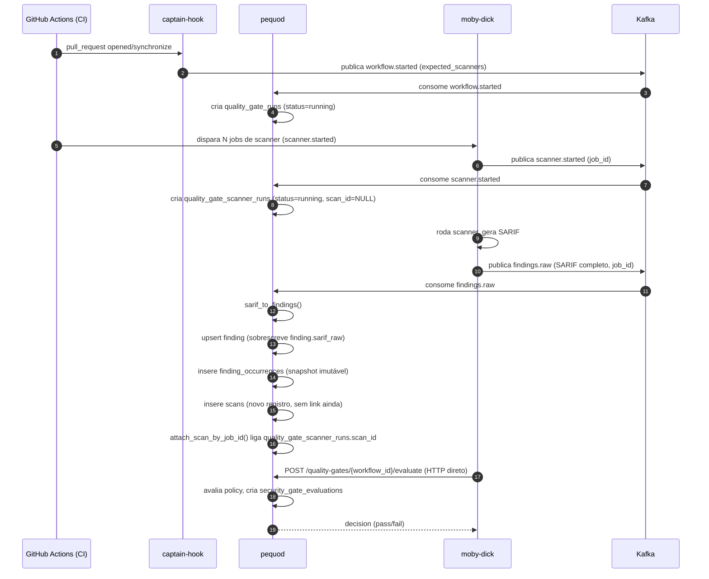
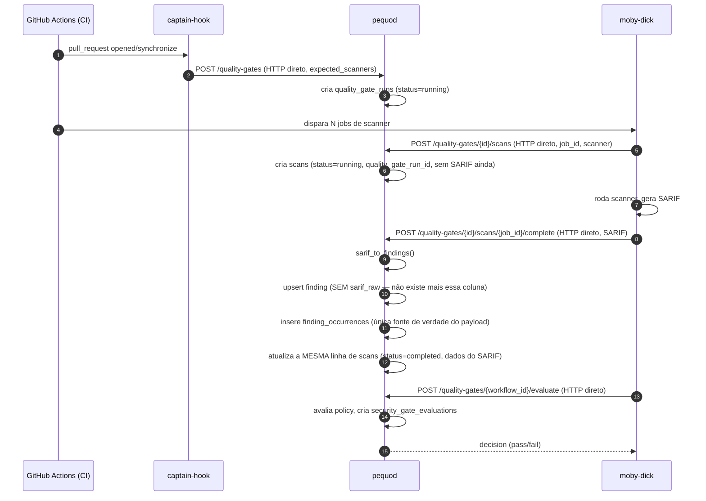

# Revisão do schema/fluxo de dados do Pequod

!!! danger "Discussão abortada (2026-08-27) — nenhuma mudança será implementada"
    Após mapear o impacto completo (Fases 1-3, arquivos afetados, riscos de migração), o usuário
    decidiu **não seguir com nenhuma das mudanças propostas neste documento** — o risco de mexer
    em schema de produção sem certeza total não compensa o ganho de enxugamento. Este documento
    fica preservado como **registro histórico da análise**, caso a discussão seja retomada no
    futuro com mais contexto/necessidade real. Nenhum código ou schema do pequod foi alterado em
    nenhum momento desta discussão — tudo abaixo é só análise.

!!! warning "Documento de discussão — nenhuma decisão foi implementada"
    Este documento acumula uma revisão em andamento do schema do Pequod, buscando enxugar
    tabelas redundantes e simplificar o fluxo de dados. **Não é uma decisão fechada** — é um
    rascunho vivo enquanto o schema é discutido item a item. Nenhuma mudança de schema/código
    descrita aqui foi implementada. Ver também [Schema do banco](../reference/database-schema.md)
    para o schema atual (real) completo.

## Contexto / motivação

Ao documentar o schema (22 tabelas), percebemos vários padrões de duplicação de dados
e tabelas intermediárias que talvez não precisem existir da forma como estão hoje.
Este documento existe para não perder o fio da meada enquanto discutimos item a item.

## Passo a passo visual: fluxo atual vs. fluxo idealizado

Combina as decisões já discutidas (#0 Kafka→HTTP, #1 sarif_raw, #2c fusão scans+scanner_runs)
num único comparativo, passo a passo.

### Fluxo atual



**Pontos de atrito no fluxo atual (numerados conforme os itens já discutidos):**

- Passos 2-6 e 7-11 usam **Kafka** para dois tópicos (`workflow.started`, `scanner.started`,
  `findings.raw`) — enquanto o passo 15 (avaliação do gate) já usa **HTTP direto**. Inconsistência
  de padrão de comunicação para o mesmo par de serviços (item #0).
- Passos 8 e 12 criam **duas linhas em duas tabelas diferentes** (`quality_gate_scanner_runs` e
  `scans`) que descrevem o mesmo scan, ligadas só depois via `job_id` (item #2c).
- Passo 10 sobrescreve `finding.sarif_raw`, dado que já existe (redundante) em `finding_occurrences`
  criado no mesmo passo (item #1).

### Fluxo idealizado (após as 3 decisões já discutidas)



**O que muda, passo a passo:**

| # | Fluxo atual | Fluxo idealizado |
|---|---|---|
| Transporte | 3 tópicos Kafka + 1 HTTP (inconsistente) | 100% HTTP direto (consistente, com retry) |
| Registro do scan | 2 linhas (`quality_gate_scanner_runs` + `scans`), ligadas depois por `job_id` | 1 linha em `scans`, criada no anúncio e atualizada na conclusão |
| Payload SARIF | 3 lugares (`finding.sarif_raw`, `scan_artifacts.inline_content`, `finding_occurrences.raw_payload`) | 2 lugares (`scan_artifacts.inline_content` + `finding_occurrences.raw_payload`) |
| Consumo do resultado | pequod é *consumer* Kafka de `findings.raw` | pequod expõe endpoint HTTP; moby-dick (ou um BFF) chama diretamente |

> Nota: o fluxo idealizado acima **não foi implementado** — é o desenho-alvo das decisões #0, #1
> e #2c registradas neste documento, dependente de aprovação e planejamento de migração antes de
> qualquer código ser alterado.

## Tabelas adicionais verificadas antes de fechar o plano (sem achados novos)

Antes de fechar o plano definitivo, revisamos `consolidated_risk_candidate` vs.
`consolidated_risk_finding`, `risk_exceptions` e `semantic_clustering_decision` — os únicos
grupos de tabelas ainda não aprofundados na revisão.

- **`consolidated_risk_finding` NÃO é redundante com `consolidated_risk_candidate` +
  `finding_cluster_member`.** Achado em `tars_integration_controller.py` (linha ~318): um cluster
  candidato pode ter N findings, mas a IA seleciona um **subconjunto** deles (`selected_findings`)
  como efetivamente compondo o risco consolidado — os demais findings do cluster podem ficar de
  fora (ex: considerados falso positivo dentro do próprio cluster). Essa seleção é informação
  genuína da decisão de IA, não derivável a partir do cluster inteiro. **Mantida como está.**
- **`risk_exceptions`** — usada ativamente (controller, handler HTTP, repo dedicados,
  `security_gate_evaluator.py` consome pra decidir policy). Funcionalidade real e distinta, sem
  sobreposição com outras tabelas. **Mantida como está.**
- **`semantic_clustering_decision`** — usada ativamente pelo fluxo de IA/clustering semântico
  (`semantic_clustering_repo.py`, `tars_integration_controller.py`). Sem sobreposição encontrada.
  **Mantida como está.**

## Plano definitivo de implementação (se e quando decidirmos seguir)

**Importante:** nada abaixo foi implementado. Este plano existe para ficar pronto para execução,
com sequenciamento pensado para minimizar risco (menor escopo primeiro), mas a decisão de quando
(ou se) implementar continua sendo do usuário, um item por vez.

### Ordem recomendada (menor → maior risco)

**Fase 1 — `finding.sarif_raw` (item #1) — 3 consumidores a ajustar, não 1**

1. Corrigir `pequod/diplomat/db/tars_integration_repo.py`: trocar o `COALESCE(occurrence.raw_payload,
   f.sarif_raw, '{}')` por uma subquery correlacionada em `finding_occurrences` (mais recente por
   `observed_at`), já que o fallback em `f.sarif_raw` deixa de existir.
2. Ajustar `pequod/diplomat/http_in/findings_handler.py` / `query_controller.get_finding` para
   buscar o payload via `finding_occurrences` (subquery/JOIN), não mais `finding.sarif_raw`.
3. **Ajustar `pequod/adapter/sarif/identifier_extractor.py`** (`extract_finding_identifiers`,
   trecho `raw_payload = finding.sarif_raw ...`): parar de ler `finding.sarif_raw` e passar a
   receber o SARIF do scan atual como parâmetro direto — ele já está disponível em memória durante
   a ingestão (`ingest_controller.process_findings_raw`), não precisa reler do banco nem depender
   de `finding_occurrences` já estar persistida na mesma transação.
4. Remover o campo de `pequod/model/finding.py`, `pequod/wire/outbound/finding_response.py`.
5. Remover as 7 referências em `pequod/diplomat/db/finding_repo.py` (INSERT/UPDATE/SELECT).
6. Ajustar `pequod/adapter/sarif/sarif_to_finding.py` (parava de popular o campo na construção
   do model).
7. Migração de schema: `ALTER TABLE finding DROP COLUMN sarif_raw` (dado histórico já replicado em
   `finding_occurrences`, nada a migrar além de conferir integridade antes do DROP). Aproveitar a
   mesma migração para `ALTER TABLE finding_identifiers DROP COLUMN metadata` (item #4 — coluna
   sempre vazia, sem uso real hoje).
8. Atualizar testes: `test_finding_occurrence.py`, `test_identifier_extractor.py`,
   `test_finding_occurrence_repo.py`, e os testes de `finding_repo`/`findings_handler` existentes.

**Fase 2 — `findings.raw`: Kafka → HTTP direto (item #0)**

> Escopo restrito ao tópico `findings.raw` apenas (não inclui `workflow.started`/`scanner.completed`
> nesta fase — ver nota de escopo abaixo).

1. `pequod/diplomat/http_in/` — novo endpoint (ex: `POST /api/v1/internal/scans/ingest`) que recebe
   o mesmo payload de `FindingsRawEvent`, chamando `ingest_controller.process_findings_raw`
   diretamente (reaproveitando toda a lógica interna, só troca o transporte de entrada).
2. `pequod/diplomat/messaging/kafka_consumer.py` — remove o registro do tópico `findings.raw`
   (mantém os demais tópicos, se não migrados nesta fase).
3. `moby-dick/diplomat/http_out/pequod_client.py` — novo método `submit_findings_raw(...)`, no
   mesmo padrão de `evaluate_quality_gate` (retry/backoff já existente).
4. `moby-dick/controller/job_controller.py` (`_publish_findings`, linha ~388) — troca
   `get_publisher().publish(topic=...)` pela chamada ao novo método do client.
5. Remover `topic_findings_raw`/`topic_findings_raw_dlq` de `pequod/config/settings.py` e do
   `.env.example` de ambos os serviços, se não usados em mais nada.
6. Atualizar testes de `job_controller` (moby-dick) e `ingest_controller`/rotas HTTP (pequod).
7. **Nota de escopo:** os tópicos `workflow.started` e `scanner.completed` (usados no
   `quality_gate_controller.py`) **não fazem parte desta fase** — o diagrama "idealizado" mostrado
   anteriormente inclui a migração completa dos 3 tópicos para HTTP, mas isso é uma extensão maior
   do que o discutido até aqui. Se o usuário quiser incluir esses dois tópicos também, tratar como
   Fase 2b separada, com o mesmo padrão de client HTTP.

**Fase 3 — Fundir `scans` + `quality_gate_scanner_runs` (item #2c)**

> Maior risco — depende da Fase 2 estar concluída (ou ao menos decidida), já que
> `attach_scan_by_job_id` e o consumo de `findings.raw` mudam de qualquer forma.

1. Migração de schema: `scans` ganha `quality_gate_run_id uuid` (nullable inicialmente, para
   permitir backfill), `error_code text`, `error_message text`; tornar `scans.tool_id` e
   `scans.application_id` nullable (ou resolver `tool_id` a partir do nome do scanner no momento
   do anúncio, via catálogo `security_tools`).
2. Migração de dados: para cada linha de `quality_gate_scanner_runs` com `scan_id` preenchido,
   copiar `quality_gate_run_id` para a linha correspondente de `scans`; para linhas sem `scan_id`
   (scanner anunciado mas nunca concluído), decidir se descarta (histórico órfão) ou cria uma linha
   `scans` com status `abandoned`/`timed_out`.
3. `pequod/controller/quality_gate_controller.py` — reescrever `_assert_expected_scanner`,
   lógica de timeout (`expires_at`), e o handler de `scanner.started`/`scanner.completed` para
   criar/atualizar `scans` diretamente ao invés de `quality_gate_scanner_runs`.
4. `pequod/diplomat/db/quality_gate_repo.py`, `security_gate_evaluation_repo.py` — reapontar os
   JOINs que hoje leem `quality_gate_scanner_runs` para `scans` filtrado por `quality_gate_run_id`.
5. `pequod/model/scan.py` — adicionar `quality_gate_run_id`, `error_code`, `error_message`.
6. Remover `pequod/deploy/schema.sql` a definição de `quality_gate_scanner_runs` só depois de
   confirmar que nenhum código mais referencia a tabela (grep de varredura final).
7. Atualizar todos os testes que hoje montam fixtures de `quality_gate_scanner_runs`.

### O que ainda precisa de decisão do usuário antes de qualquer fase começar

- **Fase 1**: nenhuma decisão pendente — pode ser feita isoladamente a qualquer momento.
- **Fase 2**: decidir se HTTP direto vai ser moby-dick→pequod puro, ou se passa por um BFF
  dedicado (mencionado pelo usuário como alternativa). Também decidir se as filas
  `workflow.started`/`scanner.completed` entram no escopo (Fase 2b) ou ficam de fora por ora.
- **Fase 3**: decidir o que fazer com `quality_gate_scanner_runs` órfãs (scanner anunciado, nunca
  concluído) durante a migração de dados — descartar ou preservar como `scans` com status especial.
- Todas as fases devem rodar primeiro em ambiente de teste/staging antes de qualquer produção,
  com a migração de schema sendo reversível (manter backup/rollback script).

## Resumo final: como ficam as 22 tabelas após o plano completo

| Tabela | Situação após o plano |
|---|---|
| `finding` | Mantida, **perde a coluna `sarif_raw`** (Fase 1) |
| `finding_ai_analysis` | Mantida como está — decisão de fundir em `finding` **pendente** (usuário não confirmou se quer histórico futuro) |
| `finding_cluster` | Mantida sem alteração |
| `finding_cluster_ai_analysis` | Mantida sem alteração (não aprofundada nesta revisão) |
| `finding_cluster_member` | Mantida como está — mesma pendência de `finding_ai_analysis` |
| `applications` | Mantida sem alteração (campos decorativos notados, não decidido remover) |
| `security_tools` | Mantida sem alteração |
| `scans` | **Absorve `quality_gate_scanner_runs`** (Fase 3): ganha `quality_gate_run_id`, `error_code`, `error_message`; passa a existir em estado "anunciado" antes do SARIF |
| `scan_artifacts` | Mantida sem alteração |
| `finding_occurrences` | Mantida — **vira a única fonte de verdade do payload SARIF por finding** (Fase 1) |
| `finding_identifiers` | Mantida (tabela em si) — **perde a coluna `metadata`** (Fase 1, item #4, sempre vazia) |
| `alerts` | Mantida sem alteração (infra de delivery não usada notada, não decidido remover) |
| `audit_log` | Mantida sem alteração |
| `risk_exceptions` | Mantida sem alteração — confirmada como funcionalidade distinta e ativa |
| `security_gate_policies` | Mantida sem alteração |
| `security_gate_evaluations` | Mantida sem alteração (colunas de contagem denormalizadas notadas, não decidido remover) |
| `security_gate_items` | Mantida sem alteração |
| `quality_gate_runs` | Mantida — passa a ser a única "raiz" de todo scan (com ou sem PR) |
| `quality_gate_scanner_runs` | **Eliminada** (Fase 3) — absorvida por `scans` |
| `semantic_clustering_decision` | Mantida sem alteração — confirmada como funcionalidade distinta e ativa |
| `consolidated_risk` | Mantida sem alteração |
| `consolidated_risk_candidate` | Mantida sem alteração |
| `consolidated_risk_finding` | Mantida sem alteração — confirmada como **não redundante** (seleção da IA é subconjunto genuíno, não derivável) |

**Saldo líquido do plano completo:** de 22 tabelas, **21 tabelas** (uma eliminada:
`quality_gate_scanner_runs`), mais a remoção de 2 colunas redundantes/mortas (`finding.sarif_raw`,
`finding_identifiers.metadata`) e a troca de 1 tópico Kafka por HTTP direto. Duas tabelas
(`finding_ai_analysis`, `finding_cluster_member`) seguem como candidatas a uma 2ª rodada de fusão,
condicionadas a uma resposta do usuário sobre planos futuros de histórico/multiplicidade.

## Fluxo de dados atual (confirmado no código)

```
1 repositório (applications)
    │
    ├──< N quality_gate_runs (1 "vigente" por PR aberto)
    │         │
    │         └──< N quality_gate_scanner_runs (1 por scanner esperado no PR)
    │                   │
    │                   └── scan_id (FK opcional → scans)
    │
    └──< N scans (1 execução de 1 scanner sobre 1 ref/commit)
              │
              ├──< scan_artifacts (relatório bruto do scan, ex: SARIF completo)
              │
              └── moby-dick publica evento Kafka `findings.raw`
                        (payload: SARIF bruto do scan, dentro do campo `sarif`)
                        │
                        ▼
                  pequod consome (ingest_controller.process_findings_raw)
                        │
                        ├── sarif_to_findings() → converte em N `Finding` (findings técnicos)
                        │        - upsert em `finding` por (fingerprint, repo_id)
                        │        - se já existe, SOBRESCREVE (last_seen_at, sarif_raw, etc.)
                        │
                        └──< finding_occurrences (snapshot imutável: este finding, neste scan)
                                 - 1 linha por (finding_id, scan_id), nunca sobrescrita
```

Confirmações da conversa:

- Repositório → N quality gates → N scans → SARIF → `sarif_to_finding` → N findings técnicos.
  Está correto, é a hierarquia real implementada.
- O SARIF bruto viaja pelo Kafka (`findings.raw`, campo `sarif` do evento) publicado pelo moby-dick,
  e o pequod é quem grava esse conteúdo no banco (em até 3 lugares — ver item #1 abaixo).

## Itens em discussão

### #0 — `findings.raw` via Kafka vs. HTTP direto (moby-dick → pequod)

**Status:** discussão concluída, recomendação registrada — não implementado.

O usuário questionou por que `findings.raw` (moby-dick → pequod) usa Kafka, já que moby-dick já é
um serviço assíncrono e o próprio momento de publicação (fim do scan) não parece exigir uma fila.
Reforça o ponto o fato de já existir, hoje, comunicação **HTTP direta** entre os dois serviços para
outra finalidade: `moby-dick/diplomat/http_out/pequod_client.py` chama
`POST /api/v1/internal/quality-gates/{workflow_id}/evaluate` no pequod diretamente, sem Kafka.

**Motivos originalmente documentados para Kafka (`decisions.md` §12/§14):**

1. Desacoplamento de disponibilidade — se o pequod estiver fora do ar, o Kafka retém a mensagem.
2. Fan-out futuro — outros consumidores do mesmo tópico (ex: auditoria, data lake) sem o moby-dick
   precisar saber quem mais consome.
3. Backpressure — picos de scans terminando ao mesmo tempo são absorvidos pela fila.

**Por que esses motivos não se sustentam hoje, segundo a análise:**

- **Fan-out (2):** hoje existe exatamente **1 consumidor real** de `findings.raw` — o próprio
  pequod. É especulativo, não uma necessidade atual.
- **Backpressure (3):** o pequod já é FastAPI (assíncrono nativo) com pool de conexões `asyncpg` —
  a concorrência já é absorvida pelo próprio serviço, sem precisar de fila externa como buffer.
- **Disponibilidade (1):** resolvido de forma equivalente com HTTP + retry/backoff — mecanismo que
  **já existe** no `pequod_client.py` para o outro endpoint (`evaluate_quality_gate`). A única
  lacuna real é: se o **moby-dick** cair no meio do retry, a mensagem em memória se perde (o Kafka
  não teria esse problema, pois a mensagem já estaria persistida no broker antes do consumo).

**Conclusão / recomendação:** trocar `findings.raw` de Kafka para uma chamada HTTP direta
moby-dick → pequod (ou via um BFF dedicado, se a plataforma evoluir para múltiplos
consumidores/serviços de borda), com retry/backoff no client — no mesmo padrão já usado para
`evaluate_quality_gate`. Isso simplifica a infraestrutura (menos um tópico Kafka + menos um
consumer a operar) sem perda de garantias relevantes ao estado atual do sistema. Se, no futuro,
surgir necessidade real de múltiplos consumidores do resultado do scan, o Kafka pode voltar a
fazer sentido nesse ponto específico — mas isso deve ser decidido quando/se essa necessidade
aparecer, não antecipado hoje.

**Risco residual aceito:** perda da mensagem se moby-dick cair durante o retry (sem persistência
teimosa própria). Mitigável com uma fila leve (outbox/BFF) se o usuário quiser essa garantia sem
reintroduzir Kafka.

### #1 — Triplicação do payload SARIF (`finding.sarif_raw` / `scan_artifacts.inline_content` / `finding_occurrences.raw_payload`)

**Status:** análise concluída, aguardando decisão de implementação.

O mesmo conteúdo (ou partes dele) acaba armazenado em 3 lugares:

1. `scan_artifacts.inline_content` — o relatório SARIF **inteiro** daquele scan.
2. `finding.sarif_raw` — o resultado **daquele finding específico** dentro do SARIF,
   mas **sobrescrito a cada novo scan** que toca esse finding (upsert por fingerprint+repo_id).
3. `finding_occurrences.raw_payload` — o mesmo conteúdo de (2), mas **snapshot imutável por scan**
   (chave única `finding_id + scan_id`, nunca sobrescrito).

**Achado-chave:** `finding.sarif_raw` é sempre igual ao `raw_payload` da ocorrência mais recente
daquele finding em `finding_occurrences`. É 100% derivável via:

```sql
SELECT raw_payload FROM finding_occurrences
WHERE finding_id = $1 ORDER BY observed_at DESC LIMIT 1
```

**Consumidores de `finding.sarif_raw` hoje (correção 2 — havíamos identificado só 1, depois achamos
um 2º, agora um 3º):**
1. `GET /findings/{id}` (`findings_handler.py` → `query_controller.get_finding` →
   `finding_repo.get_by_id`), leitura direta sem JOIN.
2. `pequod/diplomat/db/tars_integration_repo.py` — usa `COALESCE(occurrence.raw_payload,
   f.sarif_raw, '{}')` como **fallback** ao montar o payload enviado ao tars-ai. Já trata
   `finding_occurrences` como fonte primária (reforça que a coluna é redundante), mas precisa que
   o fallback vire subquery correlacionada em vez de simplesmente remover.
3. **`pequod/adapter/sarif/identifier_extractor.py` (achado ao analisar `finding_identifiers`,
   ver item #4) — lê `finding.sarif_raw.properties` diretamente** para extrair CVE/CWE/GHSA/PURL
   que só existem nas `properties` do SARIF bruto, não nos campos já normalizados do `Finding`.
   Esse é o consumidor mais delicado dos três: ele roda **no momento da ingestão**, antes de
   `finding_occurrences` necessariamente já ter sido persistida na mesma transação — precisa
   confirmar a ordem exata em `ingest_controller.py`/`persist_ingestion` antes de trocar a fonte,
   para não ler uma tabela ainda vazia.

**Proposta:** remover a coluna `finding.sarif_raw`, trocar os três consumidores para buscar via
`finding_occurrences` (JOIN/subquery pelo finding_id, ORDER BY observed_at DESC LIMIT 1) — no caso
do extrator de identificadores (3), a alternativa mais simples é passar o SARIF bruto do scan atual
como parâmetro direto para `extract_finding_identifiers()` (ele já está disponível em memória
durante a ingestão, não precisa nem de leitura ao banco).
Ganho: elimina duplicação real de um JSON potencialmente grande, e remove a inconsistência de
"qual desses lugares é a fonte de verdade" (resposta: `finding_occurrences` sempre foi).

**Ainda em aberto:** decidir se implementamos agora ou se ainda dá pra achar mais casos
parecidos antes de mexer (ver #2, tabelas intermediárias).

### #2 — Tabelas intermediárias entre repositório e scan (quality_gate_runs / quality_gate_scanner_runs)

**Status:** análise concluída — **não são redundantes**, mas o motivo de existirem separadas de `scans` não é óbvio à primeira vista. Detalhado abaixo.

**Por que `quality_gate_scanner_runs` existe separado de `scans`:**

O evento que dispara o Quality Gate a acompanhar um PR chega **antes** de existir qualquer SARIF/scan
persistido. O CI (GitHub Actions) inicia N jobs de scanner em paralelo para o PR, e cada scanner
"anuncia" seu progresso (`pending` → `running` → `completed`/`failed`) via eventos correlacionados por
`job_id` (identificador do job do orquestrador de CI, não do banco). Só quando o scanner efetivamente
termina e o SARIF é ingerido (`findings.raw` consumido) é que existe uma linha real em `scans`.

Ou seja:

- `quality_gate_scanner_runs` = "o scanner X foi anunciado/está rodando/terminou para este PR"
  (pode existir e mudar de status ANTES de qualquer scan/SARIF existir).
- `scans` = "um scan realmente aconteceu e produziu (ou não) findings" (fato consumado).
- A correlação entre os dois é feita depois, via `attach_scan_by_job_id()` (chamado quando a ingestão
  do SARIF é persistida), preenchendo `quality_gate_scanner_runs.scan_id`.

Isso resolve um problema real: sem essa tabela intermediária, não haveria como saber, no meio do
processo, "quais scanners eu esperava, quais já terminaram, quais ainda faltam" — que é exatamente
o que decide quando o Quality Gate pode avaliar (`_assert_expected_scanner`, timeout por
`quality_gate_runs.expires_at`).

**Conclusão preliminar:** a tabela não é fundível com `scans` sem perder a capacidade de rastrear
"scanner anunciado mas ainda sem scan associado" (estado transitório importante para timeout/gate).
Mas pode haver espaço para reduzir colunas duplicadas entre as duas (ex: `scanner_class`,
`findings_count` já existem em `finding`/`scans` de outra forma) — não aprofundado ainda.

**Próxima pergunta a explorar:** dado que `quality_gate_scanner_runs` cumpre um papel de
"placeholder/rastreamento de progresso", será que faz sentido ela viver tão perto do domínio de
`scans`, ou seria mais claro se pensarmos nela como parte do domínio "Quality Gate" (workflow de CI),
enquanto `scans`/`scan_artifacts`/`finding*` seriam o domínio "Findings" — dois fluxos que se
encontram apenas via `scan_id`? Isso conversa com o pedido do usuário de reorganizar o entendimento
como Organização → Repositório → Quality Gate → (scanners → scans → findings) → Risco Consolidado.

### #2b — Proposta do usuário: fundir `quality_gate_scanner_runs` dentro de `scans` (entidade genérica de "scan")

**Status:** análise concluída — **não é seguro fundir totalmente** *(conclusão revisada em #2c)*.

**A ideia:** ter uma única entidade `scan` capaz de existir num estado "anunciado" (pending/running,
sem SARIF ainda) e evoluir para "completo" (com SARIF), eliminando `quality_gate_scanner_runs` como
tabela separada — o Quality Gate apenas listaria/referenciaria `scans`.

**Achado que destrava parte do problema:** `scans.external_run_id` já é, na prática, o mesmo
`job_id` usado para correlacionar `quality_gate_scanner_runs` com o CI (`model/scan.py`, `Scan.from_event()`).
Ou seja, a chave de correlação entre "anúncio do CI" e "scan real" já existe hoje — só está
espalhada em duas tabelas com nomes diferentes (`job_id` vs `external_run_id`) para o mesmo conceito.

**Pergunta que decide a fusão, feita ao usuário:** "todo scan nasce dentro de um Quality Gate/PR,
ou existem scans fora desse contexto (ex: scan agendado na branch main, sem PR)?"
**Resposta do usuário: existem scans fora do contexto de Quality Gate** (agendados, branch principal, etc.)

**Por que isso parecia impedir a fusão total:** se `quality_gate_scanner_runs` fosse absorvida por
`scans`, toda linha de `scans` passaria a carregar colunas que só fazem sentido dentro de um
Quality Gate (`error_code`, `error_message`, `quality_gate_run_id`, status do ponto de vista do
*gate* e não do *scan em si*). Isso "vazaria" o domínio de Quality Gate (CI/workflow) para dentro
do domínio de Scan/Finding, contaminando semanticamente uma tabela que hoje é (aparentemente)
agnóstica de PR — **mas essa premissa se mostrou errada, ver #2c**.

**Recomendação inicial (meio-termo, não fusão total, depois superada por #2c):**

1. Manter as duas tabelas (pelo motivo acima), mas **parar de duplicar campos** que já existem em
   `scans` assim que `quality_gate_scanner_runs.scan_id` é preenchido — hoje `scanner_class`,
   `findings_count`, `started_at` existem nas duas tabelas e ficam redundantes a partir do momento
   do link. Ler esses campos de `scans` via JOIN quando `scan_id IS NOT NULL`, ao invés de manter
   cópias.
2. Antes do link existir (scanner anunciado, sem `scan_id` ainda), `quality_gate_scanner_runs`
   continua sendo o único lugar onde esse estado pode existir.
3. `job_id`/`external_run_id` são conceitualmente a mesma coisa (identificador do job de CI) —
   vale considerar renomear para o mesmo nome nas duas tabelas.

### #2c — Revisão: `quality_gate_runs` já foi desenhado para ser genérico (PR ou não)

**Status:** conclusão revisada — a fusão volta a ser viável, com um desenho concreto proposto.

O usuário questionou a recomendação #2b com um argumento válido: "por que `error_code` não
poderia existir num scan da branch `main`? Main também precisa de checks. Eu poderia querer
pesquisar por branch em governança e ver os dados da main."

Investigando o código para responder, dois achados mudam a conclusão:

1. **Hoje, na prática, só existe o caminho de PR.** `captain-hook/controller/pull_request_controller.py`
   é o único lugar que dispara `quality-gate.workflow.started` — não há listener de `push` (branch
   main) nem de `schedule` hoje. Ou seja, o cenário "scan solto fora de Quality Gate" não é real
   hoje, é hipotético/futuro.
2. **Mas o schema já foi desenhado pensando nisso.** `quality_gate_runs.pull_request_number` é
   `bigint` **nullable** (sem `NOT NULL`), e o model Python (`model/quality_gate_run.py`) já trata
   `pull_request_number: int | None = None` como caso válido. Ou seja, `quality_gate_runs` já é,
   por design, um **"CI Run" genérico** (pode ou não ter PR associado) — não uma tabela exclusiva
   de pull request, mesmo que hoje só seja populada via PR.

**Isso muda a conclusão de #2b:** o receio de que `error_code`/`quality_gate_run_id` "vazariam"
o domínio de Quality Gate para dentro de `scans` só fazia sentido se scans fora de PR não tivessem
Quality Gate Run. Como o desenho já prevê Quality Gate Run sem PR (ex: run "agendado" ou "de push
na main", sem `pull_request_number`), **todo scan, presente ou futuro, nasce dentro de um Quality
Gate Run** — logo, a hierarquia pedida pelo usuário (Quality Gate lista N Scans, cada Scan tem N
Findings, Findings viram Risco Consolidado) é válida como regra geral, não como caso particular de PR.

**Desenho proposto (fusão real, com correlação por `quality_gate_run_id`):**

```
quality_gate_runs (workflow/CI run — com ou sem pull_request_number)
    │
    └──< scans (FK quality_gate_run_id NOT NULL)
              - status: pending → running → completed/failed/timed_out
              - job_id (renomeado de external_run_id, mesmo conceito)
              - error_code / error_message (preenchidos só se status=failed)
              - scan_id populado incrementalmente: nasce no anúncio do CI
                (scanner.completed/started, sem SARIF ainda), e ganha os
                campos derivados do SARIF quando findings.raw é ingerido
```

Isso elimina `quality_gate_scanner_runs` como tabela separada: `scans` passa a ser a única fonte
de verdade tanto para "scanner anunciado/rodando" quanto para "scan com SARIF processado". A
correlação por `job_id` (hoje `external_run_id` em `scans`, `job_id` em `quality_gate_scanner_runs`)
já é a mesma coisa — vira uma coluna só.

**O que precisa ser resolvido para essa fusão funcionar (pontos técnicos, não são bloqueadores,
mas precisam de decisão de implementação):**

- `scans.application_id` e `scans.tool_id` são hoje `NOT NULL` — no momento do anúncio
  (`scanner.completed` chegando antes do SARIF), talvez não se tenha `tool_id` ainda resolvido
  (só o nome do scanner). Precisaria permitir `tool_id` nullable até a ingestão do SARIF, ou
  resolver `tool_id` a partir do nome do scanner no momento do anúncio (parece viável, já que
  `security_tools` é um catálogo fixo).
- A lógica de "N esperados vs M completados" (`_assert_expected_scanner`, timeout via
  `quality_gate_runs.expires_at`) passaria a contar linhas de `scans` filtradas por
  `quality_gate_run_id`, ao invés de `quality_gate_scanner_runs` — mudança direta, sem perda de
  funcionalidade aparente.
- `scans` ganharia uma FK `quality_gate_run_id` (NOT NULL, diferente do desenho atual onde `scans`
  não tem nenhuma referência a Quality Gate).

**Conclusão final:** a fusão é recomendada. Ela simplifica a hierarquia para exatamente o que o
usuário descreveu: Quality Gate → N Scans → N Findings → Risco Consolidado, sem uma tabela paralela
"fantasma" cumprindo um papel que `scans` já pode cumprir, desde que:

- (a) `scans` ganhe `quality_gate_run_id` (FK), e
- (b) `tool_id`/`application_id` tenham um caminho para serem preenchidos (ou tolerarem estado
  temporário) entre o anúncio do CI e a ingestão do SARIF.

## Fluxo de dados reorganizado (visão pedida: Org → Repo → Quality Gate → ...)

Reagrupando as mesmas tabelas pela ordem que faz mais sentido para entender a regra de negócio
(ao invés da ordem em que aparecem no `schema.sql`):

```
Organização (GitHub) ─── agrupamento em runtime de applications.owner_name (NÃO é uma tabela)
    │
    └── Repositório = applications (1 linha = 1 repo registrado via GitHub App)
              │
              └── Quality Gate Run = quality_gate_runs (1 por PR "vigente", ou por CI run sem PR)
                        │
                        ├──< Quality Gate Scanner Run = quality_gate_scanner_runs
                        │         (1 por scanner esperado; nasce ANTES do scan existir,
                        │          rastreia pending/running/completed via job_id do CI)
                        │              │
                        │              └── scan_id (preenchido depois, via attach_scan_by_job_id)
                        │
                        └── evaluation_id → security_gate_evaluations (resultado da policy)
                                  │
                                  └──< security_gate_items (detalhe por finding/cluster)

Scan = scans (1 execução real de 1 scanner sobre 1 ref, SÓ existe quando o SARIF chega)
    │
    ├──< scan_artifacts (relatório bruto, ex: SARIF completo)
    │
    └── (ingestão do findings.raw) ──< finding (upsert por fingerprint+repo_id)
                                            │
                                            ├──< finding_occurrences (snapshot por scan)
                                            ├──< finding_identifiers (CVE/CWE)
                                            ├──< finding_ai_analysis
                                            └──< finding_cluster_member ──> finding_cluster
                                                                                  │
                                                                                  └──< consolidated_risk_candidate
                                                                                            │
                                                                                            ▼
                                                                                  consolidated_risk (risco final)
```

> Nota: este diagrama reflete o estado **atual** (duas tabelas separadas). O desenho proposto em
> #2c fundiria `quality_gate_scanner_runs` para dentro de `scans` — ver seção acima.

### #3 — Tabelas satélite de `finding` (finding_occurrences / finding_identifiers / finding_ai_analysis / finding_cluster_member): todas precisam ser tabelas separadas?

**Status:** análise concluída para 2 das 4; outras 2 têm decisão pendente do usuário.

O usuário questionou por que existem 4 tabelas satélite de `finding` ao invés de campos na própria
tabela. A resposta varia por tabela — duas são genuinamente 1:N, duas são hoje 1:1 (`UNIQUE(finding_id)`).

**`finding_occurrences` — 1:N real, não fundível.** Um finding (por fingerprint) pode ser detectado
em múltiplos scans ao longo do tempo (aparece, some, reaparece). Cada linha é uma detecção em um
scan específico, com sua própria evidência/localização. É histórico genuíno — colapsar em `finding`
perderia a distinção entre ocorrências.

**`finding_identifiers` — 1:N real, não fundível como tabela, mas com 1 coluna morta encontrada.**
Um finding pode ter múltiplos identificadores externos simultâneos (ex: CVE-2023-1 + CVE-2023-2 +
CWE-79 para o mesmo finding). Não cabe em colunas fixas de `finding` sem virar array/jsonb (o que
perderia a capacidade de indexar/filtrar por identificador individual). A tabela em si fica —
**mas ver item #4 abaixo, achado ao inspecionar o código do extrator.**

**`finding_ai_analysis` — hoje é 1:1 (`UNIQUE(finding_id)`), candidata a fusão.** Cada finding tem
no máximo uma análise de IA hoje (recomendação, prioridade, confiança, modelo) — não há histórico
de reanálises, é sobrescrita. Se essa regra for permanente, faz mais sentido como colunas nullable
dentro de `finding` (`ai_recommendation`, `ai_priority`, `ai_confidence`, `ai_model_name`),
eliminando um JOIN em toda consulta que precisa da análise.

**`finding_cluster_member` — hoje é 1:1 (`UNIQUE(finding_id)`), candidata a fusão.** Apesar do nome
sugerir tabela de associação N:N, a constraint `UNIQUE(finding_id)` (não apenas `UNIQUE(cluster_id,
finding_id)`) mostra que, na prática, cada finding pertence a no máximo 1 cluster hoje. Se essa
regra for permanente, poderia virar `finding.cluster_id` (FK nullable), eliminando a tabela inteira.

**Pergunta em aberto (usuário optou por não responder ainda):** existe plano de, no futuro, um
finding ter mais de uma análise de IA (histórico de reanálises) ou pertencer a mais de um cluster
simultaneamente (ex: clusterização por critérios diferentes rodando em paralelo)? Se sim, manter as
tabelas separadas como estão evita uma migração dolorosa depois. Se não (regra 1:1 é definitiva),
a fusão em `finding` é recomendada.

**Conclusão parcial:** `finding_occurrences` e `finding_identifiers` ficam como estão (1:N genuíno).
`finding_ai_analysis` e `finding_cluster_member` aguardam decisão do usuário sobre planos futuros
antes de decidir fundir ou manter.

### #4 — `finding_identifiers.metadata`: coluna sempre vazia (achado ao aprofundar a tabela)

**Status:** análise concluída, aguardando decisão de implementação.

Ao investigar `finding_identifiers` mais a fundo (a pedido do usuário), encontramos:

- `finding_identifiers.metadata jsonb NOT NULL DEFAULT '{}'::jsonb` — verificado em
  `model/finding_identifier.py` (`metadata: dict[str, Any] = field(default_factory=dict)`) e em
  `adapter/sarif/identifier_extractor.py` (todos os construtores de `FindingIdentifier(...)` no
  extrator) que **nenhum caminho de código popula esse campo com dado real** — é sempre `{}`.
  Diferente de `source`/`reference_url`, que são efetivamente usados e preenchidos.

**Proposta:** remover a coluna `metadata` de `finding_identifiers` (ou, se o plano for usá-la no
futuro para guardar contexto extra do identificador — ex: versão do PURL, campos extras do SARIF —
manter, mas documentar a intenção). Sem uso real hoje, é overhead de schema sem benefício.

**Verificação adicional (usuário perguntou se aparece no front):** confirmado que não.
`pequod/wire/outbound/finding_response.py` (contrato de `GET /findings/{id}`) não expõe
`identifiers`/`metadata` de `finding_identifiers` de forma alguma. E no `heimdall-dashboard`, o
único `metadata` usado (`src/components/SecurityGatePanel.tsx`, `src/types/governance.ts`) é de
outras entidades (`security_gate_evaluations`, `quality_gate_runs` — campos como
`pull_request_number`, `head_ref`), sem nenhuma relação com `finding_identifiers`. O campo é
duplamente morto: não é populado no backend nem consumido/exibido em lugar nenhum do front.

**Achado adicional durante a mesma investigação (já registrado no item #1 acima):**
`identifier_extractor.py` é o **3º consumidor** de `finding.sarif_raw` que não havíamos mapeado —
ele lê `finding.sarif_raw.properties` para extrair identificadores que só existem no SARIF bruto.
Isso precisa ser resolvido junto com a Fase 1 do plano de implementação (ver seção do plano acima),
preferencialmente passando o SARIF do scan atual como parâmetro direto (já disponível em memória
durante a ingestão) em vez de reler do banco.

## Outros itens registrados (não aprofundados ainda)

- `security_gate_evaluations`: as 5 colunas de contagem (`total_findings`, `total_clusters`,
  `blocking_items`, `warning_items`, `ignored_items`) são denormalização pura, deriváveis via
  agregação sobre `security_gate_items`. Como as evaluations são imutáveis após escritas, isso
  nunca fica desatualizado — é uma escolha de performance de leitura, não de auditoria.
- `quality_gate_runs.decision` duplica `security_gate_evaluations.decision` (mesmo padrão acima).
  `repository_id`/`repository_full_name`/`installation_id` em `quality_gate_runs` podem ser
  um snapshot histórico intencional (o repo pode ser renomeado depois) — avaliar antes de mexer.
- `alerts`: tem infraestrutura de delivery/retry (`delivery_channel`, `destination`, `attempts`,
  `max_attempts`, `next_retry_at`, `last_error`, `sent_at` + funções `create_or_update_alert`,
  `claim_alerts_for_delivery`, `mark_alert_sent`, `mark_alert_failed`) nunca chamada em produção
  fora de testes — o único caminho real de escrita é o específico de falha de Quality Gate
  (`upsert_active_alert_on_connection`, chamado direto por `security_gate_controller.py`).
- `applications.business_criticality`/`exposure`/`team_name`: persistidos e expostos via API,
  mas nunca lidos por nenhuma regra de negócio/policy hoje — campos decorativos.

## Próximos passos desta discussão

- [x] Explorar se `quality_gate_scanner_runs` deveria reduzir colunas duplicadas com `scans`
      (ex: `scanner_class`, `findings_count`, `started_at`) — concluído com a fusão completa
      proposta em #2c.
- [ ] Decidir #1 (sarif_raw): implementar agora ou aguardar mais achados.
- [ ] Decidir #2c (fusão scans + quality_gate_scanner_runs): desenhar migração e plano de código.
- [ ] Continuar vasculhando as demais tabelas em busca do mesmo padrão (tabelas paralelas
      que modelam a "mesma coisa" em contextos diferentes) — candidatos: `consolidated_risk_candidate`
      vs `consolidated_risk_finding`, `risk_exceptions`, `finding_identifiers`.
- [ ] Confirmar se a reorganização conceitual (Org → Repo → Quality Gate → Scan/Finding → Risco)
      deveria virar a ordem oficial de apresentação no `database-schema.md` também.
