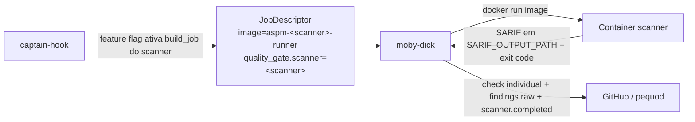

# Adicionar novo scanner

Como adicionar um scanner novo (ex: Bandit, Gitleaks) ao pipeline sem refatorar moby-dick ou captain-hook. **Este não é mais um modelo hipotético**: os 4 scanners de produção hoje (SonarQube, Semgrep, Trivy, OWASP ZAP) já seguem exatamente este padrão — use qualquer um deles como referência viva.

## Princípio

Scanner novo = nova **imagem Docker** (`moby-dick/deploy/<scanner>-runner/`) + novo builder de `JobDescriptor` (`captain-hook/adapter/wire_out/scanners/<scanner>_scanner.py`) + 1 feature flag no `captain-hook/config/settings.py`. Nada no `moby-dick` sabe que o scanner existe — ele só entende SARIF e o contrato de execução (§11).



## O modelo real: fan-out por PR/push, feature-flagged

Hoje o `captain-hook` **já publica N `JobDescriptor`s por evento** (1 por scanner habilitado), cada um virando um check individual próprio no PR/commit. Não existe mais "scanner único" nem roteamento por repositório — é fan-out condicionado a feature flag global:

```python
# controller/pull_request_controller.py::_build_pull_request_jobs
jobs: list[JobDescriptor] = [
    sonar_scanner.build_job(settings=settings, ctx=ctx, metadata=metadata, workflow_id=workflow_id)
]

if settings.enable_semgrep_scan:
    jobs.append(semgrep_scanner.build_job(settings=settings, ctx=ctx, metadata=metadata, workflow_id=workflow_id))

if settings.enable_trivy_scan:
    jobs.append(trivy_scanner.build_job(settings=settings, ctx=ctx, metadata=metadata, workflow_id=workflow_id))

if settings.enable_zap_scan:
    if settings.dast_mode == "fixed_url" and not settings.zap_target_url:
        logger.warning(...)  # não gera job sem target configurado
    else:
        jobs.append(zap_scanner.build_job(settings=settings, ctx=ctx, metadata=metadata, workflow_id=workflow_id))
```

`controller/push_controller.py::_build_baseline_jobs` é o espelho exato disso para o Security Baseline (scope=`branch`), chamando `build_baseline_job` em vez de `build_job`. **Um scanner novo precisa dos dois** (`build_job` e `build_baseline_job`) para funcionar tanto em PR quanto no push da default branch.

## Passo a passo

### 1. Decidir a imagem base

Padrão = wrapper sobre a image oficial do scanner + git + entrypoint custom, seguindo o contrato §11 (SARIF em `${SARIF_OUTPUT_PATH:-/tmp/scan.sarif.json}`, exit code = veredito, `unset GIT_TOKEN` antes de rodar código de terceiros).

Exemplo real (`moby-dick/deploy/semgrep-runner/Dockerfile`):

```dockerfile
FROM returntocorp/semgrep:latest

USER root
RUN command -v git >/dev/null || (apk add --no-cache git || apt-get install -y git)

COPY entrypoint.sh /usr/local/bin/entrypoint.sh
RUN chmod +x /usr/local/bin/entrypoint.sh

WORKDIR /src
ENTRYPOINT ["/usr/local/bin/entrypoint.sh"]
```

### 2. Escrever o entrypoint

Mesmo padrão dos 4 já existentes (`deploy/{sonar,semgrep,trivy,zap}-runner/entrypoint.sh`):

```bash
#!/usr/bin/env bash
set -euo pipefail

: "${GIT_REPO_URL:?GIT_REPO_URL ausente}"
: "${GIT_REF:?GIT_REF ausente}"

SARIF_OUT="${SARIF_OUTPUT_PATH:-/tmp/scan.sarif.json}"

# clone autenticado com GIT_TOKEN (se presente), depois unset — nunca deixe
# a credencial visível pro código de terceiros que vai rodar a partir daqui
AUTH_REPO_URL="https://x-access-token:${GIT_TOKEN}@${GIT_REPO_URL#https://}"
git clone "${AUTH_REPO_URL}" /workspace/repo
cd /workspace/repo
git checkout "${GIT_REF}"
unset GIT_TOKEN AUTH_REPO_URL
git remote set-url origin "${GIT_REPO_URL}"

# ASPM_FAIL_ON (any|low|medium|high, default any) sobe o piso de severidade
# que reprova o job — mapeamento é conhecimento do scanner, fica só aqui.
set +e
meu-scanner --sarif-output "${SARIF_OUT}" .
SCAN_EXIT=$?
set -e

if [ ! -f "${SARIF_OUT}" ]; then
  echo "..." > "${SARIF_OUT}"   # SARIF vazio — moby-dick sempre acha o arquivo
fi

exit "${SCAN_EXIT}"
```

Exit code é o veredito. moby-dick mapeia direto pro check_run (`controller/job_controller.py::_result_to_check_output`).

### 3. Buildar a imagem

```bash
docker build -t aspm-meuscanner-runner:latest moby-dick/deploy/meuscanner-runner/
```

### 4. Criar o builder em captain-hook

Novo módulo `adapter/wire_out/scanners/meuscanner_scanner.py`, seguindo `adapter/wire_out/scanners/trivy_scanner.py` como referência (é o mais simples dos 4 — sem SONAR_* nem DAST_*):

```python
from adapter.wire_in.pull_request_adapter import scanner_job_id
from adapter.wire_out.scanners._common import (
    baseline_job_context, job_context, quality_gate_context, quality_gate_context_for_branch,
)
from model.baseline_context import BaselineContext
from model.pull_request_context import PullRequestContext
from wire.schemas.job_v1 import JobDescriptor, JobMetadata


def build_job(*, settings, ctx: PullRequestContext, metadata: JobMetadata, workflow_id: str) -> JobDescriptor:
    env = {
        "GIT_REPO_URL": f"https://github.com/{ctx.repo_full_name}.git",
        "GIT_REF": ctx.head_sha,
        "REPO_FULL_NAME": ctx.repo_full_name,
        "REPO_ID": ctx.repo_id,
        "HEAD_SHA": ctx.head_sha,
    }
    return JobDescriptor(
        job_id=scanner_job_id(workflow_id=workflow_id, scanner="meuscanner"),
        kind="meuscanner_scan",
        image=settings.meuscanner_job_image,
        command=[],
        env=env,
        context=job_context(ctx, callback_name="MeuScanner"),
        metadata=metadata,
        quality_gate=quality_gate_context(workflow_id=workflow_id, scanner="meuscanner"),
    )


def build_baseline_job(*, settings, ctx: BaselineContext, metadata: JobMetadata, workflow_id: str) -> JobDescriptor:
    env = {
        "GIT_REPO_URL": f"https://github.com/{ctx.repo_full_name}.git",
        "GIT_REF": ctx.head_sha,
        "REPO_FULL_NAME": ctx.repo_full_name,
        "REPO_ID": ctx.repo_id,
        "HEAD_SHA": ctx.head_sha,
        "BRANCH_NAME": ctx.branch_name,
    }
    return JobDescriptor(
        job_id=scanner_job_id(workflow_id=workflow_id, scanner="meuscanner"),
        kind="meuscanner_scan",
        image=settings.meuscanner_job_image,
        command=[],
        env=env,
        context=baseline_job_context(ctx, callback_name="MeuScanner Baseline"),
        metadata=metadata,
        quality_gate=quality_gate_context_for_branch(workflow_id=workflow_id, scanner="meuscanner", branch_name=ctx.branch_name),
    )
```

`adapter/wire_out/scanners/_common.py` já centraliza a montagem de `JobContext`/`QualityGateJobContext` — não duplique essa lógica no módulo do scanner novo.

### 5. Adicionar a feature flag em `config/settings.py` (captain-hook)

```python
enable_meuscanner_scan: bool = False
meuscanner_job_image: str = "aspm-meuscanner-runner:latest"
```

### 6. Registrar nos dois controllers

Em `controller/pull_request_controller.py::_build_pull_request_jobs` **e** `controller/push_controller.py::_build_baseline_jobs`:

```python
from adapter.wire_out.scanners import meuscanner_scanner
...
if settings.enable_meuscanner_scan:
    jobs.append(
        meuscanner_scanner.build_job(  # ou build_baseline_job no push_controller
            settings=settings, ctx=ctx, metadata=metadata, workflow_id=workflow_id
        )
    )
```

Esquecer um dos dois controllers significa que o scanner novo só roda em PR (ou só em push) — inconsistência silenciosa, não um erro.

### 7. Registrar a classe do scanner em moby-dick (observabilidade)

`controller/job_controller.py::_SCANNER_CLASS_BY_SCANNER` mapeia o nome canônico pra uma classe (`sast`/`sca`/`dast`) usada em `quality-gate.scanner.completed.v1.scanner_class`:

```python
_SCANNER_CLASS_BY_SCANNER = {
    "sonar": "sast",
    "semgrep": "sast",
    "trivy": "sca",
    "zap": "dast",
    "meuscanner": "sast",  # ou "sca"/"dast", conforme o tipo do scanner
}
```

Sem essa entrada o scanner ainda funciona — só cai em `scanner_class="unknown"` nas métricas.

### 8. Garantir que a imagem está disponível na VPS

```bash
cd /caminho/moby-dick
git pull origin main
docker build -t aspm-meuscanner-runner:latest deploy/meuscanner-runner/
```

Não precisa restart do moby-dick — próximo `docker run` pega a imagem nova.

### 9. Testar

Habilite a flag, faça push num PR de teste. Acompanhe:

```bash
sudo journalctl -u moby-dick -f
docker ps --filter "name=moby-job-"
docker logs $(docker ps -a --filter "name=moby-job-" --latest -q)
```

E confira no PR: check individual `MeuScanner` + o check consolidado `OdinEye / Quality Gate` esperando (e depois incluindo) esse scanner na lista de `expected_scanners`.

## Convenções de naming

| Tipo | Convenção | Exemplos reais |
|---|---|---|
| Imagem Docker | `aspm-<scanner>-runner:latest` | `aspm-sonar-runner`, `aspm-semgrep-runner`, `aspm-trivy-runner`, `aspm-zap-runner` |
| Pasta no moby-dick | `deploy/<scanner>-runner/` | `deploy/sonar-runner/`, `deploy/semgrep-runner/`, `deploy/trivy-runner/`, `deploy/zap-runner/` |
| Módulo builder no captain-hook | `adapter/wire_out/scanners/<scanner>_scanner.py` | `sonar_scanner.py`, `semgrep_scanner.py`, `trivy_scanner.py`, `zap_scanner.py` |
| `kind` no JobDescriptor | `<scanner>_scan` | `sonar_scan`, `semgrep_scan`, `trivy_scan`, `zap_scan` |
| `quality_gate.scanner` (nome canônico) | forma curta, normalizada (lowercase, `_` em vez de espaço/hífen) | `sonar`, `semgrep`, `trivy`, `zap` |
| Check name no PR/commit | nome oficial do scanner (PR) / `<nome> Baseline` (push) | `SonarQube Scan`, `Semgrep SAST`, `Trivy SCA`, `OWASP ZAP DAST` / `SonarQube Baseline`, `Semgrep Baseline`, ... |

## Boas práticas

- **Stateless absoluto:** sem cache, sem volume, sem state entre runs.
- **Exit code é o veredito:** 0 = pass, !=0 = fail. `ASPM_FAIL_ON` (any/low/medium/high) é o padrão dos 4 scanners existentes pra ajustar o piso sem mudar código — reaproveite a convenção.
- **`unset GIT_TOKEN` no entrypoint** antes de chamar o scanner — evita vazamento em logs. Todos os 4 runners atuais fazem isso.
- **SARIF vazio em caso de falha antes da geração:** os 4 entrypoints atuais escrevem um SARIF com `runs[0].results=[]` quando o scanner morre antes de gerar o relatório — mantém o contrato "moby-dick sempre acha o arquivo".
- **Pinning de versão:** `aspm-trivy-runner:0.50.0` em vez de `:latest` quando o scanner for sensível a versão.
- **`set -e` no entrypoint, com `set +e`/`set -e` ao redor só do comando do scanner** — assim você ainda consegue capturar o exit code antes de decidir o veredito (é o que `sonar-runner`, `semgrep-runner`, `trivy-runner` e `zap-runner` fazem hoje).
- **Timeout:** moby-dick aplica `DOCKER_RUN_TIMEOUT_SECONDS` (default 600s) a todo container, independente do scanner.
- **`MOBY_MOUNT_DOCKER_SOCKET`:** só peça esse flag no env do job se o scanner precisar mesmo subir containers (caso do ZAP em `compose_preview`). É um privilégio equivalente a root no host — moby-dick só monta o socket quando o próprio JobDescriptor pede.

## Considerações de performance

- **Pull inicial pesado:** primeira execução de scanner novo baixa a imagem (~500MB-2GB). Pre-pull na VPS via cron se quiser evitar latência no primeiro PR.
- **Clone duplicado:** com 4 scanners habilitados no mesmo PR, são 4 clones independentes (sonar-runner também clona, via `HEAD_SHA`/`REPO_FULL_NAME`). Aceitável até virar gargalo — solução futura é volume de cache compartilhado.
- **Concorrência:** `SCANNER_MAX_CONCURRENCY` no moby-dick limita paralelismo de containers; jobs do mesmo consumer group ainda competem entre si.

## Quando o scanner novo virar 2º/3º/4º estável

Este ciclo já ocorreu 3 vezes (Semgrep, Trivy, ZAP entraram depois do Sonar) sem quebrar o contrato entre captain-hook e moby-dick — é a prova de que o modelo fan-out + feature flag escala razoavelmente bem para novos scanners. Ver [decisions.md §11](../overview/decisions.md) para o racional completo do contrato de scanner image.
