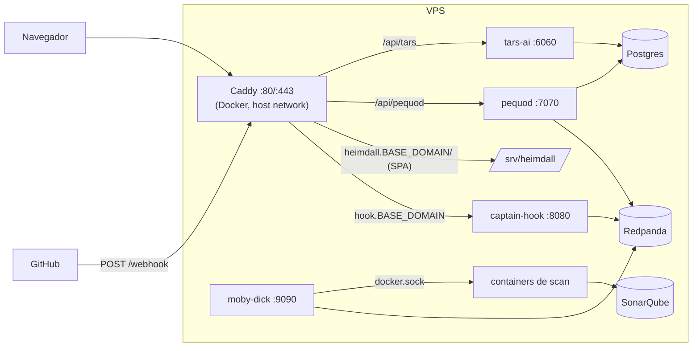

# Deploy na VPS

Como colocar o ecossistema em uma VPS Linux, com HTTPS, usando os scripts e
arquivos de [`ops/`](https://github.com/OdinEye-FIAP/aspm-docs/tree/main/ops).
Pressupõe que você entendeu o [Começando](getting-started.md) (as peças são as
mesmas; muda onde cada uma roda e como é exposta).

## Topologia



- **Infra** (Redpanda, SonarQube, Postgres) roda em containers Docker, com
  portas publicadas só em `127.0.0.1`.
- **Serviços Python** rodam como **systemd** no host, cada um com usuário próprio
  (`/opt/<svc>`, env em `/etc/<svc>/env`). O moby-dick precisa estar no grupo
  `docker` para criar os containers de scan.
- **Caddy** termina TLS e é o único ponto exposto, com dois hostnames derivados
  de uma variável `BASE_DOMAIN`.

## Pré-requisitos da VPS

| Item | Detalhe |
|---|---|
| SO | Ubuntu 24.04 / Debian 12 (precisa de Python 3.11+; o Ubuntu 22.04 traz 3.10) |
| Recursos | 4 vCPU e 8 GB RAM como ponto de partida (o SonarQube sozinho consome 2–3 GB) |
| Pacotes | `docker` com Compose **v2.24.4+**, `python3-venv`, `rsync`, `git`, `curl`, Node 20+ (só para buildar o dashboard) |
| Acesso | SSH com usuário sudo; repos clonados (passo 2) |

## 1. BASE_DOMAIN e DNS

Todos os endereços públicos derivam de `BASE_DOMAIN`:

| Hostname | Uso |
|---|---|
| `hook.<BASE_DOMAIN>` | webhook da GitHub App (`/webhook`) |
| `heimdall.<BASE_DOMAIN>` | dashboard e APIs (`/api/pequod`, `/api/tars`, `/api/hook`) |

Crie dois registros `A` apontando para o IP da VPS (ou um wildcard
`*.<BASE_DOMAIN>`). Ainda sem domínio próprio? Qualquer nome que resolva para o
IP serve, desde que o Caddy consiga validar via HTTP (portas 80/443 abertas):

| Opção | `BASE_DOMAIN` | Observação |
|---|---|---|
| Domínio próprio | `aspm.exemplo.com` | recomendado; necessário para o futuro ambiente de stage |
| sslip.io | `203-0-113-10.sslip.io` | sem cadastro; muda se o IP mudar; depende de serviço de terceiro |
| DuckDNS | `odineye.duckdns.org` | subdomínio gratuito e fixo |

Confirme a resolução antes de seguir: `dig +short hook.<BASE_DOMAIN>`.

Trocar de uma opção para outra depois exige apenas mudar `BASE_DOMAIN`,
reexecutar `bootstrap-env.sh --vps --force`, rebuildar o dashboard e atualizar a
URL do webhook na GitHub App.

## 2. Preparar a máquina

```bash
# Firewall: só SSH e web. Serviços Python (não-Docker) respeitam o ufw.
sudo ufw allow OpenSSH && sudo ufw allow 80,443/tcp && sudo ufw enable

# Código
mkdir -p ~/aspm-ai && cd ~/aspm-ai
for r in captain-hook moby-dick pequod tars-ai heimdall-dashboard aspm-docs; do
  git clone git@github.com:OdinEye-FIAP/$r.git
done
export ASPM_HOME=~/aspm-ai BASE_DOMAIN=aspm.exemplo.com
```

!!! danger "Docker ignora o ufw"
    Portas publicadas por containers (`ports: "9000:9000"`) passam por regras de
    iptables do Docker e ficam **abertas na internet mesmo com o ufw ativo**. Os
    compose dos repos publicam em `0.0.0.0`. Por isso, na VPS, a infra sobe com os
    overrides de [`ops/compose/`](https://github.com/OdinEye-FIAP/aspm-docs/tree/main/ops/compose)
    (`infra-up.sh --vps`), que prendem Kafka, SonarQube e Postgres em
    `127.0.0.1` e adicionam `restart: unless-stopped`.

## 3. Infraestrutura

```bash
cd $ASPM_HOME/aspm-docs/ops/scripts
./infra-up.sh --vps
```

## 4. Serviços

```bash
sudo ASPM_HOME=$ASPM_HOME ./install-services.sh          # usuários, /opt/<svc>, venv, units
sudo ASPM_HOME=$ASPM_HOME BASE_DOMAIN=$BASE_DOMAIN ./bootstrap-env.sh --vps
```

1. `install-services.sh` cria os usuários (`captainhook`, `mobydick`, `pequod`,
   `tarsai`), copia o código para `/opt/<svc>`, cria o virtualenv e instala as
   units de systemd (a do tars-ai vem de `ops/systemd/`, as demais dos repos).
2. `bootstrap-env.sh --vps` grava `/etc/<svc>/env` (dono `root:<usuário>`,
   modo `640`), já com `CORS_ALLOWED_ORIGINS` e `HEIMDALL_BASE_URL` derivados de
   `BASE_DOMAIN` e `APP_ENV=production`.

Agora os itens manuais:

```bash
# Chave privada da GitHub App (lida só pelo usuário do serviço)
sudo install -o mobydick -g mobydick -m 600 /caminho/app.pem /etc/moby-dick/github-app.pem
sudo install -o captainhook -g captainhook -m 600 /caminho/app.pem /etc/captain-hook/github-app-private-key.pem

# Edite: GITHUB_APP_ID / GITHUB_INSTALLATION_ID (captain-hook e moby-dick),
#        GITHUB_APP_PRIVATE_KEY_PATH do captain-hook e, se usar IA real, AI_PROVIDER + chave no tars-ai
sudo $EDITOR /etc/captain-hook/env /etc/moby-dick/env /etc/tars-ai/env

# Token do Sonar -> /etc/captain-hook/env
sudo SONAR_ADMIN_PASSWORD='SenhaForte!123' ./sonar-bootstrap.sh --write-to /etc/captain-hook/env

# Imagens dos scanners (na mesma máquina do moby-dick)
./build-scanners.sh

# Subir
sudo ASPM_HOME=$ASPM_HOME ./install-services.sh --start
```

## 5. Dashboard e Caddy

```bash
BASE_DOMAIN=$BASE_DOMAIN ./build-heimdall.sh      # build + publica em /srv/heimdall

cd $ASPM_HOME/aspm-docs/ops/caddy
echo "BASE_DOMAIN=$BASE_DOMAIN" > .env
docker compose up -d
```

O build embute as URLs `https://heimdall.<BASE_DOMAIN>/api/...` no bundle. O Caddy
emite os certificados Let's Encrypt ao subir (pode levar alguns segundos; veja
`docker logs aspm-caddy` se o HTTPS não responder).

### Proteja o dashboard

As APIs do pequod e do tars-ai (usadas pelo dashboard) não têm login. Ligue
*basic auth* no host `heimdall.`:

```bash
HASH=$(docker run --rm caddy:2 caddy hash-password --plaintext 'SenhaDoDashboard')
cat > ops/caddy/auth.d/basic.caddy <<CADDY
basic_auth {
	admin $HASH
}
CADDY
docker exec aspm-caddy caddy reload --config /etc/caddy/Caddyfile
```

O navegador reenvia as credenciais a todas as chamadas do mesmo host, então
dashboard e `/api/*` ficam protegidos juntos. O host `hook.` **não** leva basic
auth: o GitHub não consegue enviar credenciais, e o webhook já é validado por HMAC.

!!! warning "Arquivos fora do git"
    `ops/caddy/auth.d/*.caddy` contém o hash da senha e não deve ser commitado.

## 6. Conectar o GitHub

Na GitHub App (**Settings → Developer settings → GitHub Apps → sua App**):

- **Webhook URL:** `https://hook.<BASE_DOMAIN>/webhook`
- **Webhook secret:** o valor de `GITHUB_WEBHOOK_SECRET` (como o script rodou com sudo, leia com `sudo cat $ASPM_HOME/.aspm-secrets.env`)

Em *Advanced → Recent Deliveries*, use **Redeliver** em uma entrega recente (por
exemplo, o `ping`); o captain-hook deve responder `202`.

## 7. Validar

```bash
./smoke-test.sh --public $BASE_DOMAIN
```

Depois, abra um PR em um repo com a App instalada e acompanhe os logs:

```bash
sudo journalctl -u captain-hook -u moby-dick -u pequod -u tars-ai -f
docker ps --filter "name=moby-job-"
```

## Atualizar

```bash
cd $ASPM_HOME/<repo> && git pull                               # em cada repo alterado
sudo ASPM_HOME=$ASPM_HOME ./install-services.sh --restart      # serviços Python
BASE_DOMAIN=$BASE_DOMAIN ./build-heimdall.sh                   # dashboard
./build-scanners.sh sonar                                      # se mudou algum runner
```

`install-services.sh` faz `rsync --delete` do código e preserva `.venv` e o env em
`/etc/<svc>/env`. Mudanças em `requirements.txt` são aplicadas no mesmo passo.

## Operação

| Tarefa | Comando |
|---|---|
| Status | `systemctl status captain-hook moby-dick pequod tars-ai` |
| Logs | `sudo journalctl -u <svc> -f` |
| Reiniciar | `sudo systemctl restart <svc>` |
| Infra | `docker ps`, `docker logs aspm-redpanda` |
| Console Kafka / Sonar (só local na VPS) | `ssh -L 8088:localhost:8088 -L 9000:localhost:9000 usuario@vps` |
| Backup do banco | `docker exec aspm-pequod-db pg_dump -U pequod pequod \| gzip > pequod-$(date +%F).sql.gz` |
| Reset do banco | `cd pequod && docker compose -f docker-compose.yml -f ../aspm-docs/ops/compose/pequod.vps.yml down -v` e depois o mesmo comando com `up -d` (reaplica `schema.sql`) |

Agende o backup via `cron` e copie os arquivos para fora da VPS. Como os
containers de infra têm `restart: unless-stopped` e os serviços são units
systemd habilitadas, tudo volta sozinho após reboot (o Docker precisa estar
habilitado: `systemctl enable docker`).

## Riscos conhecidos

- **`moby-dick` no grupo `docker` equivale a acesso root** ao host. Aceitável
  enquanto o único código executado nos jobs for o das imagens `aspm-*-runner`;
  reavalie se passar a rodar código de repositórios de terceiros (modo DAST
  `compose_preview`).
- **Credenciais padrão** do Postgres (`pequod/pequod`, `sonar/sonar`) estão nos
  compose dos repos. Ficam restritas a `127.0.0.1` e à `aspm-net`, mas troque se
  a VPS for compartilhada.
- **`ZAP_TARGET_URL=http://host.docker.internal:5000`** (padrão do `.env.example`)
  só resolve em Docker Desktop. Em Linux é preciso apontar para um endereço
  alcançável pelo container.
- **Segredos:** `.aspm-secrets.env` e `/etc/<svc>/env` guardam segredos em texto;
  mantenha `chmod 600/640` e fora de backups compartilhados.
- **Stage:** a estrutura (`BASE_DOMAIN`, compose por projeto, envs separados) foi
  pensada para comportar um segundo ambiente, mas ele ainda não está desenhado;
  exigirá GitHub App própria, rede e portas distintas.
