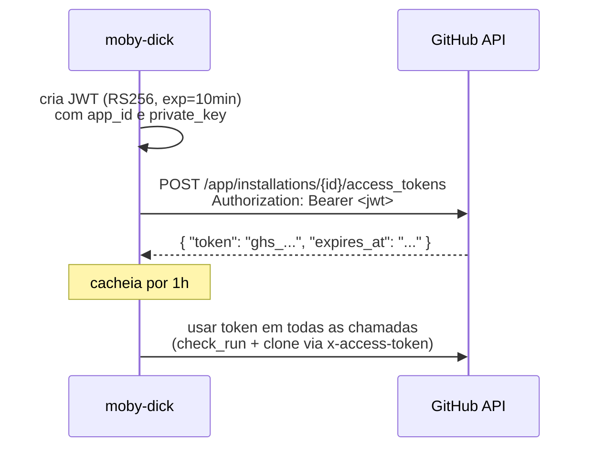

# GitHub App — configuração

ASPM-AI usa **GitHub App** (não OAuth, não Personal Access Token) pra autenticar em todas as chamadas pro GitHub. Razões:

- TTL curto (1h) — installation tokens são efêmeros
- Permissões granulares por repo
- Sem usuário associado (não morre quando alguém sai do time)
- Rate limit dedicado e maior

## Criar o GitHub App

1. **Organization settings → Developer settings → GitHub Apps → New GitHub App**
2. Preencher:
   - **Name:** `aspm-ai-pipeline` (ou similar)
   - **Homepage URL:** URL do `aspm-docs` ou do repo
   - **Webhook URL:** URL pública do captain-hook (ex: `https://aspm.seudominio.com/webhook`)
   - **Webhook secret:** gerar string longa, salvar em `captain-hook/.env` como `GITHUB_WEBHOOK_SECRET`

## Permissões necessárias

### Repository permissions
| Permissão | Nível | Por quê |
|---|---|---|
| **Contents** | Read | Clone do repo no scanner |
| **Pull requests** | Read | Ler dados do PR |
| **Checks** | Write | Criar/atualizar `check_run` |
| **Metadata** | Read (mandatório) | Default da GitHub |

### Subscribe to events
- **Pull request** ✅

Mais nada por enquanto.

## Where to install

- **Only on this account** ou **Any account** — depende da estratégia
- Após criar, **Install App** → escolher repos:
  - Específicos (recomendado): clint-eastwood, captain-hook, moby-dick, etc
  - Ou "All repositories" (mais permissivo)

## Coletar credenciais

Depois de criar:

1. **App ID** — no topo da página de settings do App. Ex: `3738860`
2. **Private key** — clicar **Generate a private key** → baixa `.pem`. **Guarde com cuidado**, não há "ver de novo".
3. **Installation ID** — vá em **Install App → Configure** no repo/org. URL fica tipo:
   ```
   https://github.com/organizations/OdinEye-FIAP/settings/installations/132981825
   ```
   `132981825` = installation_id.

## Configurar no moby-dick

```env
GITHUB_APP_ID=3738860
GITHUB_APP_PRIVATE_KEY_PATH=./config/github-app-private-key.pem
GITHUB_INSTALLATION_ID=132981825
```

Coloque o `.pem` na pasta `config/`:
```bash
mkdir -p config
cp /path/to/downloaded.pem config/github-app-private-key.pem
chmod 600 config/github-app-private-key.pem
```

!!! warning "Nunca commitar a private key"
    Adicione `config/*.pem` no `.gitignore`. Vazamento da key = comprometimento total da App.

## Como o token é mintado



Código em `moby-dick/diplomat/http_out/github_client.py`:

- `_generate_jwt()` — assina JWT com private key
- `_get_installation_token()` — troca JWT por installation token, cacheia
- `get_installation_token()` — público, usado pelo controller pra injetar `GIT_TOKEN`

## Webhook secret — validação HMAC

O captain-hook valida que o webhook veio do GitHub usando HMAC-SHA256:

```python
expected = hmac.new(
    secret.encode(),
    payload_bytes,
    hashlib.sha256
).hexdigest()

received = request.headers.get("X-Hub-Signature-256", "").replace("sha256=", "")

if not hmac.compare_digest(expected, received):
    raise HTTPException(401)
```

Se webhook secret no `.env` não bate com o configurado na App → todo webhook volta 401.

## Webhook URL — TLS obrigatório em prod

GitHub permite HTTP no campo Webhook URL, mas:

- ❌ Em **HTTP**, payload trafega em claro pela internet
- ✅ Em **HTTPS**, payload criptografado fim-a-fim

Use **Caddy** (auto Let's Encrypt) ou **nginx + certbot** na VPS:

```caddyfile
# /etc/caddy/Caddyfile
aspm.seudominio.com {
    reverse_proxy localhost:8080
}
```

## Troubleshooting

### `401 Bad credentials` ao mintar token
- Private key path está errado, ou key está corrompida (CR/LF? remover BOM)
- App ID não bate com a private key (mistura de Apps?)
- Clock skew da VPS desalinhado (>5min) → JWT exp inválido. `sudo apt install chrony`.

### `404 Not Found` no `/app/installations/{id}`
- Installation ID errado
- App não está instalado no repo cujo webhook foi disparado

### Webhook não chega
- Webhook secret diferente entre App e captain-hook
- Endpoint não acessível pela internet
- DNS / TLS quebrado

GitHub mostra histórico de delivery em **Settings → Developer settings → GitHub Apps → Advanced → Recent Deliveries**.

### Clone via `x-access-token` falha 403
- App não tem permissão `Contents: Read` no repo
- Installation token expirou (cache antigo) — moby-dick re-minta
- Repo deletado ou App desinstalado dele
