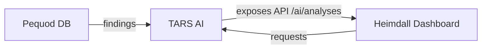
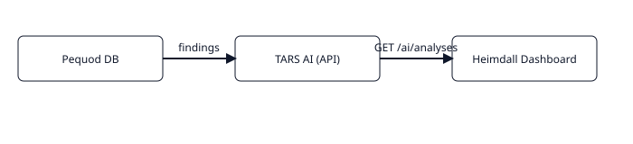

# Heimdall Dashboard

Frontend para visualização das análises geradas pelo TARS e dos findings armazenados no Pequod.

## Executando local

```bash
cd heimdall-dashboard
npm install
npm run dev
# acessar http://localhost:5173
```

## Principais funcionalidades

- Cards de resumo (findings analisados, alta prioridade, pendentes)
- Gráficos por scanner/severidade/prioridade
- Tabela de findings analisados com detalhe
- Aciona endpoints do TARS (`/ai/analyze-pending`, `/ai/analyze-ref`)

## Links

- README completo: ../heimdall-dashboard/README.md
- Integração TARS: ../tars-ai/README.md

## Fluxo de dados




