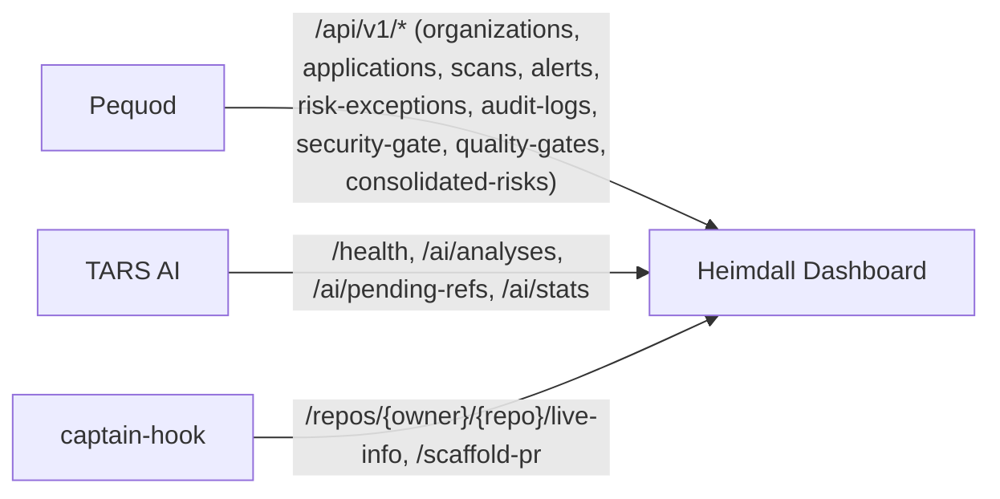

# Heimdall Dashboard

Frontend React (Vite + TypeScript) do ecossistema ASPM-AI. Visualiza findings técnicos, riscos consolidados pela IA (TARS) e a governança de cada aplicação (scans, alertas, exceções de risco, audit log, security gate e quality gate) mantida pelo pequod. É uma camada 100% visual: não executa scanners, não consome Kafka e não escreve direto no banco — tudo via HTTP.

## Executando local

```bash
cd heimdall-dashboard
npm install
npm run dev
# acessar http://localhost:5173
```

## As 6 abas

| Aba | Componente principal | Dados |
|---|---|---|
| Organizações | `OrganizationsWorkspace.tsx` | `GET /api/v1/organizations` (pequod) |
| Repositórios | `RepositoriesWorkspace.tsx` | `GET /api/v1/applications` (pequod) + scaffold de PR via captain-hook |
| Governança | `GovernanceWorkspace.tsx` | scans, alertas, risk exceptions, audit log, security gate por aplicação (pequod) + repositório ao vivo (captain-hook) |
| Quality Gate | `QualityGateWorkspace.tsx` | `GET /api/v1/quality-gates*` (pequod), com deep link por `application_id` + nº de PR |
| Findings técnicos | `DashboardCards`/`FindingsCharts`/`FindingsTable`/`FindingDetails` | `GET /ai/analyses`, `/ai/pending-refs`, `/ai/stats` (TARS) |
| Riscos consolidados | `RiskDashboardCards`/`RiskTable`/`RiskDetails` | `GET /api/v1/consolidated-risks` (pequod, via `tarsApi.ts`) |

A aba ativa é sincronizada com `localStorage` e a URL (`/quality-gates/{applicationId}/pr/{pullRequestNumber}` é um deep link direto para a aba Quality Gate).

## Três clientes HTTP

- **`src/api/pequodApi.ts`** — organizações, aplicações, scans, alertas, risk exceptions, audit log, security gate, quality gate. Base: `VITE_PEQUOD_API_URL` (padrão `http://localhost:7070`).
- **`src/api/tarsApi.ts`** — health, análises, refs pendentes, stats do TARS; também busca `/api/v1/consolidated-risks` direto no pequod e traduz para os tipos de risco usados na UI. Base: `VITE_TARS_API_URL` (padrão `http://localhost:6060`).
- **`src/api/captainHookApi.ts`** — issues abertas e dependências ao vivo de um repositório (`GET /repos/{owner}/{repo}/live-info`) e disparo de scaffold de PR (`POST /repos/{owner}/{repo}/scaffold-pr`). Base: `VITE_CAPTAIN_HOOK_API_URL` (padrão `http://localhost:8080`).

## Componentes (23, em `src/components/`)

Findings técnicos: `DashboardCards`, `FindingsCharts`, `FindingsTable`, `FindingDetails`.
Riscos consolidados: `RiskDashboardCards`, `RiskTable`, `RiskDetails`.
Governança: `GovernanceWorkspace`, `GovernanceDashboardCards`, `ApplicationSelector`, `BranchSelector`, `ScansPanel`, `AlertsPanel`, `RiskExceptionsPanel`, `SecurityGatePanel`, `AuditTimeline`.
Quality Gate: `QualityGateWorkspace`, `QualityGateRunList`, `QualityGateDetails`.
Organizações/Repositórios: `OrganizationsWorkspace`, `RepositoriesWorkspace`, `RepositoryLiveInfoPanel`.
Status: `ServiceStatus`.

## Principais funcionalidades

- Inventário de organizações (agrupadas por `owner_name` no pequod) e repositórios monitorados, com scaffold de PR via captain-hook.
- Governança por aplicação: scans recentes, alertas, exceções de risco, audit log e security gate (política efetiva + avaliações).
- Quality Gate por Pull Request: runs, decisão, scanners executados, itens bloqueantes/de aviso, exceções de risco relacionadas — com deep link estável por `application_id` + número de PR (em vez de `workflow_id`, que muda a cada novo commit).
- Cards de resumo, gráficos por scanner/severidade/prioridade e tabela de findings analisados pela IA.
- Tabela e detalhe de riscos consolidados (dedupe semântico), com navegação entre um finding técnico e o risco consolidado correspondente.
- Botão para disparar análise de pendentes no TARS; atualização automática a cada 30 segundos.

## Links

- README completo: [`heimdall-dashboard/README.md`](https://github.com/OdinEye-FIAP/heimdall-dashboard/blob/main/README.md)
- Integração TARS: [tars-ai](tars-ai.md)
- Integração pequod: [pequod](pequod.md)

## Fluxo de dados


