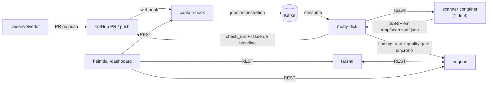

# ASPM-AI

Plataforma **Application Security Posture Management** com IA da OdinEye-FIAP.

## O que entrega

Quando um PR é aberto/atualizado num repo onboardado (ou há um push na default branch), a plataforma:

1. Recebe o webhook do GitHub
2. Despacha um scanner (Sonar, Semgrep, Trivy e/ou ZAP, conforme habilitado) em container isolado por scanner
3. Extrai findings normalizados em SARIF v2.1.0 direto do container e persiste no `pequod`
4. Avalia o Quality Gate — via PR (`scope=pr`) ou via push na default branch (`scope=branch`, **Security Baseline**, full-branch scan)
5. Reporta o resultado como **check_run** no PR (ou no commit, para Security Baseline) — e, no caso do Security Baseline, também faz upsert de uma **Issue** agregada no repositório
6. `tars-ai` triagem findings/clusters por IA (recomendação, prioridade, clustering semântico)
7. `heimdall-dashboard` exibe tudo: governança, quality gate, riscos consolidados

## Onde comear

=== "Quero entender o projeto"

    Vá pra [Visão geral](overview/what-is-aspm.md). Cobre o que é ASPM, arquitetura, decisões.

=== "Quero rodar localmente / contribuir"

    Vá pra [Desenvolvedor → Começando](developer/getting-started.md).

=== "Quero integrar meu repo"

    Vá pra [Integração → Onboarding](integration/onboarding-repo.md).

=== "Quero a referência técnica"

    Vá pra [Referência → JobDescriptor v1](reference/job-descriptor.md).

## Stack atual

| Camada | Tecnologia |
|---|---|
| Ingest | FastAPI (`captain-hook`) |
| Transport | Redpanda (Kafka-compatible) |
| Orchestration + Quality Gate | FastAPI (`moby-dick`) + Docker SDK |
| Scanners | Sonar, Semgrep, Trivy, ZAP — 4 images self-contained |
| Auth GitHub | GitHub App + installation token |
| Governança de risco / storage | FastAPI (`pequod`) + postgres + asyncpg |
| Triagem por IA | FastAPI (`tars-ai`) + Gemini/Groq/HuggingFace |
| Dashboard | React + Vite + TypeScript (`heimdall-dashboard`) |
| Deploy | docker-compose + systemd na VPS |

## Estado

| Componente | Status |
|---|---|
| Pipeline GitHub → check_run (PR, `scope=pr`) | ✅ funcionando end-to-end |
| Security Baseline (push na default branch, `scope=branch`) | ✅ funcionando end-to-end (confirmado 2026-09-10) — ver [Decisão §15](overview/decisions.md#15-quality-gate-com-scopepr-e-scopebranch-security-baseline--ponta-a-ponta-em-main-reconfirmado-2026-09-10) |
| Scanners (Sonar, Semgrep, Trivy, ZAP) | ✅ funcionando, fan-out por PR e por Security Baseline |
| Extração SARIF dentro da scanner image | ✅ concluída para os 4 scanners |
| Quality Gate síncrono (moby-dick ↔ pequod) | ✅ funcionando |
| Storage + governança de risco (risk exceptions, security gate, clustering) | ✅ `pequod` |
| Triagem por IA (individual + cluster) | ✅ `tars-ai` (Gemini) |
| Dashboard de governança | ✅ `heimdall-dashboard` |
| Correlação cross-scanner mais ampla (grafo/embeddings gerais) | ⏳ parcial — candidate clustering + clustering semântico cobrem o caso principal |
| Reachability analysis / fix suggestions automáticos | ⏳ não iniciado |

Estamos na fase de consolidação: pipeline E2E maduro tanto para PR (`scope=pr`) quanto para Security Baseline (`scope=branch`), com 4 scanners, governança de risco e triagem por IA já em produção. Próximos passos: reachability analysis, fix suggestions, sink de Issue por `consolidated_risk` (em vez da Issue agregada por branch), e métricas formais (Prometheus/OTEL).

## Projetos documentados

- [Pequod](pequod.md) — camada de persistência e governança de risco
- [Moby-dick](moby-dick.md) — orquestrador Docker + quality gate
- [TARS AI](tars-ai.md) — serviço de IA para triagem/clustering
- [Heimdall Dashboard](heimdall-dashboard.md) — frontend de visualização
- [Captain-hook](captain-hook.md) — ingest de webhooks GitHub

Última atualização: 2026-09-10
