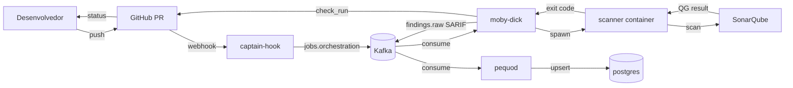

# ASPM-AI

Plataforma **Application Security Posture Management** com IA em construção pela OdinEye-FIAP.

## O que entrega

Quando um PR é aberto/atualizado num repo onboardado, a plataforma:

1. Recebe o webhook do GitHub
2. Despacha um scanner em container isolado
3. Roda análise (atualmente SonarQube; mais scanners e enriquecimento por IA virão)
4. Extrai findings, normaliza em SARIF v2.1.0 e persiste no `pequod`
5. Reporta o resultado como **check_run** no PR
6. Bloqueia ou libera merge conforme Quality Gate

## Onde começar

=== "Quero entender o projeto"

    Vá pra [Visão geral](overview/what-is-aspm.md). Cobre o que é ASPM, arquitetura, decisões.

=== "Quero rodar localmente / contribuir"

    Vá pra [Desenvolvedor → Começando](developer/getting-started.md).

=== "Quero integrar meu repo"

    Vá pra [Integração → Onboarding](integration/onboarding-repo.md).

=== "Quero a referência técnica"

    Vá pra [Referência → JobDescriptor v1](reference/job-descriptor.md).

## Stack atual

| Camada | Tecnologia |
|---|---|
| Ingest | FastAPI (`captain-hook`) |
| Transport | Redpanda (Kafka-compatible) |
| Orchestration | FastAPI (`moby-dick`) + Docker SDK |
| Scanner | SonarQube Community Build (image wrapper `aspm-sonar-runner`) |
| Auth GitHub | GitHub App + installation token |
| Normalização SARIF | adapter em `moby-dick` (Sonar API → SARIF v2.1.0) |
| Persistência scanner | postgres (`sonar-db`) |
| Persistência findings normalizados | FastAPI (`pequod`) + postgres + asyncpg |
| Deploy | docker-compose + systemd na VPS |

## Estado

| Componente | Status |
|---|---|
| Pipeline GitHub → check_run | ✅ funcionando end-to-end |
| Scanner SonarQube | ✅ funcionando |
| Extração SARIF cross-scanner | ✅ Sonar API → SARIF v2.1.0 em `moby-dick/adapter/sonar` |
| Storage central de findings | ✅ `pequod` consume `findings.raw`, normaliza e dedupa por fingerprint |
| REST de findings (UI/IA) | ✅ `GET/PATCH /findings` em `pequod` |
| Correlação cross-scanner | ⏳ adiado (precisa 2º scanner) |
| Enriquecimento IA | ⏳ adiado |

Estamos na **fase 1** do roadmap: pipeline E2E vivo, findings persistidos, próximo passo é 2º scanner + camada de IA sobre `pequod`.
