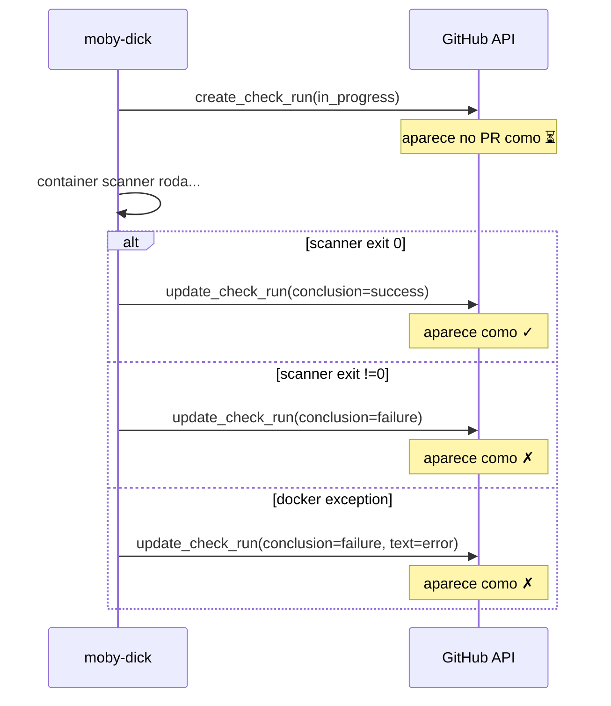

# Entendendo o check_run no PR

Como ler o feedback do ASPM-AI no seu PR.

## Onde aparece

Aba **Checks** do PR no GitHub. Procurar por:

```
SonarQube Scan
```

Estados possíveis:

```
⏳ In progress     → scanner rodando
✓  Success         → Quality Gate passou
✗  Failure         → Quality Gate falhou OU erro de execução
```

## Estados explicados

### ⏳ `In progress`

moby-dick criou o check, scanner está rodando. Tempo típico: 30s-3min dependendo do tamanho do repo.

Se ficar travado >5min, algo deu errado — ver [troubleshooting](../developer/troubleshooting.md).

### ✓ `Success`

Scanner rodou OK + Quality Gate passou. Significa:

- Nenhuma vulnerability nova introduzida acima do threshold
- Nenhum bug novo crítico
- Coverage / duplications dentro do esperado
- Hotspots revisados (ou ausentes)

Pode mergear (do ponto de vista do scan; outras revisões são por conta).

### ✗ `Failure`

Pode ser **duas coisas diferentes**:

1. **QG fail (esperado):** scanner rodou, achou problemas que violam o Quality Gate
2. **Erro de execução:** scanner não conseguiu rodar (image issue, network, etc)

Diferenciar pelo conteúdo do check.

## Como ler o detalhe

Click no check → painel lateral abre com:

### Title
Categoria do resultado, ex:
- `Orquestração concluída` (success)
- `Job falhou` (QG fail)
- `Erro de execução` (problema na infra)

### Summary
1-2 linhas resumindo:
- `Job <uuid> concluído com sucesso`
- `Job <uuid> exit_code=1`
- `Job <uuid> falhou: <erro>`

### Text
Logs tail do container — últimos 4KB do stdout/stderr do scanner. Em markdown com code fence.

Lá você vê:
- Versão do Sonar usada
- Quantos arquivos foram analisados
- `ANALYSIS SUCCESSFUL` ou erro específico
- `Quality gate status: ERROR` (se for o caso)

## Próximos passos quando o check falha

### Cenário 1: erro de validação ("Developer Edition required" ou similar)

**Causa:** misconfig do scanner — não é problema do seu código.

**Ação:** abrir issue no `aspm-docs` ou avisar quem mantém a plataforma.

### Cenário 2: `Quality gate status: ERROR`

**Causa:** seu código tem issues novas que cruzaram threshold do Quality Gate.

**Ação:**

1. Abrir Sonar UI: o link tá no log do scanner (`http://<sonar-host>/dashboard?id=<owner>_<repo>`)
2. Aba **Issues** → lista cada finding com:
   - Arquivo + linha
   - Severidade
   - Regra (link pra docs Sonar com explicação)
   - Esforço estimado de fix
3. Corrigir os críticos, push novo commit → novo scan automático
4. QG passa → check vira verde

### Cenário 3: `0 source files analyzed`

**Causa:** scanner não encontrou linguagens suportadas no diff. Repo só tem md/txt/config.

**Ação:** check normalmente passa (sem código pra analisar = sem violação possível). Se aparecer fail, é bug — reportar.

### Cenário 4: erro de rede / docker

**Sintomas no Text:**
- `pull access denied` → imagem não buildada
- `UnknownHostException` → network mal configurado
- `Connection refused` → Sonar fora do ar

**Ação:** problema de infra, não seu código. Avise quem cuida da VPS.

## Limitações conhecidas (Community Build)

Vide [decisão #7](../overview/decisions.md#7-modo-de-scan-análise-principal-sem-pr-mode).

- ❌ **Sem inline comments** no PR (feature paga)
- ❌ **Sem decoration visual** no Sonar UI por PR (last scan wins)
- ❌ **Sem comparação delta:** Sonar avalia o código todo, não só o diff do PR

O que **funciona**:
- ✅ check_run binário (verde/vermelho)
- ✅ Branch protection (bloqueio de merge se exigir check verde)
- ✅ Sonar UI mostra dashboard do último scan

## Como o check_run é produzido (interno)



## Diferença para outros checks do GitHub

| Check | Origem | O que avalia |
|---|---|---|
| **SonarQube Scan** | nosso ASPM-AI | Quality Gate (security + quality) |
| GitHub Actions / workflow | CI do seu repo | Build, testes, lint |
| Required reviews | branch protection | Aprovação humana |
| CodeQL (se ativado) | GitHub Advanced Security | SAST nativo |

ASPM não substitui CI — é uma camada extra de feedback security/quality.

## Quando confiar e quando duvidar

**Confiar:** vulnerabilities classificadas como Blocker ou Critical, em arquivos que você mexeu no PR.

**Duvidar:** code smells de complexidade cognitiva em código legado que você não tocou.

**Triagem futura:** quando o sistema de findings central existir, dará pra marcar findings como false positive sem precisar fixar.
