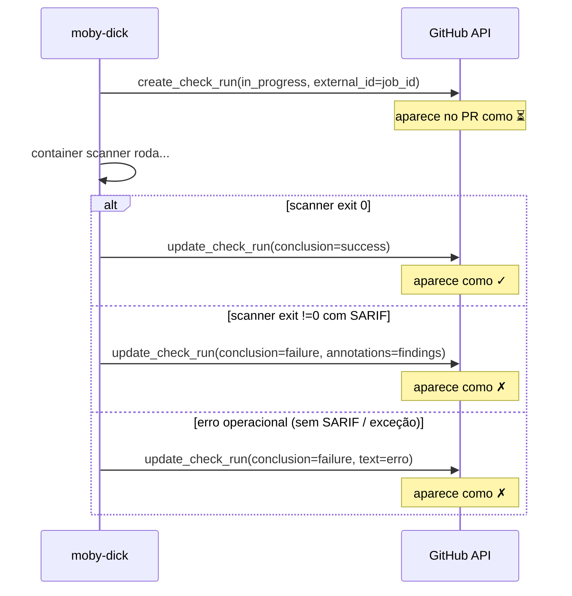
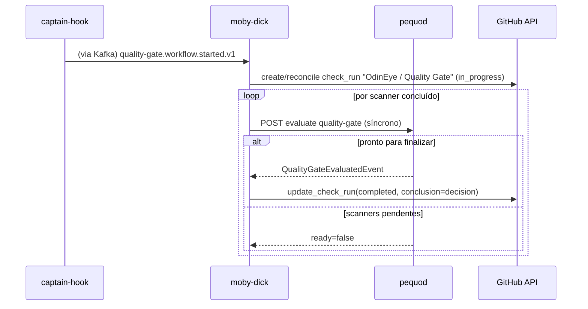
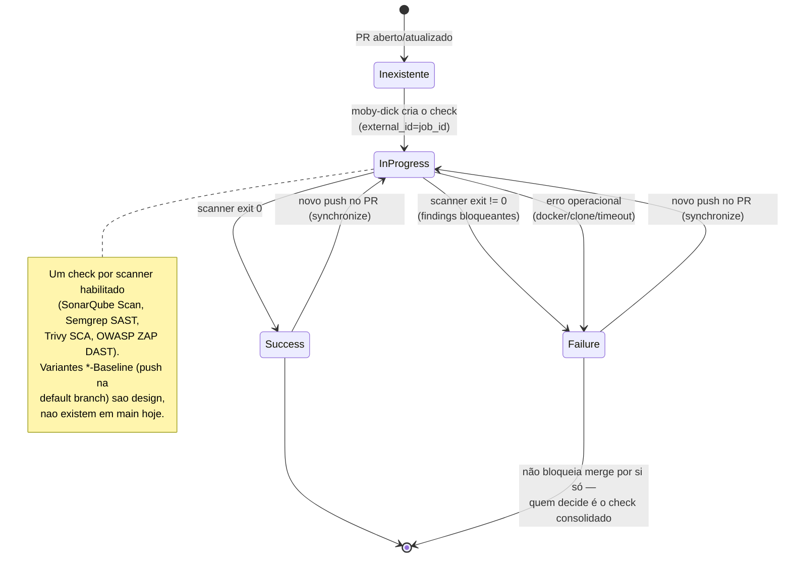
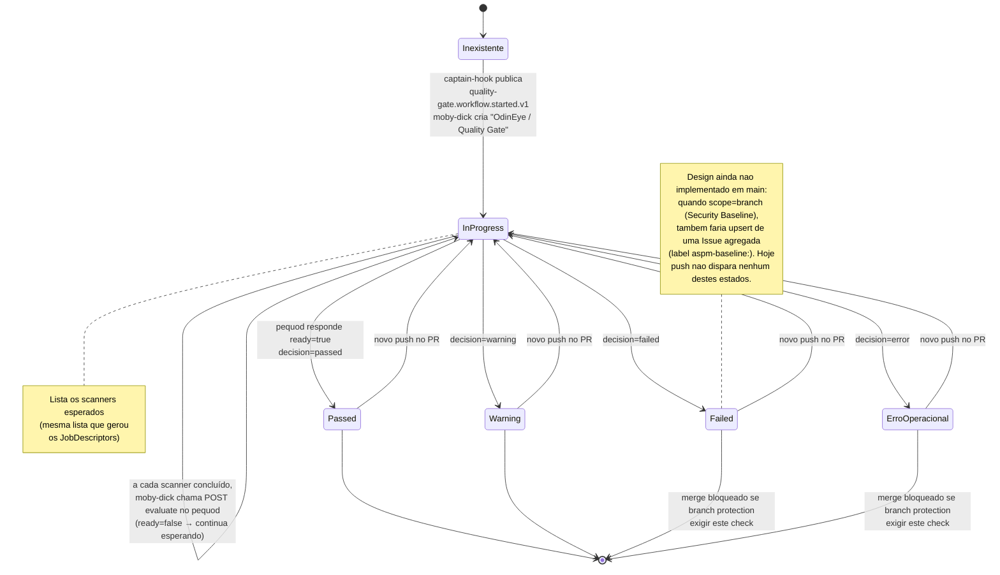

# Entendendo o check_run no PR

Como ler o feedback do ASPM-AI no seu PR.

!!! warning "Security Baseline (push na default branch) — não está em `main` (corrigido 2026-09-10)"
    Esta página já continha referências a checks/Issues de "Security Baseline" disparados por `push` na default branch. Esse fluxo **não existe em `main`** hoje: captain-hook não tem handler pra `push` (3 PRs fechados sem merge) e moby-dick não faz upsert de Issue (1 PR mergeado e depois revertido). Tudo abaixo descreve **só o fluxo de PR** de fato em produção; trechos que mencionam push/Baseline/Issue estão marcados como design ainda não implementado. Ver [Decisão §15](../overview/decisions.md#15-quality-gate-com-scopepr-e-scopebranch-security-baseline--nova).

!!! note "Dois níveis de check hoje"
    Desde a introdução do Quality Gate multi-scanner, o PR mostra **dois tipos de check**:

    1. **Checks individuais**, um por scanner habilitado (`SonarQube Scan`, `Semgrep SAST`, `Trivy SCA`, `OWASP ZAP DAST`). Criados/atualizados pelo `moby-dick` (`controller/job_controller.py`) a cada scanner executado. (Variantes `*-Baseline` para push na default branch fazem parte do design do Security Baseline, mas não existem em `main` — ver aviso no topo.)
    2. **Check consolidado** `OdinEye / Quality Gate` (nome configurável via `QUALITY_GATE_CHECK_NAME` no moby-dick), que agrega o resultado de todos os scanners esperados e é a fonte de decisão para bloqueio de merge (`controller/quality_gate_check_controller.py`).

    Se você só configurou branch protection com um scanner específico, use o check individual dele. Para bloquear merge com base no Quality Gate completo (todos os scanners), use `OdinEye / Quality Gate`.

## Onde aparece

Aba **Checks** do PR no GitHub. Você verá algo como:

```
OdinEye / Quality Gate     ← consolidado
SonarQube Scan             ← individual
Semgrep SAST                ← individual (se ENABLE_SEMGREP_SCAN=true)
Trivy SCA                   ← individual (se ENABLE_TRIVY_SCAN=true)
OWASP ZAP DAST               ← individual (se ENABLE_ZAP_SCAN=true)
```

Estados possíveis em cada um:

```
⏳ In progress     → scanner rodando / Quality Gate aguardando scanners
✓  Success         → scanner passou / Quality Gate aprovado
⚠  Neutral         → (só no consolidado) Quality Gate aprovado com avisos
✗  Failure         → scanner ou Quality Gate falhou, ou erro de execução
```

## Check consolidado — `OdinEye / Quality Gate`

Criado quando `captain-hook` publica `quality-gate.workflow.started.v1` (1 por PR aberto/atualizado). Fica `in_progress` listando os scanners esperados (mesma lista que gerou os `JobDescriptor`s) até que o `moby-dick`, depois de cada scanner terminar, consiga uma resposta "pronto" do pequod.

`decision` do pequod mapeia para `conclusion` do GitHub assim:

| `decision` (pequod) | `conclusion` (check_run) | Label |
|---|---|---|
| `passed` | `success` | ✅ Aprovado |
| `warning` | `neutral` | ⚠️ Aprovado com avisos |
| `failed` | `failure` | ❌ Reprovado |
| `error` | `failure` | ❌ Erro operacional |

O `output.text` do check consolidado traz: decisão, política aplicada (`policy_name`/`policy_version`), contagem de findings avaliados/bloqueantes/avisos/ignorados, e quantos scanners esperados completaram/falharam/foram cancelados/deram timeout.

!!! tip "Security Baseline (push na default branch) — design, não implementado"
    O pequod já suporta um gate disparado por `push` (scope=`branch`, sem PR), com check consolidado no commit e uma Issue agregada no repositório (label `aspm-baseline:<branch>`) fazendo o papel de notificação, já que um check em commit avulso tem visibilidade baixa. **Esse fluxo não roda em `main` hoje** — nem captain-hook publica o evento a partir de um push, nem moby-dick faz o upsert da Issue. Ver aviso no topo desta página.

## Check individual — por scanner

Cada scanner tem seu próprio check (`external_id` = `job_id`, entao redeliveries do Kafka não duplicam o check). Estados explicados:

### ⏳ `In progress`

moby-dick criou o check, o container do scanner está rodando. Tempo típico: 30s-3min dependendo do scanner e do tamanho do repo (DAST em modo `compose_preview` tende a ser o mais lento — sobe a aplicação antes de escanear).

Se ficar travado >5min, algo deu errado — ver [troubleshooting](../developer/troubleshooting.md).

### ✓ `Success`

Scanner rodou e não encontrou nada que reprovasse (regras de veredito são específicas de cada scanner — ver [Adicionar novo scanner](../developer/adding-a-scanner.md)). Isso não decide sozinho o merge: quem decide é o check consolidado.

### ✗ `Failure`

Pode ser **duas coisas diferentes**:

1. **Findings/QG fail (esperado):** scanner rodou, achou problemas que violam o veredito
2. **Erro de execução:** scanner não conseguiu rodar (image issue, network, clone falhou, etc — aparece como "Erro operacional do scanner" no summary)

Diferenciar pelo conteúdo do check (`output.title`/`output.summary`).

## Como ler o detalhe

Click no check → painel lateral abre com:

### Title
Categoria do resultado, ex:
- `Scan concluído` (success)
- `Scan reprovou — N finding(s)` (findings bloqueantes)
- `Erro operacional do scanner` (problema de infra/execução)

### Summary
1-2 linhas resumindo, ex:
- `Job <uuid> concluído sem findings bloqueantes`
- `Job <uuid> exit_code=1 findings=<N>`
- `Job <uuid> falhou: <erro>`

### Text
Para scanners que produziram SARIF: anotações inline nos arquivos afetados (até 50 por check — teto do GitHub) + findings sem localização em arquivo (típico do DAST, que reporta URL) em markdown + logs tail do scanner (últimos 4KB) num `<details>` colapsável.

Sem SARIF (scanner morreu antes de escrever o arquivo): só os logs tail, em code fence.

## Próximos passos quando o check falha

### Cenário 1: erro operacional do scanner

**Causa:** misconfig do scanner, imagem não buildada, rede — não é problema do seu código.

**Ação:** abrir issue no `aspm-docs` ou avisar quem mantém a plataforma.

### Cenário 2: findings bloqueantes (Sonar/Semgrep/Trivy) ou alertas (ZAP)

**Causa:** seu código (ou dependência, ou app em preview) tem issues novas que cruzam o piso configurado (`ASPM_FAIL_ON`, por scanner).

**Ação:**

1. Abrir o painel do check no PR → ver anotações inline nos arquivos
2. Pra Sonar especificamente: abrir a UI (link no log do scanner, `http://<sonar-host>/dashboard?id=gh_<repository.id>`) → aba **Issues**
3. Corrigir os críticos, push novo commit → novo scan automático (novo `job_id`, mesmo `workflow_id` se for o mesmo PR/SHA-chain)
4. Check individual e consolidado passam a verde

### Cenário 3: `0 source files analyzed` / sem findings

**Causa:** scanner não encontrou o que analisar (ex.: repo só com md/txt/config para SAST/SCA).

**Ação:** check normalmente passa. Se aparecer fail, é bug — reportar.

### Cenário 4: erro de rede / docker

**Sintomas no Text:**
- `pull access denied` → imagem não buildada
- `UnknownHostException` / `Connection refused` → dependência (Sonar, registro Docker) fora do ar
- healthcheck da preview do ZAP nunca fica pronto → app não sobe com `docker-compose.aspm.yml` fornecido

**Ação:** problema de infra, não seu código. Avise quem cuida da VPS.

## Limitações conhecidas (Community Build do Sonar)

Vide [decisão #7](../overview/decisions.md#7-modo-de-scan-análise-principal-sem-pr-mode).

- ❌ **Sem inline comments nativos do Sonar** no PR (feature paga) — mitigado pelas anotações do check_run, que vêm do SARIF construído a partir da API do Sonar
- ❌ **Sem decoration visual no Sonar UI por PR** (last scan wins)
- ❌ **Sem comparação delta no Sonar:** avalia o código todo, não só o diff do PR (Semgrep/Trivy/ZAP não têm essa limitação — rodam full-scan por natureza)

O que **funciona**:
- ✅ check individual por scanner + check consolidado do Quality Gate (verde/amarelo/vermelho)
- ✅ Branch protection (bloqueio de merge se exigir o check consolidado verde)
- ✅ Anotações inline por finding, com correção sugerida quando o scanner oferece

## Como o check_run é produzido (interno)

### Check individual



### Check consolidado



## Ciclo de vida completo (state diagrams)

!!! note "Migrado do FLOWCHART.md da raiz do monorepo (10/set/2026)"
    Os diagramas abaixo substituem o diagrama de estado antigo do `FLOWCHART.md` local (que cobria só um scanner único, sem check consolidado e sem menção ao Security Baseline). Cobrem os dois níveis de check reais em produção hoje (fluxo de PR); os pontos de design do Security Baseline (não implementado) estão marcados explicitamente.

### Check individual (por scanner)



### Check consolidado (`OdinEye / Quality Gate`)



## Error path — cenários de falha na execução (diagrama técnico)

Cobre os caminhos de erro que não aparecem no fluxo feliz acima — útil pra quem mantém a plataforma (moby-dick) diagnosticar por que um check ficou vermelho por motivo operacional, e como a chamada síncrona ao pequod se comporta quando ele está indisponível.

```mermaid
sequenceDiagram
    autonumber
    participant MD as moby-dick
    participant DR as Docker
    participant SR as scanner container
    participant PQ as pequod
    participant GHAPI as GitHub API

    MD->>GHAPI: create_check_run(in_progress, external_id=job_id)
    GHAPI-->>MD: check_run_id

    alt Imagem não existe
        MD->>DR: containers.run
        DR-->>MD: ImageNotFound
        Note over MD: result.error = "image_not_found"<br/>exit_code = -1
    else Container falha durante execução
        MD->>DR: containers.run
        DR->>SR: start
        SR->>SR: git clone falha<br/>(token inválido, repo privado)
        SR-->>DR: exit code 128
        DR-->>MD: ContainerError
        Note over MD: result.error = str(ContainerError)<br/>exit_code = 128
    else Scanner reprova (esperado — findings bloqueantes)
        MD->>DR: containers.run
        DR->>SR: start
        SR->>SR: scan encontra findings<br/>que cruzam ASPM_FAIL_ON
        SR-->>DR: exit code != 0 (sem exceção)
        DR-->>MD: exit_code != 0, error=None
        Note over MD: result.success = False<br/>result.error = None
    else Timeout
        MD->>DR: containers.run<br/>(DOCKER_RUN_TIMEOUT_SECONDS)
        DR-->>MD: APIError (timeout)
        Note over MD: result.error = "docker_api_error: timeout"
    end

    MD->>MD: _result_to_check_output<br/>mapeia exit/erro → conclusion
    MD->>GHAPI: update_check_run(conclusion=failure, output.text=logs_tail)
    Note over GHAPI: Dev vê erro no PR<br/>com logs tail no expandir

    MD->>PQ: POST /internal/quality-gates/{workflow_id}/evaluate
    alt Pequod pronto (ready=true)
        PQ-->>MD: QualityGateEvaluatedEvent
        MD->>GHAPI: update_check_run consolidado<br/>(conclusion=decision)
    else Pequod 429/5xx/erro de conexão
        Note over MD: retry exponencial<br/>(PEQUOD_API_MAX_ATTEMPTS /<br/>PEQUOD_API_RETRY_BASE_SECONDS)
    else Pequod 404 (workflow_id desconhecido)
        Note over MD: não é retryable — PequodClientError,<br/>logado como warning e engolido;<br/>consumer de quality-gate.evaluated.v1<br/>(fallback) cobre o caso raro
    end
```

## Diferença para outros checks do GitHub

| Check | Origem | O que avalia |
|---|---|---|
| **OdinEye / Quality Gate** | nosso ASPM-AI | decisão consolidada de segurança/qualidade de todos os scanners esperados |
| **SonarQube Scan / Semgrep SAST / Trivy SCA / OWASP ZAP DAST** | nosso ASPM-AI | resultado individual de cada scanner |
| GitHub Actions / workflow | CI do seu repo | Build, testes, lint |
| Required reviews | branch protection | Aprovação humana |
| CodeQL (se ativado) | GitHub Advanced Security | SAST nativo |

ASPM não substitui CI — é uma camada extra de feedback security/quality.

## Quando confiar e quando duvidar

**Confiar:** vulnerabilities/findings classificados como Blocker ou Critical, em arquivos/dependências que o PR introduziu.

**Duvidar:** code smells de complexidade cognitiva em código legado que você não tocou, ou alertas Informational do ZAP (o baseline padrão do ZAP reporta bastante ruído nesse nível — ver `ASPM_FAIL_ON` em `deploy/zap-runner/entrypoint.sh`).

**Triagem futura:** quando o sistema de findings central existir, dará pra marcar findings como false positive sem precisar fixar.
