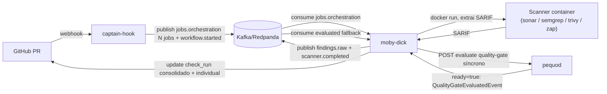

# Moby-dick

Orquestrador Docker responsável por consumir jobs do Kafka (`jobs.orchestration`), executar scanners em containers efêmeros e publicar results em `findings.raw`. Também materializa o **Quality Gate** — consolidado e por scanner — como `check_run` do GitHub.

!!! warning "Security Baseline (Issue agregada) — não está em `main` (corrigido 2026-09-10)"
    Versões anteriores desta página diziam que o moby-dick "mantém uma Issue agregada quando o escopo é `branch`". Esse recurso (`controller/baseline_sink_controller.py`) não existe em `main` hoje — uma PR (#38, "sink dual pra Security Baseline") apareceu como mergeada no histórico do GitHub, mas o commit não é ancestral do `main` atual (revertido/force-pushed depois do merge). O `wire/schemas/quality_gate_v1.py` de hoje nem tem os campos `scope`/`branch_name`. Ver [Decisão §15](overview/decisions.md#15-quality-gate-com-scopepr-e-scopebranch-security-baseline--nova).

## Executando local

```bash
pip install -r requirements.txt
cp .env.example .env
python3 main.py
# servidor em http://localhost:9090
```

## Papel principal

- Consumir `jobs.orchestration` (Kafka) — 1 job por scanner (sonar/semgrep/trivy/zap)
- Criar containers de scanner (Docker SDK) e extrair o SARIF produzido em `${SARIF_OUTPUT_PATH}`
- Publicar `findings.raw` no Kafka
- Criar/atualizar o **check individual** do scanner (`external_id=job_id`, nome vindo de `job.context.callback.name`)
- Consumir `quality-gate.workflow.started.v1` e criar/reconciliar o **check consolidado** (`OdinEye / Quality Gate`)
- Depois de cada scanner concluir, chamar **sincronamente** o pequod (`POST /api/v1/internal/quality-gates/{workflow_id}/evaluate`) para tentar finalizar o Quality Gate; se finalizado, atualiza o check consolidado imediatamente
- Consumir `quality-gate.evaluated.v1` apenas como **rede de segurança** (fallback) — não é mais o caminho principal de finalização
- Expor `GET /metrics/quality-gate` — contadores in-memory (checks criados/reconciliados/completados por decisão, replays ignorados)

Não faz upsert de Issue agregada nem processa `scope=branch` hoje — ver aviso no topo desta página.

## Subsistema de Quality Gate

Diferente do desenho original (aguardar `quality-gate.evaluated.v1` via Kafka de ponta a ponta), hoje o Moby Dick chama o **pequod diretamente por HTTP** depois de publicar cada `quality-gate.scanner.completed.v1`, evitando ficar preso esperando um evento que pode se perder em caso de instabilidade do broker:

```mermaid
sequenceDiagram
    participant MD as moby-dick (job_controller)
    participant K as Kafka
    participant PQ as pequod (HTTP síncrono)
    participant GH as GitHub API

    MD->>K: publish quality-gate.scanner.completed.v1
    MD->>PQ: POST /api/v1/internal/quality-gates/{workflow_id}/evaluate
    alt Pequod pronto para finalizar (ready=true)
        PQ-->>MD: event=QualityGateEvaluatedEvent
        MD->>GH: update_check_run (check consolidado, completed)
    else scanners ainda pendentes (ready=false)
        PQ-->>MD: sem event
        Note over MD: nada a fazer — próximo scanner que terminar tenta de novo
    else Pequod indisponível / 5xx / 404
        Note over MD: erro é logado (warning) e engolido;<br/>consumer de quality-gate.evaluated.v1 (fallback) cobre o caso raro
    end
```

Dois consumers Kafka distintos rodam dentro do `moby-dick`:

| Consumer | Consumer group | Tópicos assinados | Papel |
|---|---|---|---|
| `JobConsumer` | `moby-dick` | `jobs.orchestration` | executa scanners, publica `findings.raw` + `quality-gate.scanner.completed.v1` |
| `QualityGateConsumer` | `moby-dick-quality-gate` | `quality-gate.workflow.started.v1`, `quality-gate.evaluated.v1` | cria/reconcilia o check consolidado (`workflow.started`) e cobre a finalização como fallback (`evaluated`) |

Cliente HTTP: `diplomat/http_out/pequod_client.py` (`PequodClient.evaluate_quality_gate`), com retry exponencial (`PEQUOD_API_MAX_ATTEMPTS`/`PEQUOD_API_RETRY_BASE_SECONDS`) em 429/5xx/erro de conexão; `404` (workflow_id desconhecido no pequod) não é retryable e levanta `PequodClientError` direto.

## Scanners suportados

4 scanner images vivem em `deploy/`, todas seguindo o mesmo contrato (§11 do `aspm-docs`: escrever SARIF v2.1.0 em `${SARIF_OUTPUT_PATH}`, exit code é o veredito, `unset GIT_TOKEN` antes de rodar código de terceiros clonado):

| Pasta | Scanner | Categoria | Habilitado via (captain-hook) |
|---|---|---|---|
| `deploy/sonar-runner/` | SonarQube | SAST (+ Quality Gate de projeto) | sempre ativo |
| `deploy/semgrep-runner/` | Semgrep | SAST | `ENABLE_SEMGREP_SCAN` |
| `deploy/trivy-runner/` | Trivy | SCA + misconfig (`TRIVY_SCANNERS=vuln,misconfig`) | `ENABLE_TRIVY_SCAN` |
| `deploy/zap-runner/` | OWASP ZAP | DAST | `ENABLE_ZAP_SCAN` + `DAST_MODE` |

`DAST_MODE` tem dois valores possíveis no env do job do ZAP:

- `fixed_url` — escaneia `TARGET_URL`, uma URL que já está no ar (sem clone).
- `compose_preview` — clona o repo do PR/branch, sobe `docker-compose.aspm.yml` (`DAST_SERVICE_NAME`/`DAST_TARGET_PORT`/`DAST_HEALTH_PATH`) e escaneia a preview. Exige `MOBY_MOUNT_DOCKER_SOCKET=true` no env do `JobDescriptor` — o `moby-dick` só monta `/var/run/docker.sock` no container quando esse flag vem explícito (`controller/job_controller.py::_runner_volumes`), privilégio equivalente a root no host. Usar só com repositórios confiáveis.

Cada scanner, ao terminar, faz o `moby-dick` publicar um `quality-gate.scanner.completed.v1` com `scanner_class` resolvido em `_SCANNER_CLASS_BY_SCANNER` (`sonar`→`sast`, `semgrep`→`sast`, `trivy`→`sca`, `zap`→`dast`).

## Como o SARIF chega no check_run

`adapter/sarif_to_check_run.py::build_output` traduz o SARIF v2.1.0 (comum aos 4 scanners) no `output` do check_run: anotações inline para findings com `path` dentro do repositório (até 50, teto do GitHub) e markdown para findings sem path real (típico do DAST, que reporta URL).

## Links

- README completo: ../moby-dick/README.md
- Arquitetura: ../overview/architecture.md
- Check run consolidado + individual: ../integration/check-run.md
- JobDescriptor: ../reference/job-descriptor.md

## Fluxo de dados




