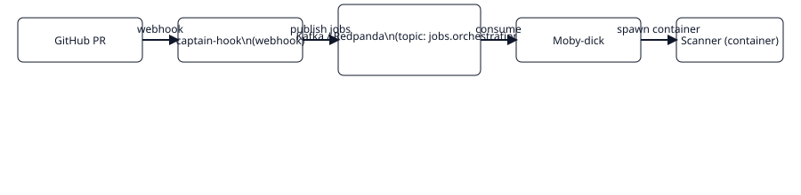

# Moby-dick

Orquestrador Docker responsável por consumir jobs do Kafka (`jobs.orchestration`), executar scanners em containers efêmeros e publicar results em `findings.raw`.

## Executando local

```bash
pip install -r requirements.txt
cp .env.example .env
python3 main.py
# servidor em http://localhost:9090
```

## Papel principal

- Consumir `jobs.orchestration` (Kafka)
- Criar containers de scanner (Docker SDK)
- Extrair arquivo SARIF produzido pelo scanner
- Publicar `findings.raw` no Kafka
- Atualizar check_runs no GitHub

## Links

- README completo: ../moby-dick/README.md
- Arquitetura: ../overview/architecture.md

## Fluxo de dados

```mermaid
flowchart LR
  GH[GitHub PR]
  CH[captain-hook]
  K[(Kafka/Redpanda)]
  MD[moby-dick]
  SR[Scanner container (SARIF)]
  PQ[pequod]

  GH -->|webhook| CH
  CH -->|publish jobs.orchestration| K
  K -->|consume| MD
  MD -->|spawn scanner| SR
  SR -->|emit SARIF -> findings.raw| K
  K -->|consume| PQ
```


