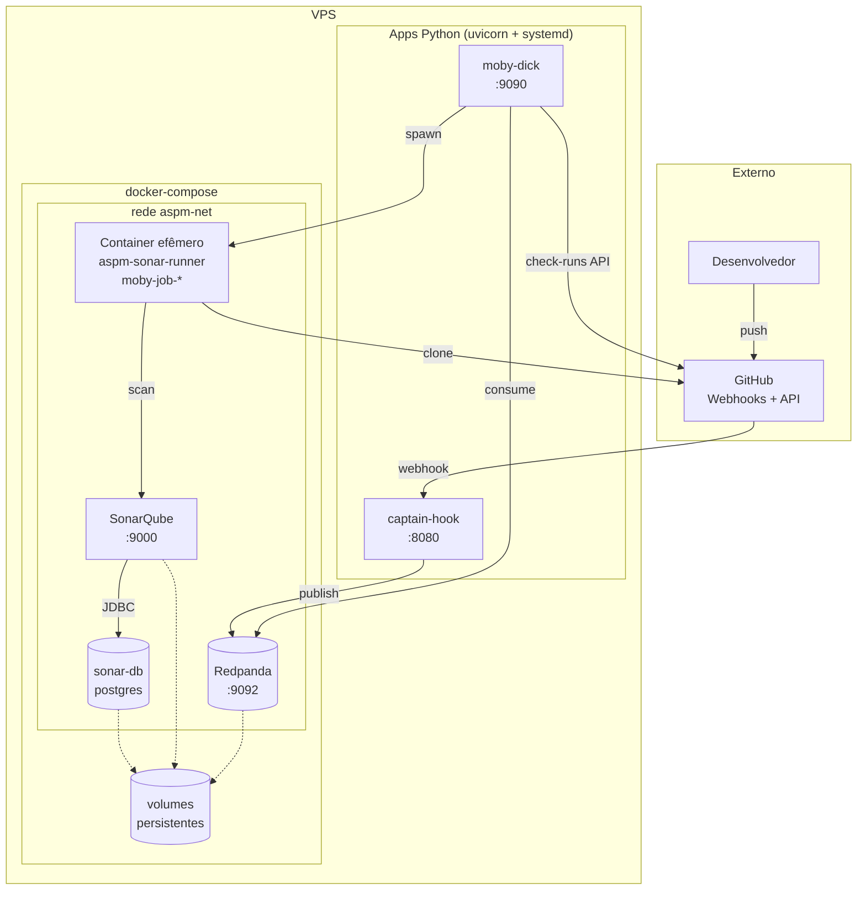
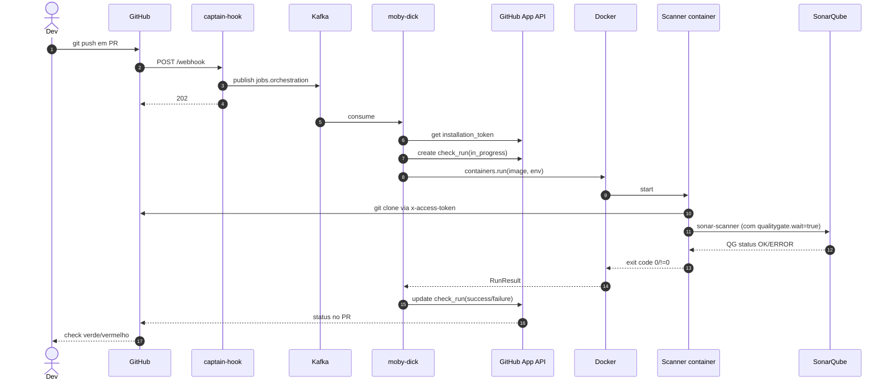

# Arquitetura

## Visão de componentes



## Fluxo completo de um PR



## Princípios arquiteturais

### 1. Event-driven, não request-driven

`captain-hook` é o único componente síncrono (responde ao webhook do GitHub em <500ms). Daí pra frente, tudo é assíncrono via Kafka. Permite:

- Retry automático
- Reprocessamento (replay de tópico)
- Adicionar consumers novos sem mexer no producer
- Backpressure se moby-dick estiver lento

### 2. Scanners stateless

Containers são efêmeros. Vivem segundos a minutos. Sem volumes persistentes, sem cache local. Toda informação:

- **Entra** via `env` do `docker run`
- **Sai** via exit code + logs

Adicionar scanner novo = construir image nova + atualizar `default_job_image`. Zero refactor no orchestrator.

### 3. Schemas versionados

`wire/schemas/job_v1.py` é o **contrato** entre captain-hook e moby-dick. Pydantic valida em ambos os lados. Mudança incompatível = `v2` paralelo, consumers migram no ritmo deles.

### 4. Token efêmero, fronteiras curtas

```
captain-hook NÃO conhece o GitHub App
moby-dick conhece (minta installation token)
Container do scan conhece (token injetado em runtime)
Kafka NUNCA vê o token
```

GitHub App installation tokens duram 1h. moby-dick cacheia em memória. Sem rotação manual.

### 5. Networking flat, DNS por nome

Tudo no mesmo bridge user-defined (`aspm-net`). Containers se enxergam por `container_name` ou `service name`. moby-dick spawna containers nessa mesma rede.

## Tópicos Kafka

| Tópico | Producer | Consumer | Schema | Particionamento |
|---|---|---|---|---|
| `github.events.raw` | captain-hook | (audit only — sem consumer ativo) | `{event_type, delivery_id, payload}` | key = repo_full_name |
| `jobs.orchestration` | captain-hook | moby-dick | `JobDescriptor v1` | key = repo_full_name |

Particionamento por `repo` garante ordem por repositório, paralelismo entre repositórios.

Tópicos futuros previstos (não implementados): `findings.raw`, `findings.created`, `ai.enrichments.*`.

## Onde mora o quê

| Componente | Process model | Estado |
|---|---|---|
| captain-hook | uvicorn (systemd) | stateless |
| moby-dick | uvicorn (systemd) | stateless |
| Redpanda | container (compose) | volume persistente |
| SonarQube | container (compose) | volume persistente |
| sonar-db | container (compose) | volume persistente |
| sonar-runner container | container (efêmero, spawned por job) | sem estado |

Apps Python rodam **fora** do compose — direto na VPS via systemd. Compose cuida só de infra com estado.

## O que está fora hoje (e por quê)

- ❌ **Findings store central** — Sonar guarda no `sonar-db` dele mesmo; ignoramos por enquanto
- ❌ **Schema unificado de findings** — adiado até 2º scanner aparecer
- ❌ **UI de triagem** — usamos só GitHub check_run como feedback
- ❌ **Enriquecimento IA** — fase posterior do roadmap
- ❌ **Métricas / observability formal** — só journalctl por enquanto

Detalhes em [Decisões](decisions.md).
