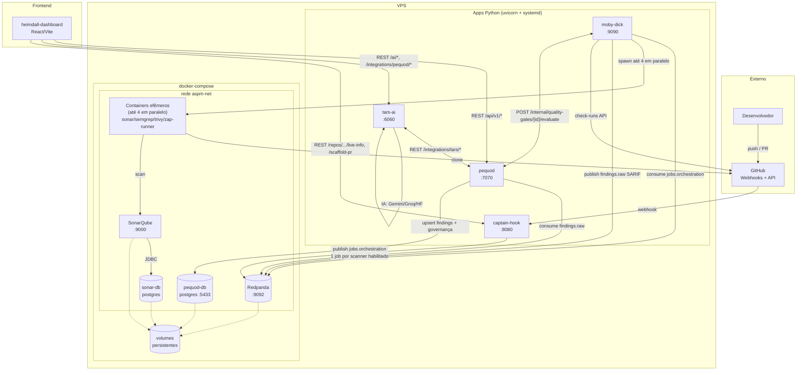
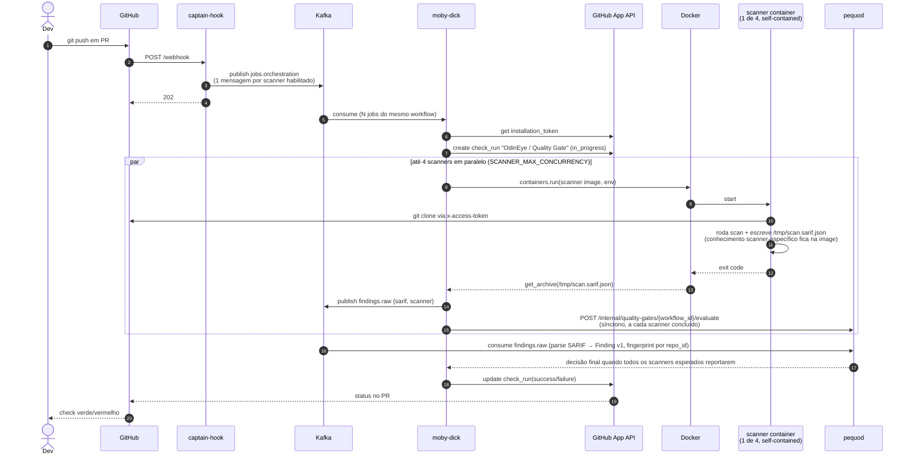

# Arquitetura

!!! note "Atualizado 2026-09-10"
    Esta página cobria apenas a primeira metade do pipeline (GitHub → captain-hook → moby-dick → Sonar). O ecossistema real hoje tem 5 serviços e 4 scanners; esta versão inclui o fluxo completo até o heimdall-dashboard.

## Visão de componentes



## Fluxo completo de um PR (multi-scanner + quality gate)



!!! warning "Security Baseline (push na default branch) — planejado, ainda NÃO está em `main` (corrigido 2026-09-10)"
    Uma versão anterior desta página descrevia `scope=branch` (disparado por `push` na default branch) como funcionando de ponta a ponta. **Não está.** Investigação direta no GitHub e no código:

    - **pequod:** ✅ completo em `main` (commit `fb65ca1`/PR #50) — schema com `scope`/`branch_name` e constraint de exclusividade, validação Pydantic, controller que processa o campo em todo o fluxo, endpoint `/internal/quality-gates/{workflow_id}/evaluate` funcional para `scope=branch`.
    - **captain-hook:** ❌ não está em `main`. Três tentativas de PR (`#38`, `#41`, `#42`) foram todas fechadas sem merge. Hoje `push` cai no branch `else` do `webhook_controller.py` — só é logado, nada é publicado.
    - **moby-dick:** ❌ não está em `main`. O PR (`#38`, "sink dual pra Security Baseline") aparece como mergeado na API do GitHub, mas o commit não é ancestral da `main` atual — foi revertido/removido depois. O schema `quality_gate_v1.py` hoje não tem campo `scope` nem `branch_name`.

    Ou seja: **só `scope=pr` funciona hoje, de ponta a ponta.** Gap detalhado e plano de recuperação em `TODO.md` (raiz do monorepo local) e [Decisão §15](decisions.md#15-quality-gate-com-scopepr-e-scopebranch-security-baseline--nova).

## Direção arquitetural — responsabilidade por camada

| Componente | Conhece | NÃO conhece |
|---|---|---|
| `*-runner` (4 images: sonar/semgrep/trivy/zap) | API/formato do próprio scanner, conversão pra SARIF | Kafka, Postgres, GitHub App, REST do pequod |
| `moby-dick` | Docker SDK, Kafka producer, GitHub App, contrato `JobDescriptor`, chamada síncrona ao pequod | qualquer scanner específico, formato interno de finding |
| `pequod` | SARIF v2.1.0, Postgres, REST, contrato `Finding v1`, governança de risco (security gate, risk exceptions, clustering) | Docker, GitHub, qualquer scanner específico |
| `tars-ai` | Providers de IA (Gemini/Groq/HF), REST do pequod | Docker, GitHub, Kafka |
| `heimdall-dashboard` | REST do pequod/tars-ai/captain-hook | Docker, GitHub, Kafka, Postgres |

**Confirmado na prática:** os 3 scanners adicionados depois do Sonar (semgrep, trivy, zap) chegaram sem exigir mudança em `moby-dick` nem `pequod` — validando a separação de responsabilidades acima. Ver [Decisão §11](decisions.md#11-extração-de-findings-dentro-da-scanner-image-status-concluído-não-é-mais-target).

## Princípios arquiteturais

### 1. Event-driven, não request-driven

`captain-hook` é o único componente síncrono (responde ao webhook do GitHub em <500ms). Daí pra frente, o pipeline de scan é assíncrono via Kafka — mas o **Quality Gate** hoje é decidido por uma chamada HTTP síncrona de moby-dick para pequod a cada scanner concluído (ver [Decisão §16](decisions.md#16-quality-gate-síncrono-via-rest-entre-moby-dick-e-pequod--nova)), não por round-trip Kafka completo.

### 2. Scanners stateless

Containers são efêmeros. Vivem segundos a minutos. Sem volumes persistentes, sem cache local. Adicionar scanner novo = construir image nova + `ENABLE_<X>_SCAN=true`. Zero refactor no orquestrador — confirmado 3x.

### 3. Schemas versionados

`wire/schemas/job_v1.py` é o contrato entre captain-hook e moby-dick. Uma versão anterior desta página dizia que esse contrato já incluía `scope`/`application_id`/bloco `quality_gate` em produção — hoje isso só é verdade dentro da branch de feature não mergeada `feat/quality-gate-scope-branch`; o `job_v1.py` de `main` ainda é só o contrato original (scope=pr implícito). Ver [JobDescriptor](../reference/job-descriptor.md) e a nota de Security Baseline acima.

### 4. Token efêmero, fronteiras curtas

```
captain-hook NÃO conhece o GitHub App
moby-dick conhece (minta installation token)
Container do scan conhece (token injetado em runtime, unset após clone)
Kafka NUNCA vê o token
```

### 5. Networking flat, DNS por nome

Tudo no mesmo bridge user-defined (`aspm-net`).

## Tópicos Kafka

| Tópico | Producer | Consumer | Propósito |
|---|---|---|---|
| `jobs.orchestration` | captain-hook | moby-dick | [`JobDescriptor v1`](../reference/job-descriptor.md), 1 msg por scanner habilitado |
| `repository.registered.v1` | captain-hook | pequod | registro de repositório (evento `installation`/ping) |
| `repository.unregistered.v1` | captain-hook | pequod | baixa de repositório |
| `quality-gate.workflow.started.v1` | captain-hook | moby-dick | início de um workflow de quality gate |
| `findings.raw` | moby-dick | pequod | SARIF normalizado pós-scan |
| `quality-gate.scanner.completed.v1` | moby-dick | pequod | fallback assíncrono por scanner concluído |
| `quality-gate.evaluated.v1` | pequod | (rede de segurança) | decisão final, só publicado quando não há chamada HTTP síncrona em andamento |

!!! note "Correção 2026-09-10"
    Uma versão anterior desta tabela listava um tópico `github.events.raw` (payload bruto do webhook, "audit only"). Esse tópico **não existe no código** — não há string, setting nem publish em nenhum dos 5 serviços. Era uma invenção que se propagou pela documentação sem verificação contra o código real. Removido.

Para a lista completa de tópicos e as dead-letter queues (bem mais numerosas do que esta tabela resumida sugere), ver [referência completa de tópicos](../reference/kafka-topics.md).

## Onde mora o quê

| Componente | Process model | Estado |
|---|---|---|
| captain-hook | uvicorn (systemd) | stateless |
| moby-dick | uvicorn (systemd) | stateless (cache de token em memória, TTL 1h) |
| pequod | uvicorn (systemd) | stateless (estado vive no pequod-db) |
| tars-ai | uvicorn (systemd) | stateless (lê/escreve tudo via REST no pequod, ou direto no banco no modo legado) |
| heimdall-dashboard | build estático (Vite) servido via CDN/host | 100% client-side, sem estado próprio |
| Redpanda | container (compose) | volume persistente |
| SonarQube | container (compose) | volume persistente |
| sonar-db | container (compose) | volume persistente |
| pequod-db | container (compose) | volume persistente |
| scanner containers (4 images) | container (efêmero, spawned por job) | sem estado |

## Estado atual do roadmap

- ✅ **Findings store central** — `pequod`, com governança completa (risk exceptions, security gate, quality gate, consolidated risk)
- ✅ **Schema unificado de findings** — `Finding v1`, fingerprint determinístico por `repo_id`
- ✅ **Extração SARIF dentro da scanner image** — concluído para os 4 scanners
- ✅ **Multi-scanner** — sonar + semgrep + trivy + zap, fan-out por PR
- ⏳ **Quality Gate com Security Baseline (`scope=branch`)** — completo no pequod (schema + validação + endpoint); captain-hook e moby-dick ainda não produzem/consomem esse evento em `main` (3 PRs fechados sem merge no captain-hook, 1 mergeado e depois revertido no moby-dick). Hoje só `scope=pr` funciona de ponta a ponta. Ver nota acima.
- ✅ **Enriquecimento por IA** — `tars-ai`, triagem individual + clustering semântico (Gemini)
- ✅ **UI de triagem/governança** — `heimdall-dashboard`
- ❌ **Correlação cross-scanner via embeddings/grafo mais amplo** — hoje é candidate clustering determinístico + clustering semântico via TARS; um grafo de correlação mais geral não existe
- ❌ **Métricas / observability formal (Prometheus/OTEL)** — só `GET /metrics/quality-gate` (não Prometheus-format) e `journalctl`

Detalhes em [Decisões](decisions.md).

## Convenções dos diagramas e como reaproveitá-los

!!! note "Migrado do FLOWCHART.md da raiz do monorepo (10/set/2026)"
    O monorepo local mantinha um `FLOWCHART.md` com diagramas equivalentes (defasados — cobriam só Sonar/modo PR). Esta seção preserva as instruções de reuso que só existiam ali; os diagramas de estado e error path foram migrados para [Entendendo o check_run no PR](../integration/check-run.md#ciclo-de-vida-completo-state-diagrams).

Todos os diagramas desta documentação são **Mermaid** — renderizam nativamente no GitHub e no site publicado, e também podem ser importados em ferramentas de diagramação:

1. Copiar **um** code block Mermaid por vez (entre ` ```mermaid ` e ` ``` `)
2. Lucidchart → **File → Import Diagram → Mermaid**
3. Colar → **Import**
4. Reorganizar layout se necessário (Lucid auto-arranja, mas pode precisar de ajuste manual em diagramas grandes)

### Legenda usada nos diagramas de fluxo

| Elemento | Significado |
|---|---|
| Seta sólida (`-->`) | chamada síncrona ou publicação direta |
| Seta tracejada (`-.->`) | retorno assíncrono, dependência fraca, persistência |
| `Note over`/`note right/left of` | estado interno do componente, não comunicação |
| Cor azul (`classDef event`/tópicos Kafka) | evento/dado em trânsito |
| Cor verde (`classDef python`) | serviço Python do ecossistema |
| Cor amarela (`classDef ephemeral`) | container efêmero/caso especial |
| Cor vermelha (`classDef external`) | ator ou sistema externo (GitHub, desenvolvedor) |
