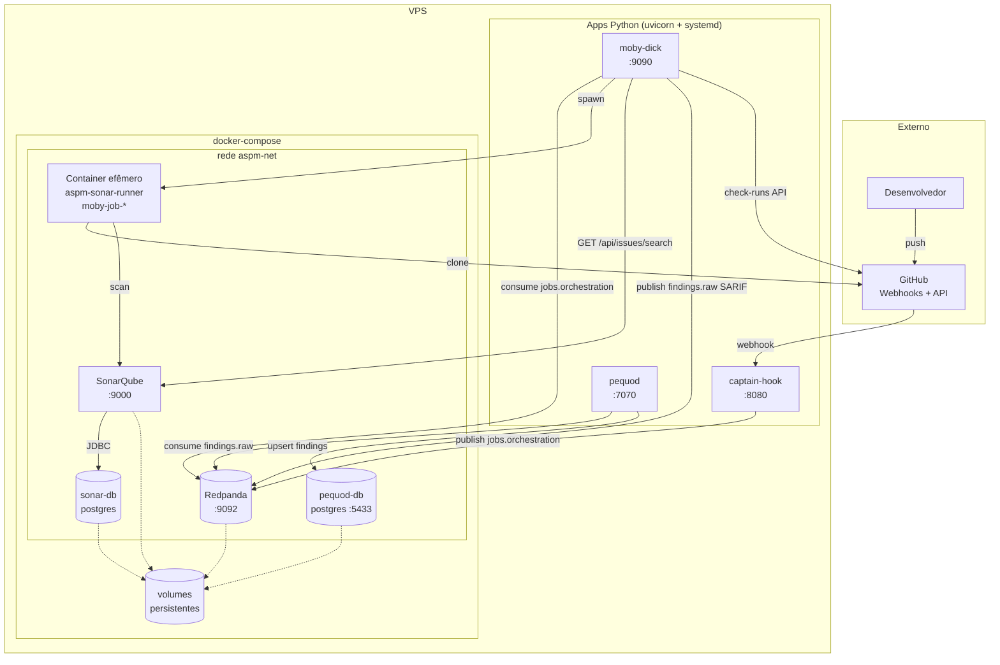
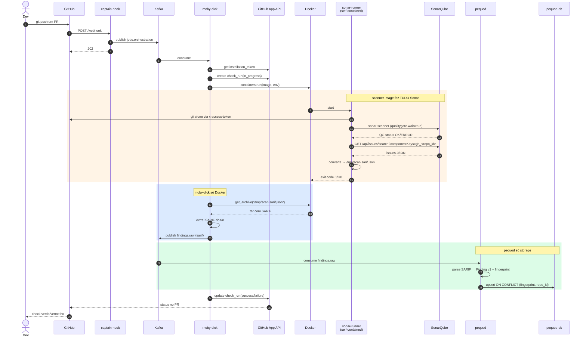
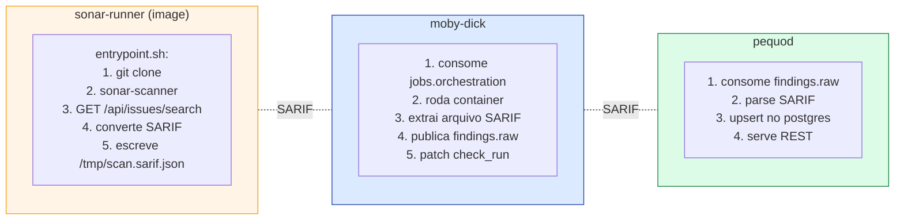

# Arquitetura

## Visão de componentes



## Fluxo completo de um PR



!!! warning "Estado atual vs. alvo"
    O diagrama acima representa o **alvo arquitetural (B)**. Hoje a extração de findings (`GET /api/issues/search` + conversão SARIF) ainda vive em `moby-dick/adapter/sonar/issues_to_sarif.py`. A migração pra dentro do `sonar-runner` está rastreada na [Decisão §11](decisions.md#11-extração-de-findings-dentro-da-scanner-image-target-arquitetural).

## Direção arquitetural — responsabilidade por camada

Para preservar `moby-dick` como orquestrador puro de Docker e `pequod` como camada de storage, todo conhecimento scanner-específico fica encapsulado **dentro da própria image do scanner**.

| Componente | Conhece | NÃO conhece |
|---|---|---|
| `sonar-runner` (image) | Sonar API, formato Sonar, SARIF, `sonar-scanner` CLI | Kafka, Postgres, GitHub App, REST do pequod |
| `moby-dick` | Docker SDK, Kafka producer, GitHub App, contrato `JobDescriptor` | qualquer scanner específico, formato de finding, parser SARIF |
| `pequod` | SARIF v2.1.0, Postgres, REST, contrato `Finding v1` | Docker, GitHub, qualquer scanner |

**Consequência:** adicionar Semgrep ao pipeline = construir `aspm-semgrep-runner` que já emite SARIF (Semgrep tem `--sarif` nativo). Zero código novo em `moby-dick` ou `pequod`. Captain-hook ganha `kind=semgrep_scan` e troca `default_job_image`.

## Topologia de fluxo (resumo conceitual)



## Princípios arquiteturais

### 1. Event-driven, não request-driven

`captain-hook` é o único componente síncrono (responde ao webhook do GitHub em <500ms). Daí pra frente, tudo é assíncrono via Kafka. Permite:

- Retry automático
- Reprocessamento (replay de tópico)
- Adicionar consumers novos sem mexer no producer
- Backpressure se moby-dick estiver lento

### 2. Scanners stateless

Containers são efêmeros. Vivem segundos a minutos. Sem volumes persistentes, sem cache local. Toda informação:

- **Entra** via `env` do `docker run`
- **Sai** via exit code + logs

Adicionar scanner novo = construir image nova + atualizar `default_job_image`. Zero refactor no orchestrator.

### 3. Schemas versionados

`wire/schemas/job_v1.py` é o **contrato** entre captain-hook e moby-dick. Pydantic valida em ambos os lados. Mudança incompatível = `v2` paralelo, consumers migram no ritmo deles.

### 4. Token efêmero, fronteiras curtas

```
captain-hook NÃO conhece o GitHub App
moby-dick conhece (minta installation token)
Container do scan conhece (token injetado em runtime)
Kafka NUNCA vê o token
```

GitHub App installation tokens duram 1h. moby-dick cacheia em memória. Sem rotação manual.

### 5. Networking flat, DNS por nome

Tudo no mesmo bridge user-defined (`aspm-net`). Containers se enxergam por `container_name` ou `service name`. moby-dick spawna containers nessa mesma rede.

## Tópicos Kafka

| Tópico | Producer | Consumer | Schema | Particionamento |
|---|---|---|---|---|
| `github.events.raw` | captain-hook | (audit only — sem consumer ativo) | `{event_type, delivery_id, payload}` | key = `repo_full_name` |
| `jobs.orchestration` | captain-hook | moby-dick | [`JobDescriptor v1`](../reference/job-descriptor.md) | key = `repo_full_name` |
| `findings.raw` | moby-dick | pequod | `{job_id, repo, repo_id, scanner, ref, sarif}` (SARIF v2.1.0) | key = `repo_id` |

Particionamento por `repo` / `repo_id` garante ordem por repositório, paralelismo entre repositórios.

Tópicos futuros previstos (não implementados): `findings.created`, `ai.enrichments.*`, `scans.completed`.

## Onde mora o quê

| Componente | Process model | Estado |
|---|---|---|
| captain-hook | uvicorn (systemd) | stateless |
| moby-dick | uvicorn (systemd) | stateless (cache de token em memória, TTL 1h) |
| pequod | uvicorn (systemd) | stateless (estado vive no pequod-db) |
| Redpanda | container (compose) | volume persistente |
| SonarQube | container (compose) | volume persistente |
| sonar-db | container (compose) | volume persistente |
| pequod-db | container (compose) | volume persistente |
| sonar-runner container | container (efêmero, spawned por job) | sem estado |

Apps Python rodam **fora** do compose — direto na VPS via systemd. Compose cuida só de infra com estado.

## O que está fora hoje (e por quê)

- ✅ **Findings store central** — agora vive no `pequod` (mas ainda sem UI; consulta via REST)
- ✅ **Schema unificado de findings** — `Finding v1` com fingerprint determinístico (SHA-256)
- 🎯 **Pequod como source-of-truth de findings** — intenção declarada ([Decisão §14](decisions.md#14-pequod-como-source-of-truth-de-findings-substitui-sonar-db-a-longo-prazo)). `sonar-db` continua existindo (Sonar exige), mas vira scratch interno; toda integração nova consulta o pequod.
- 🚧 **Extração SARIF dentro da scanner image** — em migração ([§11](decisions.md#11-extração-de-findings-dentro-da-scanner-image-target-arquitetural)). Após isso, moby-dick fica Docker-only de verdade.
- ❌ **UI de triagem** — só `PATCH /findings/{id}` por enquanto; UI Web fica pra próxima fase
- ❌ **Correlação cross-scanner** — só faz sentido quando 2º scanner entrar
- ❌ **Enriquecimento IA** — fase posterior do roadmap (pgvector + LLM triage sobre `pequod`)
- ❌ **Métricas / observability formal** — só journalctl por enquanto

Detalhes em [Decisões](decisions.md).
