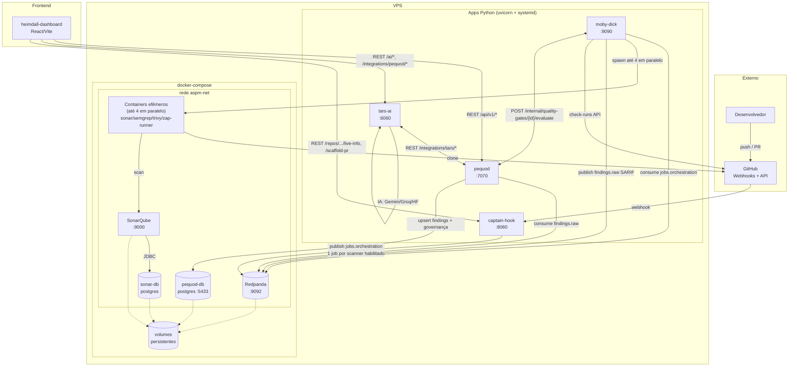
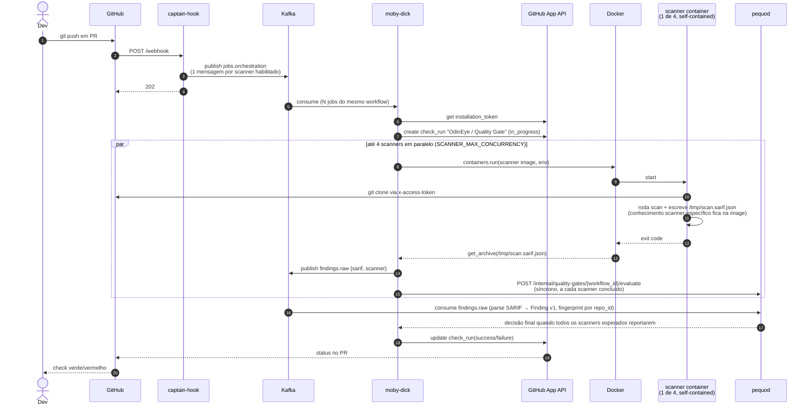

# Arquitetura

!!! note "Atualizado 2026-09-10"
    Esta página cobria apenas a primeira metade do pipeline (GitHub → captain-hook → moby-dick → Sonar). O ecossistema real hoje tem 5 serviços e 4 scanners; esta versão inclui o fluxo completo até o heimdall-dashboard.

## Visão de componentes



## Fluxo completo de um PR (multi-scanner + quality gate)



!!! info "Security Baseline (push na default branch)"
    O mesmo fluxo roda com `scope=branch` quando há `push` direto na default branch (sem PR aberto) — captain-hook (`controller/push_controller.py`) monta o `JobDescriptor` com `branch_name` em vez de `pull_request_number`, e moby-dick agrega o resultado numa Issue do GitHub (`baseline_issue_sink_enabled`), em vez de um `check_run` de PR.

## Direção arquitetural — responsabilidade por camada

| Componente | Conhece | NÃO conhece |
|---|---|---|
| `*-runner` (4 images: sonar/semgrep/trivy/zap) | API/formato do próprio scanner, conversão pra SARIF | Kafka, Postgres, GitHub App, REST do pequod |
| `moby-dick` | Docker SDK, Kafka producer, GitHub App, contrato `JobDescriptor`, chamada síncrona ao pequod | qualquer scanner específico, formato interno de finding |
| `pequod` | SARIF v2.1.0, Postgres, REST, contrato `Finding v1`, governança de risco (security gate, risk exceptions, clustering) | Docker, GitHub, qualquer scanner específico |
| `tars-ai` | Providers de IA (Gemini/Groq/HF), REST do pequod | Docker, GitHub, Kafka |
| `heimdall-dashboard` | REST do pequod/tars-ai/captain-hook | Docker, GitHub, Kafka, Postgres |

**Confirmado na prática:** os 3 scanners adicionados depois do Sonar (semgrep, trivy, zap) chegaram sem exigir mudança em `moby-dick` nem `pequod` — validando a separação de responsabilidades acima. Ver [Decisão §11](decisions.md#11-extração-de-findings-dentro-da-scanner-image-status-concluído-não-é-mais-target).

## Princípios arquiteturais

### 1. Event-driven, não request-driven

`captain-hook` é o único componente síncrono (responde ao webhook do GitHub em <500ms). Daí pra frente, o pipeline de scan é assíncrono via Kafka — mas o **Quality Gate** hoje é decidido por uma chamada HTTP síncrona de moby-dick para pequod a cada scanner concluído (ver [Decisão §16](decisions.md#16-quality-gate-síncrono-via-rest-entre-moby-dick-e-pequod--nova)), não por round-trip Kafka completo.

### 2. Scanners stateless

Containers são efêmeros. Vivem segundos a minutos. Sem volumes persistentes, sem cache local. Adicionar scanner novo = construir image nova + `ENABLE_<X>_SCAN=true`. Zero refactor no orquestrador — confirmado 3x.

### 3. Schemas versionados

`wire/schemas/job_v1.py` é o contrato entre captain-hook e moby-dick — hoje inclui `scope` (`pr`/`branch`), `application_id` e bloco `quality_gate`. Ver [JobDescriptor](../reference/job-descriptor.md).

### 4. Token efêmero, fronteiras curtas

```
captain-hook NÃO conhece o GitHub App
moby-dick conhece (minta installation token)
Container do scan conhece (token injetado em runtime, unset após clone)
Kafka NUNCA vê o token
```

### 5. Networking flat, DNS por nome

Tudo no mesmo bridge user-defined (`aspm-net`).

## Tópicos Kafka

| Tópico | Producer | Consumer | Propósito |
|---|---|---|---|
| `github.events.raw` | captain-hook | (audit only) | payload bruto do webhook |
| `jobs.orchestration` | captain-hook | moby-dick | [`JobDescriptor v1`](../reference/job-descriptor.md), 1 msg por scanner habilitado |
| `repository.registered.v1` | captain-hook | pequod | registro de repositório (evento `installation`/ping) |
| `repository.unregistered.v1` | captain-hook | pequod | baixa de repositório |
| `quality-gate.workflow.started.v1` | captain-hook | moby-dick | início de um workflow de quality gate (PR ou baseline) |
| `findings.raw` | moby-dick | pequod | SARIF normalizado pós-scan |
| `quality-gate.scanner.completed.v1` | moby-dick | pequod | fallback assíncrono por scanner concluído |
| `quality-gate.evaluated.v1` | pequod | (rede de segurança) | decisão final, só publicado quando não há chamada HTTP síncrona em andamento |
| `jobs.orchestration.dlq` / `quality-gate.moby-dick.dlq` | moby-dick | — | dead-letter queues |

Ver [referência completa de tópicos](../reference/kafka-topics.md).

## Onde mora o quê

| Componente | Process model | Estado |
|---|---|---|
| captain-hook | uvicorn (systemd) | stateless |
| moby-dick | uvicorn (systemd) | stateless (cache de token em memória, TTL 1h) |
| pequod | uvicorn (systemd) | stateless (estado vive no pequod-db) |
| tars-ai | uvicorn (systemd) | stateless (lê/escreve tudo via REST no pequod, ou direto no banco no modo legado) |
| heimdall-dashboard | build estático (Vite) servido via CDN/host | 100% client-side, sem estado próprio |
| Redpanda | container (compose) | volume persistente |
| SonarQube | container (compose) | volume persistente |
| sonar-db | container (compose) | volume persistente |
| pequod-db | container (compose) | volume persistente |
| scanner containers (4 images) | container (efêmero, spawned por job) | sem estado |

## Estado atual do roadmap

- ✅ **Findings store central** — `pequod`, com governança completa (risk exceptions, security gate, quality gate, consolidated risk)
- ✅ **Schema unificado de findings** — `Finding v1`, fingerprint determinístico por `repo_id`
- ✅ **Extração SARIF dentro da scanner image** — concluído para os 4 scanners
- ✅ **Multi-scanner** — sonar + semgrep + trivy + zap, fan-out por PR
- ✅ **Quality Gate com Security Baseline** — `scope=pr` e `scope=branch`
- ✅ **Enriquecimento por IA** — `tars-ai`, triagem individual + clustering semântico (Gemini)
- ✅ **UI de triagem/governança** — `heimdall-dashboard`
- ❌ **Correlação cross-scanner via embeddings/grafo mais amplo** — hoje é candidate clustering determinístico + clustering semântico via TARS; um grafo de correlação mais geral não existe
- ❌ **Métricas / observability formal (Prometheus/OTEL)** — só `GET /metrics/quality-gate` (não Prometheus-format) e `journalctl`

Detalhes em [Decisões](decisions.md).
