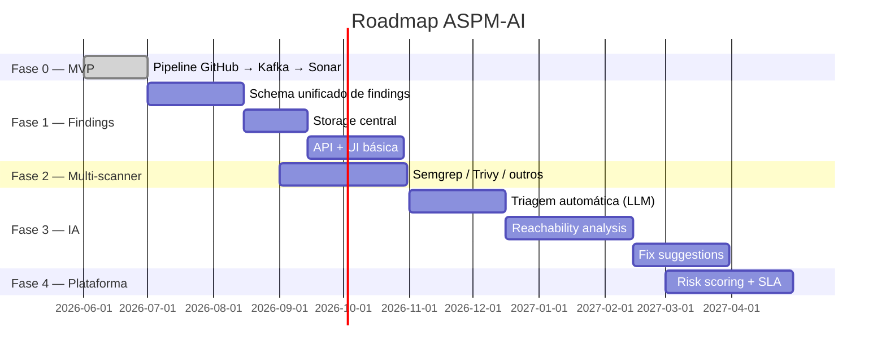

# O que é o ASPM-AI

## ASPM em uma frase

> **Application Security Posture Management** = unificar a visão de segurança de aplicações: descobrir, correlacionar, priorizar e remediar vulnerabilidades através de todo o SDLC.

## O problema

Times de engenharia hoje têm uma sopa de scanners:

- SAST (Sonar, Semgrep, CodeQL) para defeitos de código
- SCA (Snyk, Trivy, Grype) para vulnerabilidades em dependências
- DAST (ZAP, Burp) para falhas em runtime
- Secret scanners (Gitleaks, TruffleHog)
- Container scanners, IaC scanners, etc

Cada um tem sua UI, seu dashboard, seu schema. O resultado:

- **Findings duplicados** entre ferramentas que olham coisas parecidas
- **Falsos positivos** não triagem nunca somem
- **Sem priorização cross-fonte** — uma CVE crítica numa lib sem reachability fica do lado de um code smell trivial
- **Sem contexto de negócio** — "qual serviço é PCI scope?" → ninguém sabe
- **Triagem manual** virou trabalho fulltime

Plataformas ASPM resolvem isso: 1 schema unificado, 1 lugar pra triagem, 1 fonte pro time de segurança e pro time de produto.

## O que IA adiciona

- **Triagem automática**: LLM classifica false positive vs real
- **Reachability**: agente lê o código e decide se a vuln é alcançável
- **Fix suggestions**: PR comment com diff sugerido
- **Risk scoring**: combina severity + reachability + business criticality + exploitabilidade
- **Correlação semântica**: embedding-based dedup que resiste a refactor

## O que **este** projeto é

O ASPM-AI da OdinEye-FIAP está construindo essa plataforma do zero, com foco em:

1. **Pipeline event-driven** (Kafka como espinha dorsal)
2. **Modularidade extrema** — scanners stateless, schemas versionados, serviços trocáveis
3. **Containers isolados por scan** — cada finding nasce de um container efêmero
4. **Stack moderna** — Python (FastAPI), Pydantic, aiokafka, Docker SDK
5. **Foco em PR feedback** primeiro, dashboard depois

## O que **não** é

- ❌ Não é apenas um wrapper de SonarQube
- ❌ Não é um agregador passivo de relatórios
- ❌ Não é "rode SAST no CI e tá bom"
- ❌ Não é pra ser bonito antes de ser correto

## Roadmap conceitual

Datas indicativas, não compromissos.

## Princípios técnicos

- **Stateless onde possível, stateful onde necessário.** Scanners stateless; plataformas com histórico (Sonar) ficam stateful em DB próprio.
- **Schemas versionados são o contrato.** Serviços não se conhecem por código, só por mensagens Kafka tipadas.
- **Decisões reversíveis primeiro.** Evitamos compromissos caros até o uso real exigir.
- **Token nunca atravessa fronteira de processo desnecessária.** `GIT_TOKEN` só existe no moby-dick e no container que precisa.
- **Cada componente substituível.** Trocar Python por Go num serviço hot path não deve quebrar o resto.

Continua em [Arquitetura](architecture.md).
