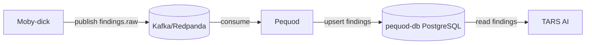
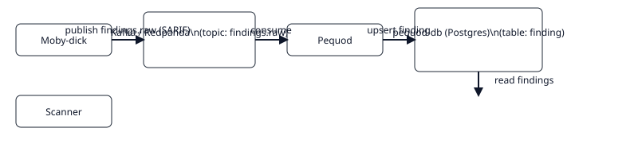

# Pequod

Camada de persistência do pipeline ASPM-AI. Consome `findings.raw` do Kafka, normaliza SARIF em `finding_v1`, deduplica por fingerprint e expõe REST para UI/IA.

## Quick start

```bash
# Sobe infra necessária (rede aspm-net)
docker compose -f ../captain-hook/docker-compose.yml up -d

# Sobe banco e serviço do pequod
cd pequod
docker compose up -d

# Deps + config
pip install -r requirements.txt
cp .env.example .env
uvicorn main:app --host 0.0.0.0 --port 7070
```

## Endpoints principais

- `GET /health` — liveness + readiness
- `GET /findings` — lista paginada (filtros: repo, severity, status)
- `GET /findings/{id}` — detalhe + `sarif_raw`
- `PATCH /findings/{id}` — atualiza `status` (triage manual)

## Links

- README completo: ../pequod/README.md
- Documentação central: ../index.md

## Fluxo de dados




