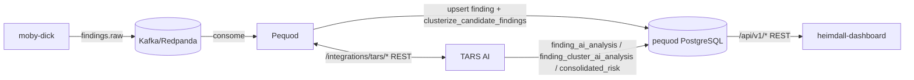

# Pequod

Camada de persistência e **governança de risco** do ecossistema ASPM-AI. Consome `findings.raw` do Kafka (publicado pelo moby-dick), normaliza SARIF em `finding_v1`, dedupa por `fingerprint`+`repo_id`, orquestra o Quality Gate multi-scanner, avalia o Security Gate contra políticas configuráveis, agrupa findings correlacionados (clustering determinístico) e consolida-os em riscos (com apoio de IA via TARS ou regra automática), e expõe REST para a UI (heimdall-dashboard) e para o TARS.

!!! note "Muito além de um storage de findings"
    O pequod não é só "onde os findings são salvos". É o serviço central de storage e governança do ASPM-AI: risk exceptions, security gate (policies/evaluations), quality gate (runs por PR e por branch), candidate clustering e consolidated risk vivem todos aqui.

## Quick start

```bash
# Garante rede aspm-net (compose do captain-hook cria)
docker compose -f ../captain-hook/docker-compose.yml up -d

# Sobe postgres do pequod (aplica deploy/schema.sql em init)
docker compose up -d

# Deps + config
pip install -r requirements.txt
cp .env.example .env

uvicorn main:app --host 0.0.0.0 --port 7070
```

## Tópicos Kafka

| Tópico | Direção | Producer → Consumer |
|---|---|---|
| `findings.raw` | consome | moby-dick → pequod |
| `quality-gate.workflow.started.v1` | consome | captain-hook → pequod |
| `quality-gate.scanner.completed.v1` | consome | moby-dick → pequod |
| `quality-gate.evaluated.v1` | publica (fallback) | pequod → interessados |

!!! note "Registro de repositório não é mais Kafka"
    Até o PR #44 do captain-hook (mergeado 2026-09-15), o pequod consumia `repository.registered.v1`/`repository.unregistered.v1`. Hoje é REST síncrono: captain-hook chama `POST /internal/repositories/register`/`/unregister` (ver [captain-hook.md](captain-hook.md)).

!!! warning "O caminho principal do Quality Gate não é mais assíncrono"
    Hoje a decisão do Quality Gate é resolvida pelo endpoint HTTP síncrono `POST /internal/quality-gates/{workflow_id}/evaluate`, chamado pelo moby-dick a cada scanner concluído. O evento Kafka `quality-gate.evaluated.v1` só é publicado como rede de segurança quando o gate finaliza sem nenhuma chamada HTTP em andamento (mensagens fora de ordem ou timeout).

## Endpoints (catálogo completo)

Prefixo de versão: `/api/v1`. As rotas legadas (`/findings*`) e as rotas service-to-service (`/integrations/tars/*`, `/internal/quality-gates/*`) não usam esse prefixo.

### Health & Observability

| Método | Path |
|---|---|
| `GET` | `/health` |
| `GET` | `/metrics/quality-gate` |
| `GET` | `/docs` (Swagger) |

### Findings (legado — mantido por compatibilidade)

| Método | Path | Função |
|---|---|---|
| `GET` | `/findings` | lista paginada (filtros: `repo`, `repo_id`, `severity`, `status`) |
| `GET` | `/findings/{finding_id}` | detalhe (recompõe `sarif_raw` a partir da ocorrência mais recente em `finding_occurrences`) |
| `PATCH` | `/findings/{finding_id}` | atualiza `status` (`open`/`triaged_fp`/`fixed`/`wontfix`) |

### Organizations / Applications / Scans

| Método | Path |
|---|---|
| `GET` | `/api/v1/organizations` |
| `GET` | `/api/v1/applications` |
| `GET` | `/api/v1/applications/{application_id}` |
| `GET` | `/api/v1/applications/{application_id}/scans` |
| `GET` | `/api/v1/scans/{scan_id}` |

### Risk Exceptions

| Método | Path |
|---|---|
| `GET` | `/api/v1/risk-exceptions` |
| `POST` | `/api/v1/risk-exceptions` |
| `POST` | `/api/v1/risk-exceptions/expire` |
| `GET` | `/api/v1/risk-exceptions/{exception_id}` |
| `POST` | `/api/v1/risk-exceptions/{exception_id}/revoke` |

### Alerts

| Método | Path |
|---|---|
| `GET` | `/api/v1/alerts` |
| `GET` | `/api/v1/alerts/{alert_id}` |

### Audit Log

| Método | Path |
|---|---|
| `GET` | `/api/v1/audit-logs` |
| `GET` | `/api/v1/audit-logs/{audit_log_id}` |

### Security Gate

| Método | Path |
|---|---|
| `GET` | `/api/v1/security-gate/policies` |
| `POST` | `/api/v1/security-gate/policies` |
| `GET` | `/api/v1/security-gate/policies/effective` |
| `GET` | `/api/v1/security-gate/evaluations` |
| `POST` | `/api/v1/security-gate/evaluations` |
| `GET` | `/api/v1/security-gate/evaluations/{evaluation_id}` |

### Consolidated Risks

| Método | Path |
|---|---|
| `GET` | `/api/v1/consolidated-risks` |
| `GET` | `/api/v1/consolidated-risks/{risk_id}` |

### Quality Gates

| Método | Path | Função |
|---|---|---|
| `GET` | `/api/v1/quality-gates` | lista runs (filtros: `application_id`, `status`, `decision`, `ref`) |
| `GET` | `/api/v1/quality-gates/by-pr` | resolve o run mais recente por `application_id` + `pull_request_number`, sem depender de `workflow_id` |
| `GET` | `/api/v1/quality-gates/{workflow_id}` | detalhe completo: run, scanners, evaluation, policy, items, risk exceptions |

### Integração TARS (service-to-service, `X-Service-Token`)

| Método | Path |
|---|---|
| `GET` | `/integrations/tars/capabilities` |
| `GET` | `/integrations/tars/pending-findings` |
| `POST` | `/integrations/tars/finding-analyses` |
| `GET` | `/integrations/tars/pending-clusters` |
| `POST` | `/integrations/tars/cluster-analyses` |
| `GET` | `/integrations/tars/semantic-candidates` |
| `POST` | `/integrations/tars/semantic-clustering-decisions` |

### Integração Moby Dick (service-to-service, `X-Service-Token`)

| Método | Path |
|---|---|
| `POST` | `/internal/quality-gates/{workflow_id}/evaluate` |

## Governança de risco (o que o pequod administra)

- **Risk Exceptions** — decisão de governança (`false_positive`/`accepted_risk`/`suppressed`) aplicada a exatamente um `finding` **ou** um `finding_cluster` (nunca os dois).
- **Security Gate Policies/Evaluations/Items** — regras versionadas (por aplicação ou globais), avaliadas contra findings/clusters de um scan ou de um Quality Gate.
- **Candidate Clustering** (`finding_cluster*`) — agrupamento **determinístico** (sem IA), por `correlation_key`, feito em `clusterize_candidate_findings()`. Reduz ruído antes de qualquer decisão semântica.
- **Consolidated Risk** (`consolidated_risk*`) — a unidade de risco "canônica" exibida pelo heimdall-dashboard. Resulta de uma decisão de IA do TARS (`merge`/`keep`/`split`, via `semantic_clustering_decision`) ou de auto-attach determinístico a um risco já existente.



## Quality Gate: `scope=pr` vs `scope=branch` (Security Baseline)

Todo `quality_gate_runs` tem um `scope`: `pr` (padrão, exige `pull_request_number`) ou `branch` (Security Baseline — avaliação contínua de uma branch como `main`, exige `branch_name`). Os dois campos são mutuamente exclusivos. Só é mantido 1 run "vigente" por PR (ou por branch) — novos commits/pushes substituem a run anterior.

## Schema (`deploy/schema.sql`)

Schema consolidado do PostgreSQL (23 tabelas), aplicado do zero via `docker-entrypoint-initdb.d`. Substitui as antigas migrations incrementais (`deploy/migrations/001..016`) — ver [Schema do banco](reference/database-schema.md) para o detalhe completo de tabelas e colunas.

## Dedup

`Finding.compute_fingerprint` usa `repo_id` (não `repo`) e a identidade estruturada de `location` (varia por `location_type`) — não mais uma tupla fixa de `file_path`/`line_start`/`snippet`. Ver [Finding v1](reference/finding-v1.md).

## Links

- README completo: [`pequod/README.md`](https://github.com/OdinEye-FIAP/pequod/blob/main/README.md)
- [Schema do banco](reference/database-schema.md)
- [Finding v1](reference/finding-v1.md)
- [Endpoints HTTP](reference/http-endpoints.md)
