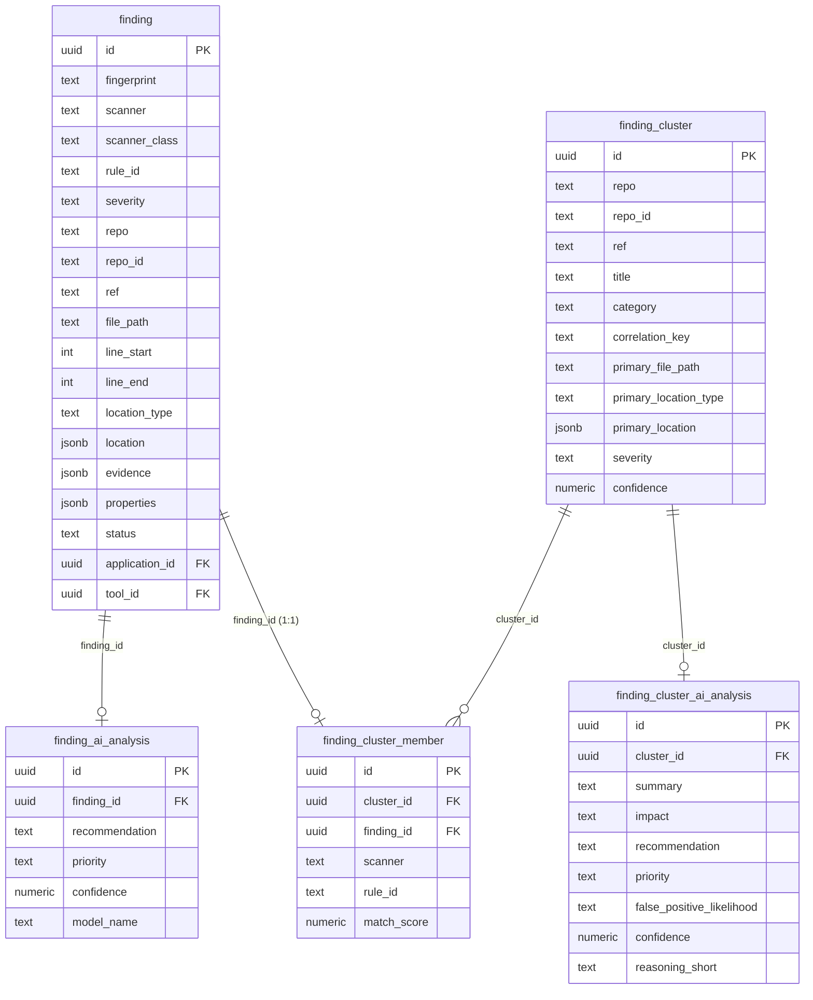
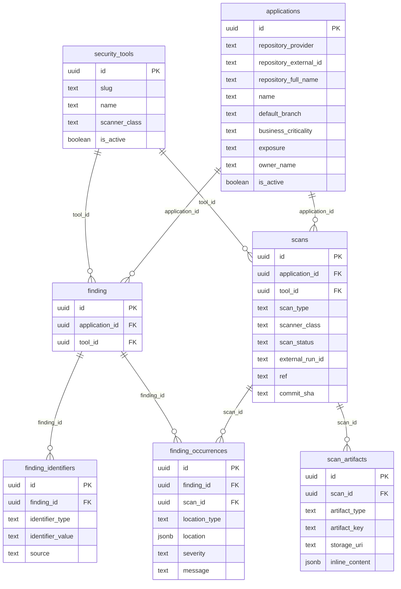
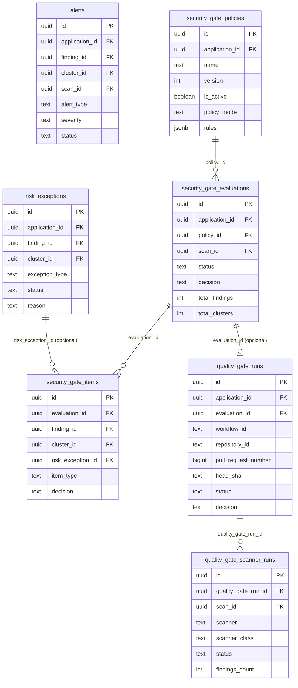
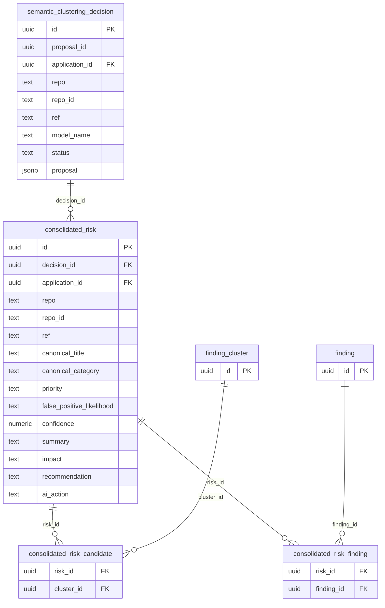

# Schema do banco (Pequod)

Referência das tabelas do banco relacional do Pequod. Source-of-truth em `pequod/deploy/schema.sql` (schema consolidado, sem migrations incrementais).

Convenção de nomenclatura: `finding_cluster`/`finding_cluster_member` representam o **agrupamento técnico bruto, pré-IA** (determinístico, por `correlation_key`). `consolidated_risk` representa o **risco já decidido** (via IA `propose_semantic_clustering` ou auto-attach determinístico), que é o que a UI (heimdall-dashboard) exibe como "Risco consolidado". Ver [decisions.md](../overview/decisions.md) para o histórico dessa distinção.

## Diagrama (estilo dbdiagram)

**Total: 22 tabelas** no schema (`finding`, `finding_ai_analysis`, `finding_cluster`, `finding_cluster_ai_analysis`, `finding_cluster_member`, `applications`, `security_tools`, `scans`, `scan_artifacts`, `finding_occurrences`, `finding_identifiers`, `alerts`, `audit_log`, `risk_exceptions`, `security_gate_policies`, `security_gate_evaluations`, `security_gate_items`, `quality_gate_runs`, `quality_gate_scanner_runs`, `semantic_clustering_decision`, `consolidated_risk`, `consolidated_risk_candidate`, `consolidated_risk_finding`).

Diagramas Mermaid ER com colunas e tipos, agrupados por domínio (mesma divisão do `schema.sql`). Renderizam como caixas de tabela conectadas no GitHub e no mkdocs-material.

### Visão geral (todas as 22 tabelas)

Colunas reduzidas ao essencial (PK/FK + poucos campos identificadores) para caber as 22 tabelas em um único diagrama. Para o detalhe completo de colunas, veja os diagramas por domínio logo abaixo.

```mermaid
erDiagram
    applications {
        uuid id PK
        text repository_full_name
        text owner_name
    }
    security_tools {
        uuid id PK
        text slug
        text scanner_class
    }
    scans {
        uuid id PK
        uuid application_id FK
        uuid tool_id FK
    }
    scan_artifacts {
        uuid id PK
        uuid scan_id FK
    }
    finding {
        uuid id PK
        uuid application_id FK
        uuid tool_id FK
        text fingerprint
        text scanner_class
    }
    finding_ai_analysis {
        uuid id PK
        uuid finding_id FK
    }
    finding_occurrences {
        uuid id PK
        uuid finding_id FK
        uuid scan_id FK
    }
    finding_identifiers {
        uuid id PK
        uuid finding_id FK
    }
    finding_cluster {
        uuid id PK
        text correlation_key
    }
    finding_cluster_ai_analysis {
        uuid id PK
        uuid cluster_id FK
    }
    finding_cluster_member {
        uuid id PK
        uuid cluster_id FK
        uuid finding_id FK
    }
    alerts {
        uuid id PK
        uuid application_id FK
        uuid finding_id FK
        uuid cluster_id FK
        uuid scan_id FK
    }
    audit_log {
        uuid id PK
        uuid application_id FK
    }
    risk_exceptions {
        uuid id PK
        uuid application_id FK
        uuid finding_id FK
        uuid cluster_id FK
    }
    security_gate_policies {
        uuid id PK
        uuid application_id FK
    }
    security_gate_evaluations {
        uuid id PK
        uuid application_id FK
        uuid policy_id FK
        uuid scan_id FK
    }
    security_gate_items {
        uuid id PK
        uuid evaluation_id FK
        uuid finding_id FK
        uuid cluster_id FK
        uuid risk_exception_id FK
    }
    quality_gate_runs {
        uuid id PK
        uuid application_id FK
        uuid evaluation_id FK
        text workflow_id
    }
    quality_gate_scanner_runs {
        uuid id PK
        uuid quality_gate_run_id FK
        uuid scan_id FK
    }
    semantic_clustering_decision {
        uuid id PK
        uuid application_id FK
    }
    consolidated_risk {
        uuid id PK
        uuid decision_id FK
        uuid application_id FK
        text canonical_title
    }
    consolidated_risk_candidate {
        uuid risk_id FK
        uuid cluster_id FK
    }
    consolidated_risk_finding {
        uuid risk_id FK
        uuid finding_id FK
    }

    applications ||--o{ finding : "application_id"
    applications ||--o{ scans : "application_id"
    applications ||--o{ alerts : "application_id"
    applications ||--o{ audit_log : "application_id (opcional)"
    applications ||--o{ risk_exceptions : "application_id"
    applications ||--o{ security_gate_policies : "application_id (opcional)"
    applications ||--o{ security_gate_evaluations : "application_id"
    applications ||--o{ quality_gate_runs : "application_id (opcional)"
    applications ||--o{ semantic_clustering_decision : "application_id (opcional)"
    applications ||--o{ consolidated_risk : "application_id (opcional)"

    security_tools ||--o{ finding : "tool_id"
    security_tools ||--o{ scans : "tool_id"

    scans ||--o{ scan_artifacts : "scan_id"
    scans ||--o{ finding_occurrences : "scan_id"
    scans ||--o{ alerts : "scan_id (opcional)"
    scans ||--o{ security_gate_evaluations : "scan_id (opcional)"
    scans ||--o{ quality_gate_scanner_runs : "scan_id (opcional)"

    finding ||--o| finding_ai_analysis : "finding_id"
    finding ||--o{ finding_occurrences : "finding_id"
    finding ||--o{ finding_identifiers : "finding_id"
    finding ||--o| finding_cluster_member : "finding_id (1:1)"
    finding ||--o{ alerts : "finding_id (opcional/xor)"
    finding ||--o{ risk_exceptions : "finding_id (xor cluster_id)"
    finding ||--o{ security_gate_items : "finding_id (xor cluster_id)"
    finding ||--o{ consolidated_risk_finding : "finding_id"

    finding_cluster ||--o{ finding_cluster_member : "cluster_id"
    finding_cluster ||--o| finding_cluster_ai_analysis : "cluster_id"
    finding_cluster ||--o{ alerts : "cluster_id (opcional/xor)"
    finding_cluster ||--o{ risk_exceptions : "cluster_id (xor finding_id)"
    finding_cluster ||--o{ security_gate_items : "cluster_id (xor finding_id)"
    finding_cluster ||--o{ consolidated_risk_candidate : "cluster_id"

    risk_exceptions ||--o{ security_gate_items : "risk_exception_id (opcional)"

    security_gate_policies ||--o{ security_gate_evaluations : "policy_id"
    security_gate_evaluations ||--o{ security_gate_items : "evaluation_id"
    security_gate_evaluations ||--o| quality_gate_runs : "evaluation_id (opcional)"

    quality_gate_runs ||--o{ quality_gate_scanner_runs : "quality_gate_run_id"

    semantic_clustering_decision ||--o{ consolidated_risk : "decision_id"
    consolidated_risk ||--o{ consolidated_risk_candidate : "risk_id"
    consolidated_risk ||--o{ consolidated_risk_finding : "risk_id"
```



### Findings e correlação



### Inventário, execuções e occurrences



### Governança operacional e Quality Gate



### Consolidação semântica de risco



## Relacionamentos entre tabelas (FKs)

Tabela de referência com toda foreign key do schema: tabela de origem, coluna, tabela/coluna referenciada, cardinalidade e comportamento de delete.

| Tabela de origem | Coluna FK | Referencia | Cardinalidade | ON DELETE | Observação |
|---|---|---|---|---|---|
| `finding` | `application_id` | `applications.id` | N:1 | RESTRICT | |
| `finding` | `tool_id` | `security_tools.id` | N:1 | RESTRICT | |
| `finding_ai_analysis` | `finding_id` | `finding.id` | 1:1 | CASCADE | `finding_id` é UNIQUE |
| `finding_cluster_ai_analysis` | `cluster_id` | `finding_cluster.id` | 1:1 | CASCADE | `cluster_id` é UNIQUE |
| `finding_cluster_member` | `cluster_id` | `finding_cluster.id` | N:1 | CASCADE | |
| `finding_cluster_member` | `finding_id` | `finding.id` | 1:1 | CASCADE | `finding_id` é UNIQUE (finding pertence a no máx. 1 cluster) |
| `scans` | `application_id` | `applications.id` | N:1 | RESTRICT | |
| `scans` | `tool_id` | `security_tools.id` | N:1 | RESTRICT | |
| `scan_artifacts` | `scan_id` | `scans.id` | N:1 | CASCADE | |
| `finding_occurrences` | `finding_id` | `finding.id` | N:1 | CASCADE | |
| `finding_occurrences` | `scan_id` | `scans.id` | N:1 | CASCADE | par `(finding_id, scan_id)` é UNIQUE |
| `finding_identifiers` | `finding_id` | `finding.id` | N:1 | CASCADE | |
| `alerts` | `application_id` | `applications.id` | N:1 | RESTRICT | |
| `alerts` | `finding_id` | `finding.id` | N:1 (opcional) | SET NULL | nullable |
| `alerts` | `cluster_id` | `finding_cluster.id` | N:1 (opcional) | SET NULL | nullable |
| `alerts` | `scan_id` | `scans.id` | N:1 (opcional) | SET NULL | nullable |
| `audit_log` | `application_id` | `applications.id` | N:1 (opcional) | SET NULL | nullable |
| `risk_exceptions` | `application_id` | `applications.id` | N:1 | RESTRICT | |
| `risk_exceptions` | `finding_id` | `finding.id` | N:1 (xor) | CASCADE | exatamente um entre `finding_id`/`cluster_id` |
| `risk_exceptions` | `cluster_id` | `finding_cluster.id` | N:1 (xor) | CASCADE | exatamente um entre `finding_id`/`cluster_id` |
| `security_gate_policies` | `application_id` | `applications.id` | N:1 (opcional) | CASCADE | nullable (policy global se NULL) |
| `security_gate_evaluations` | `application_id` | `applications.id` | N:1 | RESTRICT | |
| `security_gate_evaluations` | `policy_id` | `security_gate_policies.id` | N:1 | RESTRICT | |
| `security_gate_evaluations` | `scan_id` | `scans.id` | N:1 (opcional) | SET NULL | nullable |
| `security_gate_items` | `evaluation_id` | `security_gate_evaluations.id` | N:1 | CASCADE | |
| `security_gate_items` | `finding_id` | `finding.id` | N:1 (xor/opcional) | SET NULL | no máx. um entre `finding_id`/`cluster_id`; pode ser `aggregate`/`system` (nenhum) |
| `security_gate_items` | `cluster_id` | `finding_cluster.id` | N:1 (xor/opcional) | SET NULL | idem acima |
| `security_gate_items` | `risk_exception_id` | `risk_exceptions.id` | N:1 (opcional) | SET NULL | nullable |
| `quality_gate_runs` | `application_id` | `applications.id` | N:1 (opcional) | RESTRICT | nullable |
| `quality_gate_runs` | `evaluation_id` | `security_gate_evaluations.id` | N:1 (opcional) | SET NULL | nullable |
| `quality_gate_scanner_runs` | `quality_gate_run_id` | `quality_gate_runs.id` | N:1 | CASCADE | |
| `quality_gate_scanner_runs` | `scan_id` | `scans.id` | N:1 (opcional) | SET NULL | nullable |
| `semantic_clustering_decision` | `application_id` | `applications.id` | N:1 (opcional) | SET NULL | nullable |
| `consolidated_risk` | `decision_id` | `semantic_clustering_decision.id` | N:1 | CASCADE | |
| `consolidated_risk` | `application_id` | `applications.id` | N:1 (opcional) | SET NULL | nullable |
| `consolidated_risk_candidate` | `risk_id` | `consolidated_risk.id` | N:1 | CASCADE | PK composta `(risk_id, cluster_id)` |
| `consolidated_risk_candidate` | `cluster_id` | `finding_cluster.id` | N:1 | CASCADE | PK composta `(risk_id, cluster_id)` |
| `consolidated_risk_finding` | `risk_id` | `consolidated_risk.id` | N:1 | CASCADE | PK composta `(risk_id, finding_id)` |
| `consolidated_risk_finding` | `finding_id` | `finding.id` | N:1 | CASCADE | PK composta `(risk_id, finding_id)` |

### Por tabela "pai" (quem referencia quem)

| Tabela | Referenciada por |
|---|---|
| `applications` | `finding`, `scans`, `alerts`, `risk_exceptions`, `security_gate_policies`, `security_gate_evaluations`, `quality_gate_runs`, `semantic_clustering_decision`, `consolidated_risk` |
| `security_tools` | `finding`, `scans` |
| `scans` | `scan_artifacts`, `finding_occurrences`, `alerts`, `security_gate_evaluations`, `quality_gate_scanner_runs` |
| `finding` | `finding_ai_analysis`, `finding_occurrences`, `finding_identifiers`, `finding_cluster_member`, `alerts`, `risk_exceptions`, `security_gate_items`, `consolidated_risk_finding` |
| `finding_cluster` | `finding_cluster_member`, `finding_cluster_ai_analysis`, `alerts`, `risk_exceptions`, `security_gate_items`, `consolidated_risk_candidate` |
| `risk_exceptions` | `security_gate_items` |
| `security_gate_policies` | `security_gate_evaluations` |
| `security_gate_evaluations` | `security_gate_items`, `quality_gate_runs` |
| `quality_gate_runs` | `quality_gate_scanner_runs` |
| `semantic_clustering_decision` | `consolidated_risk` |
| `consolidated_risk` | `consolidated_risk_candidate`, `consolidated_risk_finding` |

> `finding` e `finding_cluster` nunca são referenciados juntos pela mesma linha em `risk_exceptions`/`security_gate_items` (constraint de exclusividade — "xor" na tabela acima).

## Vulnerabilidades canônicas e correlação

### `finding`
Vulnerabilidade normalizada (contrato [Finding v1](finding-v1.md)), deduplicada por `fingerprint` + `repo_id`. É o registro canônico de uma ocorrência de scanner após ingestão.

Colunas principais: `fingerprint`, `scanner`, `scanner_class`, `rule_id`, `severity`, `repo`/`repo_id`/`ref`, `file_path`/`line_start`/`line_end`, `location_type`/`location` (jsonb), `evidence`/`properties` (jsonb, dados brutos do scanner), `status` (`open`/...), `application_id`, `tool_id`, `sarif_raw` (auditoria).

### `finding_ai_analysis`
Análise de IA 1:1 por finding individual (`finding_id` UNIQUE). Colunas: `recommendation`, `priority`, `confidence`, `model_name`.

### `finding_cluster`
Agrupamento técnico determinístico pré-IA, criado por `clusterize_candidate_findings()` a partir de `correlation_key` (ver `candidate_clustering_controller.py`). Não é ainda um risco decidido.

Colunas: `repo`/`repo_id`/`ref`, `title`, `category`, `correlation_key` (UNIQUE por `repo_id`+`ref`), `primary_file_path`/`primary_line_start`/`primary_line_end`, `primary_location_type`/`primary_location`, `severity`, `confidence`.

### `finding_cluster_ai_analysis`
Análise de IA 1:1 por cluster (`cluster_id` UNIQUE) — usada quando o cluster ainda não foi promovido a `consolidated_risk`, ou como registro auxiliar do fluxo de decisão. Colunas: `summary`, `impact`, `recommendation`, `priority`, `false_positive_likelihood`, `confidence`, `reasoning_short`, `model_name`.

### `finding_cluster_member`
Relação N:1 entre `finding` e `finding_cluster` (cada finding pertence a no máximo um cluster: `finding_id` UNIQUE). Colunas: `cluster_id`, `finding_id`, `scanner`, `rule_id`, `match_score`.

## Inventário e execuções

### `applications`
Repositório/aplicação registrada no ecossistema (via GitHub App). Colunas: `repository_provider`/`repository_external_id`/`repository_full_name`, `name`, `default_branch`, `language`, `business_criticality`, `exposure`, `owner_name`/`team_name`, `github_installation_id`, `is_active`.

> **Não existem tabelas dedicadas `repositories` ou `organizations`.** As telas "Repositórios" e "Organizações" do heimdall-dashboard são visões derivadas de `applications`: cada linha de `applications` já É um repositório registrado, e "Organização" é simplesmente o agrupamento de `applications` pelo campo `owner_name` (conta/organização GitHub), feito em runtime por `list_organizations_on_connection()` (`pequod/diplomat/db/rest_query_repo.py`) — não há persistência própria para organização.

### `security_tools`
Catálogo de scanners/ferramentas de segurança integradas. Colunas: `slug` (UNIQUE), `name`, `vendor`, `scanner_class`, `is_active`.

### `scans`
Execução de um scanner sobre uma aplicação. Colunas: `application_id`, `tool_id`, `scan_type`, `scanner_class`, `scan_status`, `source_type`, `external_run_id` (UNIQUE por app+tool), `ref_type`/`ref`/`commit_sha`, `tool_version`, `started_at`/`finished_at`.

### `scan_artifacts`
Artefato bruto produzido por um scan (ex: SARIF original, log). Colunas: `scan_id`, `artifact_type`, `artifact_key`, `storage_uri` ou `inline_content` (jsonb), `content_hash`, `size_bytes`, `mime_type`.

## Occurrences e identificadores

### `finding_occurrences`
Ocorrência de um `finding` em um `scan` específico (permite rastrear reincidência do mesmo finding em múltiplos scans). Colunas: `finding_id`, `scan_id` (UNIQUE juntos), `location_type`/`location`, `evidence`/`properties`/`raw_payload`, `severity`, `message`, `observed_at`.

### `finding_identifiers`
Identificadores externos associados a um finding (ex: CVE, CWE). Colunas: `finding_id`, `identifier_type`, `identifier_value`, `source`, `reference_url`.

## Governança operacional

### `alerts`
Alerta operacional gerado para um finding/cluster/scan (ex.: falha de Quality Gate). Colunas: `application_id`, `finding_id`/`cluster_id`/`scan_id` (nullable), `alert_type`, `severity`, `title`/`message`, `deduplication_key`, `payload` (jsonb), `resolved_at` (nulo enquanto ativo). Não há mais ciclo de entrega/retentativa nem reconhecimento manual: o alerta fica ativo até ser resolvido automaticamente pelo próprio sistema quando o problema que o originou deixa de existir (ex.: Quality Gate volta a aprovar o mesmo PR).

### `audit_log`
Log de auditoria append-only (triggers bloqueiam UPDATE/DELETE). Colunas: `application_id`, `entity_type`/`entity_id`, `action`, `actor_type`/`actor_id`/`actor_name`, `previous_data`/`new_data` (jsonb), `correlation_id`/`request_id`.

## Governança de risco e Quality Gate

### `risk_exceptions`
Exceção de risco aceita/suprimida para um finding OU cluster (nunca ambos). Colunas: `application_id`, `finding_id` xor `cluster_id`, `exception_type` (`false_positive`/`accepted_risk`/`suppressed`), `status` (`active`/`expired`/`revoked`), `reason`/`justification`, `requested_by`/`approved_by`, `starts_at`/`expires_at`/`revoked_at`.

### `security_gate_policies`
Política de bloqueio configurável (global ou por `application_id`). Colunas: `name`, `version`, `is_active`, `policy_mode` (`blocking`/`monitoring`), `rules` (jsonb).

### `security_gate_evaluations`
Avaliação de uma policy contra um conjunto de findings/clusters de um scan/PR. Colunas: `application_id`, `policy_id`, `scan_id`, `ref_type`/`ref`/`commit_sha`, `status`, `decision` (`passed`/`failed`/`warning`/`error`), `total_findings`/`total_clusters`, `blocking_items`/`warning_items`/`ignored_items`, `summary` (jsonb).

### `security_gate_items`
Item individual avaliado dentro de uma `security_gate_evaluations` — aponta para um `finding` OU `cluster` (nunca ambos), ou é `aggregate`/`system`. Colunas: `evaluation_id`, `finding_id` xor `cluster_id`, `risk_exception_id`, `item_type` (`finding`/`cluster`/`aggregate`/`system`), `decision` (`passed`/`failed`/`warning`/`ignored`/`error`), `reason`.

> Nota: `item_type`/campos `cluster_*` aqui referenciam o `finding_cluster` (agrupamento pré-IA), não o `consolidated_risk` — nomenclatura pendente de alinhamento (ver item de backlog sobre renomear `finding_cluster`/`candidate_cluster` no backend).

### `quality_gate_runs`
Execução do Quality Gate para um PR (1 run "vigente" por PR — novos commits substituem a run anterior). Colunas: `application_id`, `workflow_id` (UNIQUE), `delivery_id`, `repository_id`/`repository_full_name`, `pull_request_number`, `head_sha`/`head_ref`/`base_ref`, `expected_scanners` (jsonb array), `status` (`pending`→`running`→`evaluating`→`completed`/`failed`/`cancelled`/`timed_out`), `decision`, `evaluation_id` (FK para `security_gate_evaluations`).

### `quality_gate_scanner_runs`
Execução de um scanner específico dentro de um `quality_gate_runs` (1 por scanner por run). Colunas: `quality_gate_run_id`, `scanner`/`scanner_class`, `job_id` (UNIQUE), `scan_id`, `status`, `findings_count`, `error_code`/`error_message`.

## Consolidação semântica de risco

### `semantic_clustering_decision`
Registro da decisão da IA (`propose_semantic_clustering`) sobre um conjunto de `finding_cluster`. Colunas: `proposal_id` (UNIQUE), `application_id`, `repo`/`repo_id`/`ref`, `model_name`, `contract_version`, `status` (`applied`/`rejected`), `proposal` (jsonb, payload completo retornado pela IA).

### `consolidated_risk`
**O risco consolidado exibido ao usuário final** — resultado de uma decisão de IA (`merge`/`keep`/`split`) ou de auto-attach determinístico. É essa tabela que o heimdall-dashboard renderiza como "Riscos consolidados" (via `ConsolidatedRiskApiItem` → `RiskAnalysis` no front).

Colunas: `decision_id` (FK para `semantic_clustering_decision`), `application_id`, `repo`/`repo_id`/`ref`, `canonical_title`/`canonical_category`, `technical_severity`, `priority`, `false_positive_likelihood`, `confidence`, `summary`/`impact`/`recommendation`/`reasoning`, `ai_action` (`merge`/`keep`/`split`), `model_name`.

### `consolidated_risk_candidate`
Relação N:N entre `consolidated_risk` e `finding_cluster` — quais clusters técnicos foram consolidados em qual risco. PK composta `(risk_id, cluster_id)`.

### `consolidated_risk_finding`
Relação N:N entre `consolidated_risk` e `finding` — todos os findings individuais cobertos por um risco consolidado (via os clusters candidatos). PK composta `(risk_id, finding_id)`.

## Fluxo de dados (visão geral)

```
Quality Gate (N scanners) → findings.raw (Kafka) → finding (ingestão)
                                                        │
                                                        ▼
                                     clusterize_candidate_findings()
                                     (agrupa por correlation_key)
                                                        │
                                                        ▼
                                              finding_cluster
                                       (+ finding_cluster_member)
                                                        │
                              ┌─────────────────────────┴─────────────────────────┐
                              ▼                                                     ▼
                 auto-attach determinístico                          IA: propose_semantic_clustering
              (find_risk_by_target_on_connection)                      (merge / keep / split)
                              │                                                     │
                              └─────────────────────────┬─────────────────────────┘
                                                        ▼
                                            semantic_clustering_decision
                                                        │
                                                        ▼
                                              consolidated_risk
                                    (+ consolidated_risk_candidate/_finding)
                                                        │
                                                        ▼
                                    heimdall-dashboard ("Riscos consolidados")
```

Ver também [Finding v1](finding-v1.md) e [ADRs](../overview/decisions.md) para o histórico de decisões que moldaram esse fluxo (ex: por que `correlation_key` não usa mais bucket de linha para `kind=="code"`).
