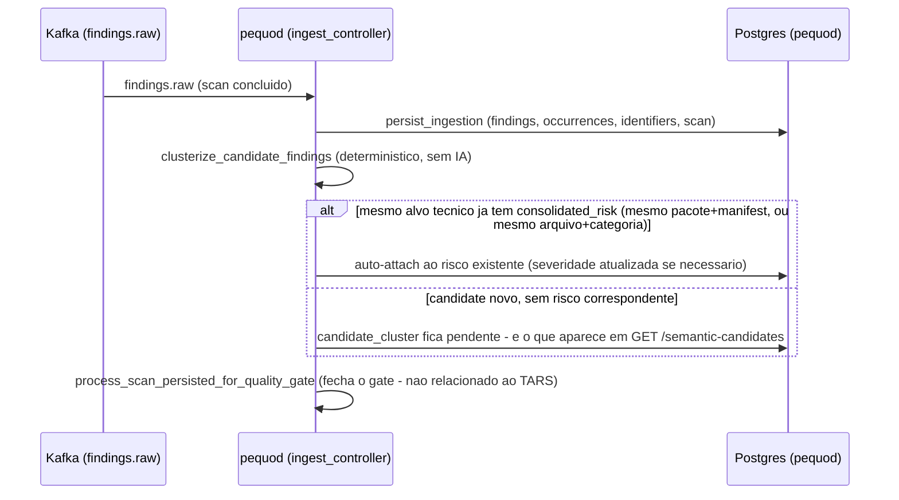
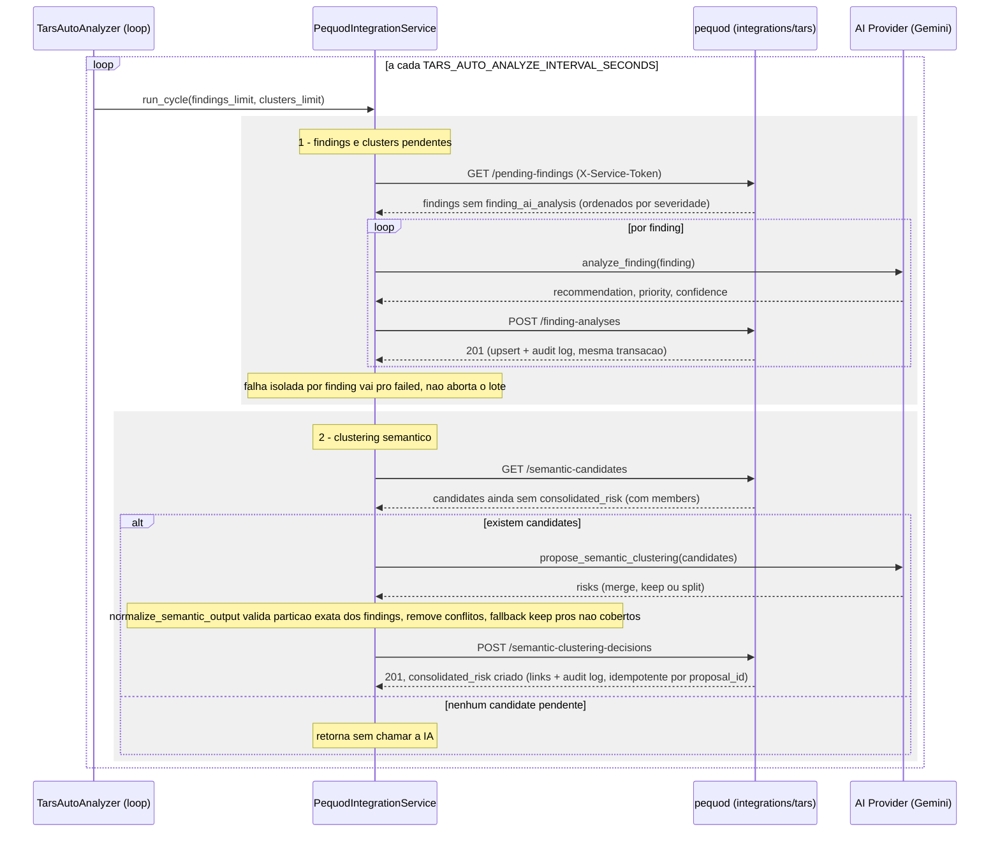

# TARS AI

Serviço de triagem por IA e clustering semântico do ecossistema ASPM-AI. Enriquece findings/clusters técnicos do pequod com análises estruturadas e propõe a consolidação semântica de risco (dedupe entre scanners).

!!! note "Dois modos de operação"
    O TARS AI opera em dois modos, controlados por `TARS_PEQUOD_INTEGRATION_ENABLED`:

    - **Legado** (padrão, `false`) — acesso direto ao PostgreSQL do pequod (`database.db`), rotas `/ai/*`.
    - **REST contra o pequod** (`true`) — nenhum acesso direto ao banco; consome as filas de trabalho e submete vereditos via `/integrations/tars/*` do pequod, rotas `/integrations/pequod/*`.

    Ambos os modos coexistem no mesmo binário (`main.py` inclui os dois routers); o `TarsAutoAnalyzer` escolhe o ciclo automático de acordo com a flag. Os diagramas abaixo descrevem o **modo REST** — é o modo com integração real ao resto do ecossistema; o legado é lido direto do banco e não tem chamada entre serviços pra diagramar.

## Visão rápida

- Lê findings/clusters pendentes de análise (do banco do pequod direto, ou via REST `/integrations/tars/pending-findings` / `/pending-clusters` / `/semantic-candidates`).
- Envia para o provider de IA configurável (`mock`, `groq`, `huggingface`, `gemini`).
- Persiste o veredito em `finding_ai_analysis` (individual, "slim") ou `finding_cluster_ai_analysis` (cluster, completo), ou propõe consolidação semântica (`merge`/`keep`/`split`) que o pequod grava como `consolidated_risk`.

## Quick start

```bash
git clone https://github.com/OdinEye-FIAP/tars-ai.git
cd tars-ai
python -m venv .venv
source .venv/bin/activate
pip install -r requirements.txt
cp .env.example .env
python -m uvicorn main:app --host 0.0.0.0 --port 6060 --reload
```

## Provider de IA ativo

Configurado por `AI_PROVIDER` (`config/settings.py`). Provider padrão do código é `mock`, mas o provider em uso operacionalmente é o **Gemini** (`gemini-2.5-flash`, `service/ai_provider/gemini_provider.py`). `groq` (`llama-3.1-8b-instant`) e `huggingface` (`fdtn-ai/Foundation-Sec-8B-Reasoning`) continuam disponíveis via `service/ai_provider/factory.py`.

## Endpoints — modo legado (`/ai/*`, `/health`)

| Método | Path | Função |
|---|---|---|
| `GET` | `/health` | status do serviço + provider ativo |
| `GET` | `/ai/pending` | findings pendentes (qualquer repo/ref) |
| `GET` | `/ai/pending-refs` | grupos `repo`/`ref` com findings pendentes |
| `POST` | `/ai/analyze-pending` | analisa findings pendentes (qualquer repo/ref) |
| `POST` | `/ai/analyze-ref` | analisa findings pendentes de um `repo`+`ref` específico (fluxo de PR) |
| `POST` | `/ai/analyze/{finding_id}` | analisa um finding específico |
| `GET` | `/ai/analyses` | lista análises de findings individuais (com o finding embutido) |
| `GET` | `/ai/stats` | totais: findings ingeridos vs. já enriquecidos pela IA |
| `POST` | `/ai/clusterize-pending` | clustering determinístico legado (grava em `finding_cluster`) |
| `GET` | `/ai/clusters` | lista clusters |
| `GET` | `/ai/clusters/{cluster_id}` | detalhe de um cluster |
| `POST` | `/ai/analyze-clusters` | analisa clusters pendentes (grava em `finding_cluster_ai_analysis`) |
| `GET` | `/ai/cluster-analyses` | lista análises de clusters (com o cluster embutido) |

## Endpoints — modo REST/pequod (`/integrations/pequod/*`)

| Método | Path | Função |
|---|---|---|
| `GET` | `/integrations/pequod/health` | healthcheck do pequod + capacidades (`/integrations/tars/capabilities`) |
| `POST` | `/integrations/pequod/analyze-findings` | busca `pending-findings` no pequod, analisa e submete via `finding-analyses` |
| `POST` | `/integrations/pequod/analyze-clusters` | busca `pending-clusters` no pequod, analisa e submete via `cluster-analyses` |
| `POST` | `/integrations/pequod/run` | ciclo completo: findings pendentes + clustering semântico (`semantic-candidates` → proposta `merge`/`keep`/`split` → `semantic-clustering-decisions`) — 409 se `TARS_PEQUOD_INTEGRATION_ENABLED=false` |

Do lado do pequod, todas essas rotas vivem em `/api/v1/integrations/tars/*` (`diplomat/http_in/tars_integration_router.py`), autenticadas por `X-Service-Token` (`tars_auth.py::require_tars_service_token` — mesmo padrão de auth por header usado no restante do ecossistema; sem token configurado, dev local segue sem exigir auth).

## Contrato de análise

Individual finding (`finding_ai_analysis`, "slim"):

```json
{
  "recommendation": "...",
  "priority": "high",
  "confidence": 0.82,
  "model_name": "gemini-2.5-flash"
}
```

Cluster / candidate cluster (`finding_cluster_ai_analysis`, completo):

```json
{
  "summary": "...",
  "impact": "...",
  "recommendation": "...",
  "priority": "high",
  "false_positive_likelihood": "low",
  "confidence": 0.82,
  "reasoning_short": "...",
  "model_name": "gemini-2.5-flash"
}
```

No modo REST, a consolidação semântica (`semantic_cluster_pending_candidates`) normaliza a proposta da IA em uma lista de "riscos" (`merge`/`keep`/`split`) antes de enviar ao pequod — candidates ambíguos ou não cobertos caem em `keep` seguro (fallback), preservando a evidência sem merge automático indevido.

## Auto worker

`service/auto_worker.py` (`TarsAutoAnalyzer`) roda em background quando `TARS_AUTO_ANALYZE_ENABLED=true`:

- **Modo REST** (`TARS_PEQUOD_INTEGRATION_ENABLED=true`): chama `PequodIntegrationService.run_cycle()` a cada `TARS_AUTO_ANALYZE_INTERVAL_SECONDS`.
- **Modo legado**: clusteriza pendências e analisa clusters pendentes (`ClusterService` + `analyze_pending_clusters`).

## Fluxo de ponta a ponta (diagramas)

Os findings/clusters que o TARS analisa não nascem para ele — o pequod já faz um primeiro passe **determinístico, sem IA**, no momento da ingestão (`findings.raw`). Só o que sobra desse passo (candidates sem risco correspondente ainda) é que fica disponível pro TARS decidir semanticamente. Os dois diagramas abaixo mostram essa cadeia completa.

### 1. Antes do TARS — candidate clustering determinístico (pequod)

Disparado pelo próprio `ingest_controller.py::process_findings_raw`, logo após persistir o scan. Roda pra **todo** finding ingerido, TARS habilitado ou não.



A regra de auto-attach (`candidate_clustering_controller.py::_auto_attach_to_existing_risk`) agrupa por alvo técnico — mesmo pacote+manifest pra dependências, ou mesmo arquivo+categoria pra código — sem depender de decisão de IA. Isso significa que **múltiplas CVEs do mesmo pacote, ou múltiplas ocorrências da mesma regra no mesmo arquivo, nunca chegam ao TARS como candidates separados**: já saem do pequod anexadas ao mesmo `consolidated_risk`. O TARS só vê o que é genuinamente novo e ambíguo o suficiente pra precisar de uma decisão semântica (merge/keep/split entre candidates de categorias/alvos diferentes).

### 2. Ciclo automático do TARS (modo REST)

`TarsAutoAnalyzer` roda esse ciclo a cada `TARS_AUTO_ANALYZE_INTERVAL_SECONDS`, com `TARS_PEQUOD_INTEGRATION_ENABLED=true`. São dois sub-fluxos independentes dentro do mesmo `run_cycle`.



Pontos que vale destacar de quem for mexer nesse fluxo:

- Os dois sub-fluxos (findings/clusters individuais e clustering semântico) são independentes — uma falha em um não afeta o outro dentro do mesmo `run_cycle`.
- Falha por finding individual (passo 1) é isolada e reportada em `failed`, sem abortar o restante do lote — mesmo padrão de isolamento por item usado em outras integrações do ecossistema (ver `docs/design/ping-install-rest-migration.md`).
- O envio da proposta semântica (passo 2) é idempotente: se o mesmo `proposal_id` já foi aplicado, o pequod devolve o resultado existente (`status="replay"`) em vez de duplicar `consolidated_risk`.
- `normalize_semantic_output` (`service/pequod_integration_service.py`) é uma camada de validação **no lado do TARS**, antes de mandar pro pequod: garante que cada candidate participe de no máximo um risco (exceto em `split`, que precisa particionar os findings sem sobreposição), e qualquer candidate que a IA não cobriu de forma válida cai em `keep` seguro — preserva a evidência em vez de arriscar um merge indevido.
- `consolidated_risk` gerado aqui (por auto-attach ou por decisão do TARS) é o que o heimdall-dashboard e as demais consultas de risco do pequod (`consolidated_risk_controller.py`) expõem — é o dado final de "risco consolidado" do ecossistema.

## Links

- README completo: [`tars-ai/README.md`](https://github.com/OdinEye-FIAP/tars-ai/blob/main/README.md)
- [Schema do banco](reference/database-schema.md)
- TARS docs central: [Índice](index.md)
